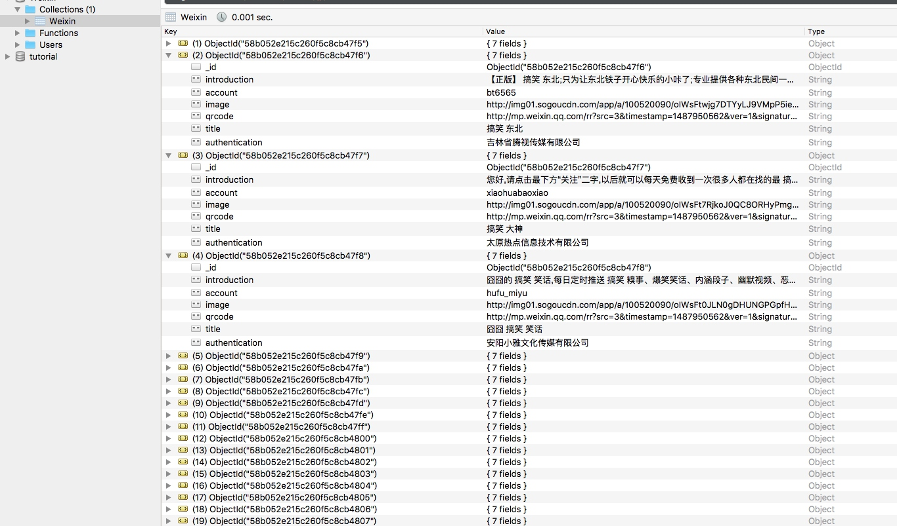

### 使用代理爬取微信公众号文章

#### 本节目标

输入关键词，爬取相关微信公众号信息及推送文章并保存到数据库。

#### 脉络梳理

爬取微信公众号最方便的方式是使用搜狗搜索引擎，搜狗有一个专门搜索微信的页面，[搜狗微信搜索](http://weixin.sogou.com/)

进入之后可以看到搜索文章和公众号的功能。


输入关键词搜索公众号，可以看到公众号列表。


再点击进入之后会进入到公众号详情页和文章推送列表。


首先观察一下请求，可以后台请求实际上是发了一个Get请求，请求参数有一个query内容就是关键字。


如果访问过于频繁，会出现输入验证码的页面，观察后台请求得到的302状态码，如果遇到这样的结果，我们就需要使用代理。


#### 实战演练

```python
import requests
from requests.exceptions import ConnectionError
from urllib.parse import urlencode

headers = {
    'Host': 'weixin.sogou.com',
    'User-Agent': 'Mozilla/5.0 (Macintosh; Intel Mac OS X 10_12_3) AppleWebKit/537.36 (KHTML, like Gecko) Chrome/56.0.2924.87 Safari/537.36'
}
base_url = 'http://weixin.sogou.com/weixin?'

def get_page(url):
    try:
        response = requests.get(url, headers=headers, allow_redirects=False)
        if response.status_code == 200:
            print('Success')
        if response.status_code == 302:
            print('Need Proxy')
    except ConnectionError:
        print('Error Occurred')

def get_index_page(url):
    html = get_page(url)
    if html: parse_index_page()
    
def parse_index_page(html):
    pass    
    
def main():
    keyword = '搞笑',
    page = 1
    data = {
        '_sug_type_': '',
        's_from': 'input',
        '_sug_': 'n',
        'type': 1,
        'ie': 'utf-8',
        'query': keyword,
        'page': page
    }
    params = urlencode(data)
    url = base_url + params
    get_index_page(url)

main()
```

首先定义一个get_page方法，主要用来获取某个页面结果，如果状态码是200，则正常解析，如果出现302，则说明请求受到限制，需要更换代理。get_index_page则通过关键词和页码构造了请求url进行请求。

注意在请求时加了`allow_redirects=False`这个参数，防止自动处理重定向，如果不加，可能结果一直是200状态码。

最关键的方法就是修改get_page方法，处理两种不同的情况。

下面改写一下proxy方法：

```python
proxy = None
max_count = 5

def get_page(url, count=1):
    global proxy, max_count
    print('Now proxy', proxy)
    if count == max_count:
        print('Tried too many times')
        return None
    try:
        if proxy:
            proxies = {'http': 'http://' + proxy}
            print(proxies, url)
            response = requests.get(url, headers=headers, proxies=proxies, allow_redirects=False)
        else:
            response = requests.get(url, headers=headers, allow_redirects=False)
        if response.status_code == 200:
            return response.text
        if response.status_code == 302:
            proxy = get_proxy()
            if proxy:
                print('Using proxy', proxy)
                return get_page(url)
            else:
                print('Get proxy failed')
                return None
    except ConnectionError:
        print('Error Occurred')
        count += 1
        proxy = get_proxy()
        return get_page(url, count)
```

首先声明pxory变量为全局变量，表示当前使用的代理，初始为空。
在爬取过程中如果遇到302状态码就立即切换代理，将全局代理更新。这样一个可用代理在后续的爬取中将一直被沿用这个代理直到爬取失败。然后再更换下一个代理。将代理设置为全局变量比较方便，可以不用把proxy这个变量当作参数再次传递，简化代码的书写。

方法内部首先进行了判断，如果存在代理，那么就设置代理请求，不存在则直接请求。

如果遇到200状态码，即正常请求，则返回响应结果，如果遇到302状态码，即遇到了爬取限制，则获取一个新代理，然后重新执行爬取。

对于错误的处理，在这里设置了重试次数，如果这个页面多次尝试都会出现连接错误，则直接返回空。此时证明无法正常访问此网页，可能是本机网络问题、代理不可用或服务器错误，注意此时不是出现爬取限制，出现爬取限制会得到302状态码，而不会抛出链接错误异常。如果出现了这个异常，则将重试次数加1，然后重新请求。如果次数大于定义的max_count，则直接返回空，以这个url爬取失败而告终。

#### 解析内容

```python
def parse_index_page(html):
    doc = pq(html)
    items = doc('.news-box li').items()
    for item in items:
        image = item.find('.img-box img').attr('src')
        title = item.find('.tit').text()
        account = item.find('label[name="em_weixinhao"]').text()
        qrcode = item.find('.ew-pop img[height="104"]').attr('src')
        introduction = item.find('dl:nth-child(2) > dd').text()
        authentication = item.find('dl:nth-child(3) > dd').text()
        yield {'image': image, 'title': title, 'account': account, 'qrcode': qrcode, 'introduction': introduction,
               'authentication': authentication}
   next = doc('.p-fy #sogou_next').attr('href')
   yield urljoin(base_url, next) if next else None
```

在这里我们使用pyquery解析出了公众号的图像、标题、微信号、二维码、介绍、认证信息。另外我们还需要获取下一页的地址，解析文档内容获得下一页链接并yield之即可。

那么这样一来就构建了一个生成器，parse_index_page既生成了抓取结果又生成了下一页的链接，那么怎样来进行下一步的处理呢？那就需要进行类型判断了。在get_index_page方法中判断如果是字典类型，那么就存入数据库，如果是链接形式，那么就接着请求。

```python
def get_index_page(url):
    html = get_page(url)
    if html:
        for result in parse_index_page(html):
            if isinstance(result, dict):
                save_to_mongo(result)
            elif isinstance(result, str) and re.match(r'^https?:/{2}\w.+$', result):
                get_index_page(result)
```

完整代码如下：

```python
import re
import requests
from requests.exceptions import ConnectionError
from urllib.parse import urlencode, urljoin
from pyquery import PyQuery as pq

import pymongo

MONGO_URL = 'localhost'
MONGO_DB = 'Weixin'
MONGO_TABLE = 'Weixin'

client = pymongo.MongoClient(MONGO_URL)
db = client[MONGO_DB]

headers = {
    'Host': 'weixin.sogou.com',
    'User-Agent': 'Mozilla/5.0 (Macintosh; Intel Mac OS X 10_12_3) AppleWebKit/537.36 (KHTML, like Gecko) Chrome/56.0.2924.87 Safari/537.36'
}


def save_to_mongo(result):
    if db[MONGO_TABLE].insert(result):
        print('Successfully Saved to Mongo', result)
        return True
    return False

def get_proxy():
    proxy_pool_url = 'http://127.0.0.1:5000/get'
    try:
        r = requests.get(proxy_pool_url)
        return r.text
    except ConnectionError:
        return None

proxy = None
max_count = 5
base_url = 'http://weixin.sogou.com/weixin?'

def get_page(url, count=1):
    global proxy, max_count
    print('Now proxy', proxy)
    if count == max_count:
        print('Tried too many times')
        return None
    try:
        if proxy:
            proxies = {'http': 'http://' + proxy}
            print(proxies, url)
            response = requests.get(url, headers=headers, proxies=proxies, allow_redirects=False)
        else:
            response = requests.get(url, headers=headers, allow_redirects=False)
        if response.status_code == 200:
            return response.text
        if response.status_code == 302:
            proxy = get_proxy()
            if proxy:
                print('Using proxy', proxy)
                return get_page(url)
            else:
                print('Get proxy failed')
                return None
    except ConnectionError:
        print('Error Occurred')
        count += 1
        proxy = get_proxy()
        return get_page(url, count)

def get_index_page(url):
    print('Crawling...', url)
    html = get_page(url)
    if html:
        for result in parse_index_page(html):
            if isinstance(result, dict):
                save_to_mongo(result)
            elif isinstance(result, str) and re.match(r'^https?:/{2}\w.+$', result):
                get_index_page(result)

def parse_index_page(html):
    doc = pq(html)
    items = doc('.news-box li').items()
    for item in items:
        image = item.find('.img-box img').attr('src')
        title = item.find('.tit').text()
        account = item.find('label[name="em_weixinhao"]').text()
        qrcode = item.find('.ew-pop img[height="104"]').attr('src')
        introduction = item.find('dl:nth-child(2) > dd').text()
        authentication = item.find('dl:nth-child(3) > dd').text()
        yield {'image': image, 'title': title, 'account': account, 'qrcode': qrcode, 'introduction': introduction,
               'authentication': authentication}
    next = doc('.p-fy #sogou_next').attr('href')
    yield urljoin(base_url, next) if next else None


def main(keyword):
    page = 1
    data = {
        '_sug_type_': '',
        's_from': 'input',
        '_sug_': 'n',
        'type': 1,
        'ie': 'utf-8',
        'query': keyword,
        'page': page
    }
    params = urlencode(data)
    url = base_url + params
    print('Crawling', url)
    get_index_page(url)
    
main('搞笑')
```





