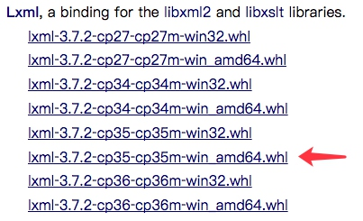

### Scrapy安装

Scrapy的安装有多种方式，它支持Python2.7版本及以上或Python3.3版本及以上。下面说明Python3环境下的安装过程。

Scrapy依赖的库比较多，至少需要依赖库有Twisted 14.0，lxml 3.4，pyOpenSSL 0.14。而在不同平台环境又各不相同，所以在安装之前最好确保把一些基本库安装好，尤其是Windows。

#### Anaconda

这种方法是一种比较简单的安装Scrapy的方法（尤其是对Windows来说），你可以使用该方法安装，也可以选用下文中专用平台的安装方法。

Anaconda是包含了常用的数据科学库的Python发行版本，如果没有安装，可以到[https://www.continuum.io/downloads](https://www.continuum.io/downloads)下载对应平台的包安装。

如果已经安装，那么可以轻松地通过`conda`命令安装Scrapy。

安装命令如下：

```
conda install Scrapy
```

#### Windows

* 安装lxml

最好的安装方式是通过wheel文件来安装，[http://www.lfd.uci.edu/~gohlke/pythonlibs/](http://www.lfd.uci.edu/~gohlke/pythonlibs/)，从该网站找到lxml的相关文件。假如是Python3.5版本，WIndows 64位系统，那就找到lxml‑3.7.2‑cp35‑cp35m‑win_amd64.whl 这个文件并下载，然后通过pip安装。



下载之后，运行如下命令安装：

```
pip3 install wheel
pip3 install lxml‑3.7.2‑cp35‑cp35m‑win_amd64.whl
```

即可完成lxml的安装，其他文件替换文件名即可。

* 安装zope.interface

到官方网站[https://pypi.python.org/pypi/zope.interface#downloads](https://pypi.python.org/pypi/zope.interface#downloads)下载对应版本的wheel文件，然后pip安装。比如Python 3.5版本，Windows 64位系统，就下载zope.interface-4.3.3-cp35-cp35m-win_amd64.whl。


然后安装wheel文件即可，命令如下：

```
pip3 install zope.interface-4.3.3-cp35-cp35m-win_amd64.whl
```

其他版本替换文件名即可。

* 安装pyOpenSSL

官方网站下载wheel文件，[https://pypi.python.org/pypi/pyOpenSSL#downloads](https://pypi.python.org/pypi/pyOpenSSL#downloads)，如当前最新版本名称是pyOpenSSL-16.2.0-py2.py3-none-any.whl，下载后安装即可。

```
pip3 install pyOpenSSL-16.2.0-py2.py3-none-any.whl 
```

* 安装Twisted

同理，[http://www.lfd.uci.edu/~gohlke/pythonlibs/#twisted](http://www.lfd.uci.edu/~gohlke/pythonlibs/#twisted)下载wheel文件，利用pip安装即可。
如Python 3.5版本，Windows 64位系统，下载 Twisted‑17.1.0‑cp35‑cp35m‑win_amd64.whl，然后pip安装。

```
pip3 install Twisted‑17.1.0‑cp35‑cp35m‑win_amd64.whl
```

* 安装pywin32

从官方网站 [https://sourceforge.net/projects/pywin32/files/pywin32/Build%20220/](https://sourceforge.net/projects/pywin32/files/pywin32/Build%20220/) 下载对应版本的安装包安装即可。

* 安装Scrapy

最后安装Scrapy即可，依然使用pip，命令如下：

```
pip3 install Scrapy
```

#### CentOS、RedHat、Fedora

* 依赖库安装

确保一些必须的类库已经安装，运行如下命令：

```
sudo yum groupinstall development tools
sudo yum install python34-devel epel-release libxslt-devel libxml2-devel openssl-devel
```

* 安装Scrapy

利用pip安装Scrapy即可，运行如下命令：

```
pip3 install Scrapy
```

#### Ubuntu、Debian、Deepin

* 依赖库安装

首先确保一些必须的类库已经安装，运行如下命令：

```
sudo apt-get install build-essential python3-dev libssl-dev libffi-dev libxml2 libxml2-dev libxslt1-dev zlib1g-dev
```

* 安装Scrapy

利用pip安装Scrapy即可，运行如下命令：

```
pip3 install Scrapy
```

#### Mac OS

* 依赖库安装

在Mac上构建Scrapy的依赖库需要C编译器以及开发头文件，它一般由Xcode提供，运行如下命令安装即可：

```
xcode-select --install
```

* 安装Scrapy

利用pip安装Scrapy即可，运行如下命令：

```
pip3 install Scrapy
```

#### 常见错误

* pkg_resources.VersionConflict: (six 1.5.2 (/usr/lib/python3/dist-packages), Requirement.parse('six>=1.6.0'))

six包版本过低，six包是一个提供兼容Python2和Python3的库，升级six包即可。

```
sudo pip3 install -U six
```

* c/_cffi_backend.c:15:17: fatal error: ffi.h: No such file or directory

缺少Libffi这个库。什么是libffi？“FFI” 的全名是 Foreign Function Interface，通常指的是允许以一种语言编写的代码调用另一种语言的代码。而Libffi库只提供了最底层的、与架构相关的、完整的”FFI”。

安装相应的库即可。

Ubuntu、Debian：

```
sudo apt-get install build-essential libssl-dev libffi-dev python3-dev
```

CentOS、RedHat:

```
sudo yum install gcc libffi-devel python-devel openssl-devel
```

* ImportError: No module named 'cryptography'

这是缺少加密的相关组件，利用pip安装即可。

```
sudo pip3 install cryptography
```
* ImportError: No module named 'packaging'

缺少packaging这个包，它提供了Python包的核心功能，利用pip安装即可。

```
sudo pip3 install packaging
```
* ImportError: No module named 'appdirs'

缺少appdirs这个包，它用来确定文件目录，利用pip单独安装即可。

```
sudo pip3 install appdirs
```
