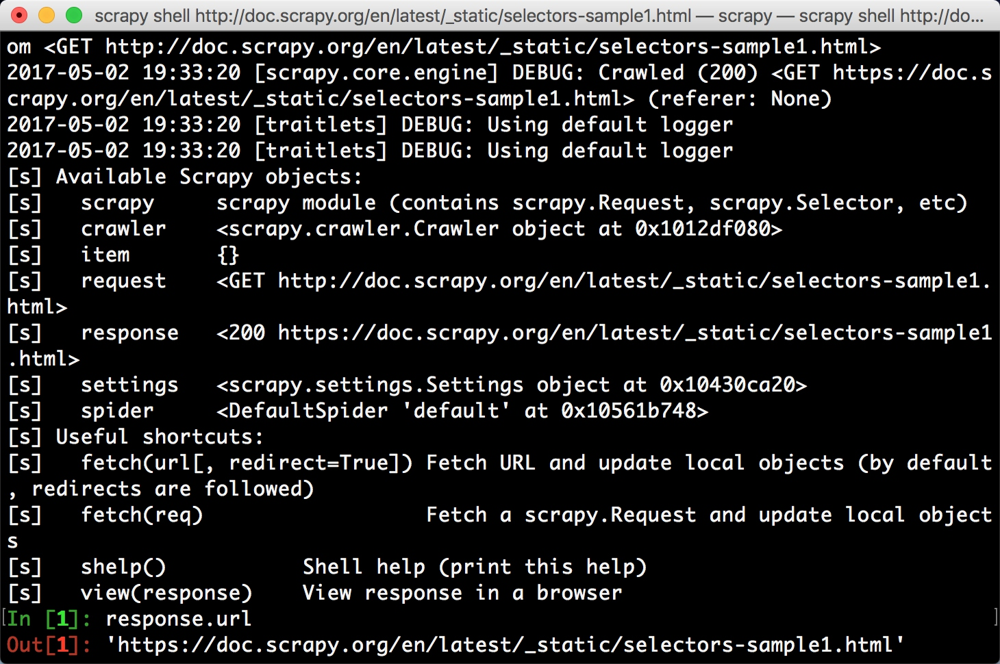

### Scrapy选择器用法

我们之前介绍了利用BeautifulSoup、PyQuery以及正则表达式来提取网页数据，但是在Scrapy中它也提供了自己的数据提取方法，即Selector（选择器），它是基于lxml来构建的，支持XPath选择器、CSS选择器以及正则表达式，功能全面，解析速度和准确度也是非常高的。

本节介绍一下Scrapy选择器的用法。

#### 直接使用

Scrapy Selector其实是一个可以独立使用的模块，我们可以直接利用这个类来构建一个选择器对象，然后调用它的相关方法如xpath()、css()等来提取数据。

比如有一段HTML代码，我们可以用如下方式构建Selector对象来提取数据，我们用一个实例来感受一下：

```python
from scrapy import Selector

body = '<html><head><title>Hello World</title></head><body></body></html>'
selector = Selector(text=body)
title = selector.xpath('//title/text()').extract_first()
print(title)
```

运行结果：

```
Hello World
```

我们在这里没有在Scrapy框架中运行，而是把Scrapy中的Selector单独拿出来使用了，构建的时候传入text这个参数，就生成了一个selector选择器对象，然后就可以像前面我们所用的Scrapy中的解析方式一样，调用xpath()、css()等方法来提取了。

在这里我们查找的是源代码中的title中的文本，通过在选择器最后加text()方法就可以实现文本的提取了。

以上就是Selector的直接使用方式，其实它也是同BeautifulSoup等库类似的强大的网页解析库，如果觉得方便的话，也可以在其他项目中直接使用Selector来提取数据。

接下来我们就用实例来详细讲解下Selector的用法。

#### Scrapy Shell

由于Selector主要是与Scrapy结合使用，例如Scrapy的回调函数中的参数response直接调用xpath()或者css()方法来提取数据，所以在这里我们借助于Scrapy Shell来模拟Scrapy请求的过程，拿到response对象，用它来讲解相关的提取方法。

在这里我们拿官方文档的一个样例页面来做演示。[http://doc.scrapy.org/en/latest/_static/selectors-sample1.html](http://doc.scrapy.org/en/latest/_static/selectors-sample1.html)

首先我们需要开启Scrapy Shell，在命令行下输入

```
scrapy shell http://doc.scrapy.org/en/latest/_static/selectors-sample1.html
```

这样我们就进入到了Scrapy Shell模式，这个过程其实是Scrapy为我们发起了一次请求，请求的链接就是刚才命令行下输入的链接，然后把一些可操作的变量传递给我们，如
request、response等等。



进入到Shell模式之后，我们可以在下方的输入命令调用对象的一些相关方法，回车之后会实时显示结果，这与Python的命令行交互模式是类似的。

页面的源码是这样的，接下来演示的实例都是以它为分析目标。

```html
<html>
 <head>
  <base href='http://example.com/' />
  <title>Example website</title>
 </head>
 <body>
  <div id='images'>
   <a href='image1.html'>Name: My image 1 <br /></a>
   <a href='image2.html'>Name: My image 2 <br /></a>
   <a href='image3.html'>Name: My image 3 <br /></a>
   <a href='image4.html'>Name: My image 4 <br /></a>
   <a href='image5.html'>Name: My image 5 <br /></a>
  </div>
 </body>
</html>
```

进入Scrapy Shell之后，我们将主要操作response这个变量来进行解析，而且因为我们解析的是HTML代码，Selector将自动使用HTML语法来分析。

response有一个属性selector，我们调用`response.selector`返回的内容就相当于用response的body构造一个Selector对象，通过它我们可以调用解析方法如xpath()、css()等等，通过传入XPath或CSS选择器就可以实现信息的提取。

我们用一个实例感受一下：

```python
>>> result = response.selector.xpath('//a')
>>> result
[<Selector xpath='//a' data='<a href="image1.html">Name: My image 1 <'>,
 <Selector xpath='//a' data='<a href="image2.html">Name: My image 2 <'>,
 <Selector xpath='//a' data='<a href="image3.html">Name: My image 3 <'>,
 <Selector xpath='//a' data='<a href="image4.html">Name: My image 4 <'>,
 <Selector xpath='//a' data='<a href="image5.html">Name: My image 5 <'>]
>>> type(result)
scrapy.selector.unified.SelectorList
```

可以看到打印结果的形式是Selector组成的列表，其实它是SelectorList类型，SelectorList和Selector都可以继续调用xpath()和css()等方法来进一步提取数据。

上面的例子我们提取了`<a>`标签，接下来我们尝试继续调用xpath()方法来提取里面包含的``，可以这么写：

```python
>>> result.xpath('./img')
[<Selector xpath='./img' data=''>,
 <Selector xpath='./img' data=''>,
 <Selector xpath='./img' data=''>,
 <Selector xpath='./img' data=''>,
 <Selector xpath='./img' data=''>]
```

这样我们就获得了`<a>`标签里面的所有``标签，结果正为5个。

值得注意的是，选择器的最前方加`.`才代表提取元素内部的数据，如果没有加点，则还是从根节点开始提取。比如此处我们用了`./img`的提取方式，则代表从`<a>`里面进行提取，如果此处我们用`//img`，则还是从`<html>`标签里面进行提取，所以这点非常值得注意。

我们刚才使用了`response.selector.xpath()`方法对数据进行了提取，其实为了方便，Scrapy提供了两个实用的快捷方法，`response.xpath()`和`response.css()`，它们二者完全等同于`response.selector.xpath()`和`response.selector.css()`，所以后面我们为了方便，统一直接调用response的xpath()和css()方法进行选择。


