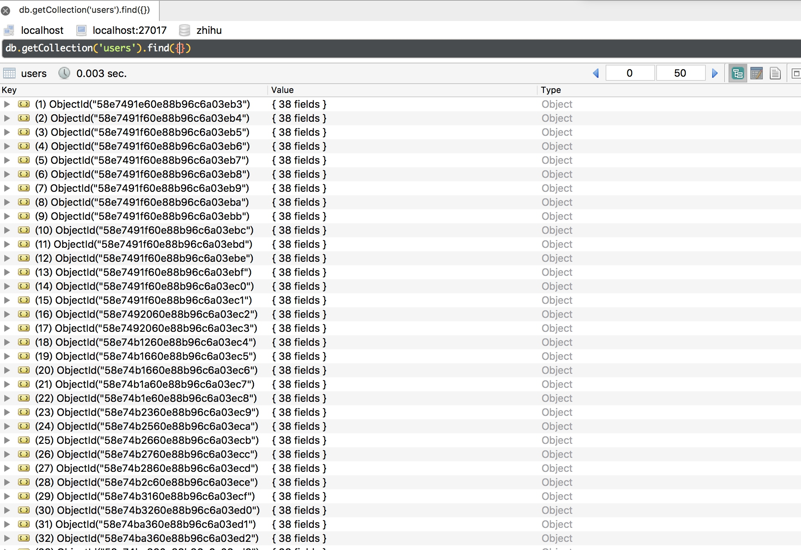

本节分享一下爬取知乎用户所有用户信息的Scrapy爬虫实战。

##  本节目标

本节要实现的内容有：

* 从一个大V用户开始，通过递归抓取粉丝列表和关注列表，实现知乎所有用户的详细信息的抓取。
* 将抓取到的结果存储到MongoDB，并进行去重操作。

## 思路分析

我们都知道每个人都有关注列表和粉丝列表，尤其对于大V来说，粉丝和关注尤其更多。

如果我们从一个大V开始，首先可以获取他的个人信息，然后我们获取他的粉丝列表和关注列表，然后遍历列表中的每一个用户，进一步抓取每一个用户的信息还有他们各自的粉丝列表和关注列表，然后再进一步遍历获取到的列表中的每一个用户，进一步抓取他们的信息和关注粉丝列表，循环往复，不断递归，这样就可以做到一爬百，百爬万，万爬百万，通过社交关系自然形成了一个爬取网，这样就可以爬到所有的用户信息了。当然零粉丝零关注的用户就忽略他们吧～

爬取的信息怎样来获得呢？不用担心，通过分析知乎的请求就可以得到相关接口，通过请求接口就可以拿到用户详细信息和粉丝、关注列表了。

接下来我们开始实战爬取。

## 环境需求

### Python3

本项目使用的Python版本是Python3，项目开始之前请确保你已经安装了Python3。

### Scrapy

Scrapy是一个强大的爬虫框架，安装方式如下：

```
pip3 install scrapy
```

### MongoDB

非关系型数据库，项目开始之前请先安装好MongoDB并启动服务。

### PyMongo

Python的MongoDB连接库，安装方式如下：

```
pip3 install pymongo
```

## 创建项目

安装好以上环境之后，我们便可以开始我们的项目了。
在项目开始之首先我们用命令行创建一个项目：
```
scrapy startproject zhihuuser
```

## 创建爬虫

接下来我们需要创建一个spider，同样利用命令行，不过这次命令行需要进入到项目里运行。

```
cd zhihuuser
scrapy genspider zhihu www.zhihu.com
```

## 禁止ROBOTSTXT_OBEY 

接下来你需要打开settings.py文件，将ROBOTSTXT_OBEY修改为False。

```python
ROBOTSTXT_OBEY = False
```
它默认为True，就是要遵守robots.txt 的规则，那么 robots.txt 是个什么东西呢？

通俗来说， robots.txt 是遵循 Robot 协议的一个文件，它保存在网站的服务器中，它的作用是，告诉搜索引擎爬虫，本网站哪些目录下的网页 不希望 你进行爬取收录。在Scrapy启动后，会在第一时间访问网站的 robots.txt 文件，然后决定该网站的爬取范围。

当然，我们并不是在做搜索引擎，而且在某些情况下我们想要获取的内容恰恰是被 robots.txt 所禁止访问的。所以，某些时候，我们就要将此配置项设置为 False ，拒绝遵守 Robot协议 ！

所以在这里设置为False。当然可能本次爬取不一定会被它限制，但是我们一般来说会首先选择禁止它。

## 尝试最初的爬取

接下来我们什么代码也不修改，执行爬取，运行如下命令：

```
scrapy crawl zhihu
```

你会发现爬取结果会出现这样的一个错误：

```
500 Internal Server Error
```

访问知乎得到的状态码是500，这说明爬取并没有成功，其实这是因为我们没有加入请求头，知乎识别User-Agent发现不是浏览器，就返回错误的响应了。

所以接下来的一步我们需要加入请求headers信息，你可以在Request的参数里加，也可以在spider里面的custom_settings里面加，当然最简单的方法莫过于在全局settings里面加了。

我们打开settings.py文件，取消DEFAULT_REQUEST_HEADERS的注释，加入如下的内容：

```python
DEFAULT_REQUEST_HEADERS = {
    'User-Agent': 'Mozilla/5.0 (Macintosh; Intel Mac OS X 10_12_3) AppleWebKit/537.36 (KHTML, like Gecko) Chrome/56.0.2924.87 Safari/537.36'
}
```

这个是为你的请求添加请求头，如果你没有设置headers的话，它就会使用这个请求头请求，添加了User-Agent信息，所以这样我们的爬虫就可以伪装浏览器了。

接下来重新运行爬虫。

```
scrapy crawl zhihu
```

这时你就会发现得到的返回状态码就正常了。

解决了这个问题，我们接下来就可以分析页面逻辑来正式实现爬虫了。

## 爬取流程

接下来我们需要先探寻获取用户详细信息和获取关注列表的接口。

回到网页，打开浏览器的控制台，切换到Network监听模式。

我们首先要做的是寻找一个大V，以轮子哥为例吧，它的个人信息页面网址是：[https://www.zhihu.com/people/excited-vczh](https://www.zhihu.com/people/excited-vczh)

首先打开轮子哥的首页


我们可以看到这里就是他的一些基本信息，我们需要抓取的就是这些，比如名字、签名、职业、关注数、赞同数等等。

接下来我们需要探索一下关注列表接口在哪里，我们点击关注选项卡，然后下拉，点击翻页，我们会在下面的请求中发现出现了
followees开头的Ajax请求。这个就是获取关注列表的接口。


我们观察一下这个请求结构


首先它是一个Get类型的请求，请求的URL是[https://www.zhihu.com/api/v4/members/excited-vczh/followees](https://www.zhihu.com/api/v4/members/excited-vczh/followees)，后面跟了三个参数，一个是include，一个是offset，一个是limit。

观察后可以发现，include是一些获取关注的人的基本信息的查询参数，包括回答数、文章数等等。

offset是偏移量，我们现在分析的是第3页的关注列表内容，offset当前为40。

limit为每一页的数量，这里是20，所以结合上面的offset可以推断，当offset为0时，获取到的是第一页关注列表，当offset为20时，获取到的是第二页关注列表，依次类推。

然后接下来看下返回结果：


可以看到有data和paging两个字段，data就是数据，包含20个内容，这些就是用户的基本信息，也就是关注列表的用户信息。
paging里面又有几个字段，is_end表示当前翻页是否结束，next是下一页的链接，所以在判读分页的时候，我们可以先利用is_end判断翻页是否结束，然后再获取next链接，请求下一页。

这样我们的关注列表就可以通过接口获取到了。

接下来我们再看下用户详情接口在哪里，我们将鼠标放到关注列表任意一个头像上面，观察下网络请求，可以发现又会出现一个Ajax请求。


可以看到这次的请求链接为[https://www.zhihu.com/api/v4/members/lu-jun-ya-1](https://www.zhihu.com/api/v4/members/lu-jun-ya-1)
后面又一个参数include，include是一些查询参数，与刚才的接口类似，不过这次参数非常全，几乎可以把所有详情获取下来，另外接口的最后是加了用户的用户名，这个其实是url_token，上面的那个接口其实也是，在返回数据中是可以获得的。


所以综上所述：
* 要获取用户的关注列表，我们需要请求类似 [https://www.zhihu.com/api/v4/members/{user}/followees?include={include}&offset={offset}&limit={limit}](https://www.zhihu.com/api/v4/members/{user}/followees?include={include}&offset={offset}&limit={limit}) 这样的接口，其中user就是该用户的url_token，include是固定的查询参数，offset是分页偏移量，limit是一页取多少个。
* 要获取用户的详细信息，我们需要请求类似 [https://www.zhihu.com/api/v4/members/{user}?include={include}](https://www.zhihu.com/api/v4/members/{user}?include={include}) 这样的接口，其中user就是该用户的url_token，include是查询参数。

理清了如上接口逻辑后，我们就可以开始构造请求了。

## 生成第一步请求

接下来我们要做的第一步当然是请求轮子哥的基本信息，然后获取轮子哥的关注列表了，我们首先构造一个格式化的url，将一些可变参数提取出来，然后需要重写start_requests方法，生成第一步的请求，接下来我们还需要根据获取到到关注列表做进一步的分析。

```python
import json
from scrapy import Spider, Request
from zhihuuser.items import UserItem

class ZhihuSpider(Spider):
    name = "zhihu"
    allowed_domains = ["www.zhihu.com"]
    user_url = 'https://www.zhihu.com/api/v4/members/{user}?include={include}'
    follows_url = 'https://www.zhihu.com/api/v4/members/{user}/followees?include={include}&offset={offset}&limit={limit}'
    start_user = 'excited-vczh'
    user_query = 'locations,employments,gender,educations,business,voteup_count,thanked_Count,follower_count,following_count,cover_url,following_topic_count,following_question_count,following_favlists_count,following_columns_count,answer_count,articles_count,pins_count,question_count,commercial_question_count,favorite_count,favorited_count,logs_count,marked_answers_count,marked_answers_text,message_thread_token,account_status,is_active,is_force_renamed,is_bind_sina,sina_weibo_url,sina_weibo_name,show_sina_weibo,is_blocking,is_blocked,is_following,is_followed,mutual_followees_count,vote_to_count,vote_from_count,thank_to_count,thank_from_count,thanked_count,description,hosted_live_count,participated_live_count,allow_message,industry_category,org_name,org_homepage,badge[?(type=best_answerer)].topics'
    follows_query = 'data[*].answer_count,articles_count,gender,follower_count,is_followed,is_following,badge[?(type=best_answerer)].topics'

    def start_requests(self):
        yield Request(self.user_url.format(user=self.start_user, include=self.user_query), self.parse_user)
        yield Request(self.follows_url.format(user=self.start_user, include=self.follows_query, limit=20, offset=0),
                      self.parse_follows)
```

然后我们实现一下两个解析方法parse_user和parse_follows。

```python
    def parse_user(self, response):
        print(response.text)
    def parse_follows(self, response):
        print(response.text)
```

最简单的实现他们的结果输出即可，然后运行观察结果。

```
scrapy crawl zhihu
```

这时你会发现出现了 

```
401 HTTP status code is not handled or not allowed
```

访问被禁止了，这时我们观察下浏览器请求，发现它相比之前的请求多了一个OAuth请求头。


## OAuth

它是Open Authorization的缩写。

OAUTH_token:OAUTH进行到最后一步得到的一个“令牌”，通过此“令牌”请求，就可以去拥有资源的网站抓取任意有权限可以被抓取的资源。

在这里我知乎并没有登陆，这里的OAuth值是
```
oauth c3cef7c66a1843f8b3a9e6a1e3160e20
```

经过我长久的观察，这个一直不会改变，所以可以长久使用，我们将它配置到DEFAULT_REQUEST_HEADERS里，这样它就变成了：

```python
DEFAULT_REQUEST_HEADERS = {
    'User-Agent': 'Mozilla/5.0 (Macintosh; Intel Mac OS X 10_12_3) AppleWebKit/537.36 (KHTML, like Gecko) Chrome/56.0.2924.87 Safari/537.36',
    'authorization': 'oauth c3cef7c66a1843f8b3a9e6a1e3160e20',
}
```

接下来如果我们重新运行爬虫，就可以发现可以正常爬取了。

##  parse_user

接下来我们处理一下用户基本信息，首先我们查看一下接口信息会返回一些什么数据。


可以看到返回的结果非常全，在这里我们直接声明一个Item全保存下就好了。

在items里新声明一个UserItem

```python
from scrapy import Item, Field

class UserItem(Item):
    # define the fields for your item here like:
    id = Field()
    name = Field()
    avatar_url = Field()
    headline = Field()
    description = Field()
    url = Field()
    url_token = Field()
    gender = Field()
    cover_url = Field()
    type = Field()
    badge = Field()

    answer_count = Field()
    articles_count = Field()
    commercial_question_count = Field()
    favorite_count = Field()
    favorited_count = Field()
    follower_count = Field()
    following_columns_count = Field()
    following_count = Field()
    pins_count = Field()
    question_count = Field()
    thank_from_count = Field()
    thank_to_count = Field()
    thanked_count = Field()
    vote_from_count = Field()
    vote_to_count = Field()
    voteup_count = Field()
    following_favlists_count = Field()
    following_question_count = Field()
    following_topic_count = Field()
    marked_answers_count = Field()
    mutual_followees_count = Field()
    hosted_live_count = Field()
    participated_live_count = Field()

    locations = Field()
    educations = Field()
    employments = Field()

```

所以在解析方法里面我们解析得到的response内容，然后转为json对象，然后依次判断字段是否存在，赋值就好了。

```python
result = json.loads(response.text)
item = UserItem()
for field in item.fields:
    if field in result.keys():
        item[field] = result.get(field)
yield item
```

得到item后通过yield返回就好了。

这样保存用户基本信息就完成了。

接下来我们还需要在这里获取这个用户的关注列表，所以我们需要再重新发起一个获取关注列表的request

在parse_user后面再添加如下代码：

```python
yield Request(
            self.follows_url.format(user=result.get('url_token'), include=self.follows_query, limit=20, offset=0),
            self.parse_follows)
```

这样我们又生成了获取该用户关注列表的请求。

## parse_follows

接下来我们处理一下关注列表，首先也是解析response的文本，然后要做两件事：
* 通过关注列表的每一个用户，对每一个用户发起请求，获取其详细信息。
* 处理分页，判断paging内容，获取下一页关注列表。

所以在这里将parse_follows改写如下：

```python
results = json.loads(response.text)

if 'data' in results.keys():
    for result in results.get('data'):
        yield Request(self.user_url.format(user=result.get('url_token'), include=self.user_query),
                      self.parse_user)

if 'paging' in results.keys() and results.get('paging').get('is_end') == False:
    next_page = results.get('paging').get('next')
    yield Request(next_page,
                  self.parse_follows)
```

这样，整体代码如下：

```python
# -*- coding: utf-8 -*-
import json

from scrapy import Spider, Request
from zhihuuser.items import UserItem


class ZhihuSpider(Spider):
    name = "zhihu"
    allowed_domains = ["www.zhihu.com"]
    user_url = 'https://www.zhihu.com/api/v4/members/{user}?include={include}'
    follows_url = 'https://www.zhihu.com/api/v4/members/{user}/followees?include={include}&offset={offset}&limit={limit}'
    start_user = 'excited-vczh'
    user_query = 'locations,employments,gender,educations,business,voteup_count,thanked_Count,follower_count,following_count,cover_url,following_topic_count,following_question_count,following_favlists_count,following_columns_count,answer_count,articles_count,pins_count,question_count,commercial_question_count,favorite_count,favorited_count,logs_count,marked_answers_count,marked_answers_text,message_thread_token,account_status,is_active,is_force_renamed,is_bind_sina,sina_weibo_url,sina_weibo_name,show_sina_weibo,is_blocking,is_blocked,is_following,is_followed,mutual_followees_count,vote_to_count,vote_from_count,thank_to_count,thank_from_count,thanked_count,description,hosted_live_count,participated_live_count,allow_message,industry_category,org_name,org_homepage,badge[?(type=best_answerer)].topics'
    follows_query = 'data[*].answer_count,articles_count,gender,follower_count,is_followed,is_following,badge[?(type=best_answerer)].topics'
    
    def start_requests(self):
        yield Request(self.user_url.format(user=self.start_user, include=self.user_query), self.parse_user)
        yield Request(self.follows_url.format(user=self.start_user, include=self.follows_query, limit=20, offset=0),
                      self.parse_follows)

    def parse_user(self, response):
        result = json.loads(response.text)
        item = UserItem()

        for field in item.fields:
            if field in result.keys():
                item[field] = result.get(field)
        yield item

        yield Request(
            self.follows_url.format(user=result.get('url_token'), include=self.follows_query, limit=20, offset=0),
            self.parse_follows)
            
    def parse_follows(self, response):
        results = json.loads(response.text)

        if 'data' in results.keys():
            for result in results.get('data'):
                yield Request(self.user_url.format(user=result.get('url_token'), include=self.user_query),
                              self.parse_user)

        if 'paging' in results.keys() and results.get('paging').get('is_end') == False:
            next_page = results.get('paging').get('next')
            yield Request(next_page,
                          self.parse_follows)
```

这样我们就完成了获取用户基本信息，然后递归获取关注列表进一步请求了。

重新运行爬虫，可以发现当前已经可以实现循环递归爬取了。

## followers

上面我们实现了通过获取关注列表实现爬取循环，那这里少不了的还有粉丝列表，经过分析后发现粉丝列表的api也类似，只不过把followee换成了follower，其他的完全相同，所以我们按照同样的逻辑添加followers相关信息，

最终spider代码如下：

```python
# -*- coding: utf-8 -*-
import json

from scrapy import Spider, Request
from zhihuuser.items import UserItem


class ZhihuSpider(Spider):
    name = "zhihu"
    allowed_domains = ["www.zhihu.com"]
    user_url = 'https://www.zhihu.com/api/v4/members/{user}?include={include}'
    follows_url = 'https://www.zhihu.com/api/v4/members/{user}/followees?include={include}&offset={offset}&limit={limit}'
    followers_url = 'https://www.zhihu.com/api/v4/members/{user}/followers?include={include}&offset={offset}&limit={limit}'
    start_user = 'excited-vczh'
    user_query = 'locations,employments,gender,educations,business,voteup_count,thanked_Count,follower_count,following_count,cover_url,following_topic_count,following_question_count,following_favlists_count,following_columns_count,answer_count,articles_count,pins_count,question_count,commercial_question_count,favorite_count,favorited_count,logs_count,marked_answers_count,marked_answers_text,message_thread_token,account_status,is_active,is_force_renamed,is_bind_sina,sina_weibo_url,sina_weibo_name,show_sina_weibo,is_blocking,is_blocked,is_following,is_followed,mutual_followees_count,vote_to_count,vote_from_count,thank_to_count,thank_from_count,thanked_count,description,hosted_live_count,participated_live_count,allow_message,industry_category,org_name,org_homepage,badge[?(type=best_answerer)].topics'
    follows_query = 'data[*].answer_count,articles_count,gender,follower_count,is_followed,is_following,badge[?(type=best_answerer)].topics'
    followers_query = 'data[*].answer_count,articles_count,gender,follower_count,is_followed,is_following,badge[?(type=best_answerer)].topics'

    def start_requests(self):
        yield Request(self.user_url.format(user=self.start_user, include=self.user_query), self.parse_user)
        yield Request(self.follows_url.format(user=self.start_user, include=self.follows_query, limit=20, offset=0),
                      self.parse_follows)
        yield Request(self.followers_url.format(user=self.start_user, include=self.followers_query, limit=20, offset=0),
                      self.parse_followers)

    def parse_user(self, response):
        result = json.loads(response.text)
        item = UserItem()

        for field in item.fields:
            if field in result.keys():
                item[field] = result.get(field)
        yield item

        yield Request(
            self.follows_url.format(user=result.get('url_token'), include=self.follows_query, limit=20, offset=0),
            self.parse_follows)

        yield Request(
            self.followers_url.format(user=result.get('url_token'), include=self.followers_query, limit=20, offset=0),
            self.parse_followers)

    def parse_follows(self, response):
        results = json.loads(response.text)

        if 'data' in results.keys():
            for result in results.get('data'):
                yield Request(self.user_url.format(user=result.get('url_token'), include=self.user_query),
                              self.parse_user)

        if 'paging' in results.keys() and results.get('paging').get('is_end') == False:
            next_page = results.get('paging').get('next')
            yield Request(next_page,
                          self.parse_follows)

    def parse_followers(self, response):
        results = json.loads(response.text)

        if 'data' in results.keys():
            for result in results.get('data'):
                yield Request(self.user_url.format(user=result.get('url_token'), include=self.user_query),
                              self.parse_user)

        if 'paging' in results.keys() and results.get('paging').get('is_end') == False:
            next_page = results.get('paging').get('next')
            yield Request(next_page,
                          self.parse_followers)

```

需要改变的位置有
* start_requests里面添加yield followers信息
* parse_user里面里面添加yield followers信息
* parse_followers做相应的的抓取详情请求和翻页。

如此一来，spider就完成了，这样我们就可以实现通过社交网络递归的爬取，把用户详情都爬下来。

## 小结

通过以上的spider，我们实现了如上逻辑：

* start_requests方法，实现了第一个大V用户的详细信息请求还有他的粉丝和关注列表请求。
* parse_user方法，实现了详细信息的提取和粉丝关注列表的获取。
* paese_follows，实现了通过关注列表重新请求用户并进行翻页的功能。
* paese_followers，实现了通过粉丝列表重新请求用户并进行翻页的功能。

## 加入pipeline

在这里数据库存储使用MongoDB，所以在这里我们需要借助于Item Pipeline，实现如下：

```python
class MongoPipeline(object):
    collection_name = 'users'

    def __init__(self, mongo_uri, mongo_db):
        self.mongo_uri = mongo_uri
        self.mongo_db = mongo_db

    @classmethod
    def from_crawler(cls, crawler):
        return cls(
            mongo_uri=crawler.settings.get('MONGO_URI'),
            mongo_db=crawler.settings.get('MONGO_DATABASE')
        )

    def open_spider(self, spider):
        self.client = pymongo.MongoClient(self.mongo_uri)
        self.db = self.client[self.mongo_db]

    def close_spider(self, spider):
        self.client.close()

    def process_item(self, item, spider):
        self.db[self.collection_name].update({'url_token': item['url_token']}, {'$set': dict(item)}, True)
        return item
```

比较重要的一点就在于process_item，在这里使用了update方法，第一个参数传入查询条件，这里使用的是url_token，第二个参数传入字典类型的对象，就是我们的item，第三个参数传入True，这样就可以保证，如果查询数据存在的话就更新，不存在的话就插入。这样就可以保证去重了。

另外记得开启一下Item Pileline

```
ITEM_PIPELINES = {
    'zhihuuser.pipelines.MongoPipeline': 300,
}
```

然后重新运行爬虫

```
scrapy crawl zhihu
```

这样就可以发现正常的输出了，会一直不停地运行，用户也一个个被保存到数据库。


看下MongoDB，里面我们爬取的用户详情结果。



到现在为止，整个爬虫就基本完结了，我们主要通过递归的方式实现了这个逻辑。存储结果也通过适当的方法实现了去重。

## 更高效率

当然我们现在运行的是单机爬虫，只在一台电脑上运行速度是有限的，所以后面我们要想提高抓取效率，需要用到分布式爬虫，在这里需要用到Redis来维护一个公共的爬取队列。

更多的分布式爬虫的实现可以查看[自己动手，丰衣足食！Python3网络爬虫实战案例](https://edu.hellobi.com/course/157)


