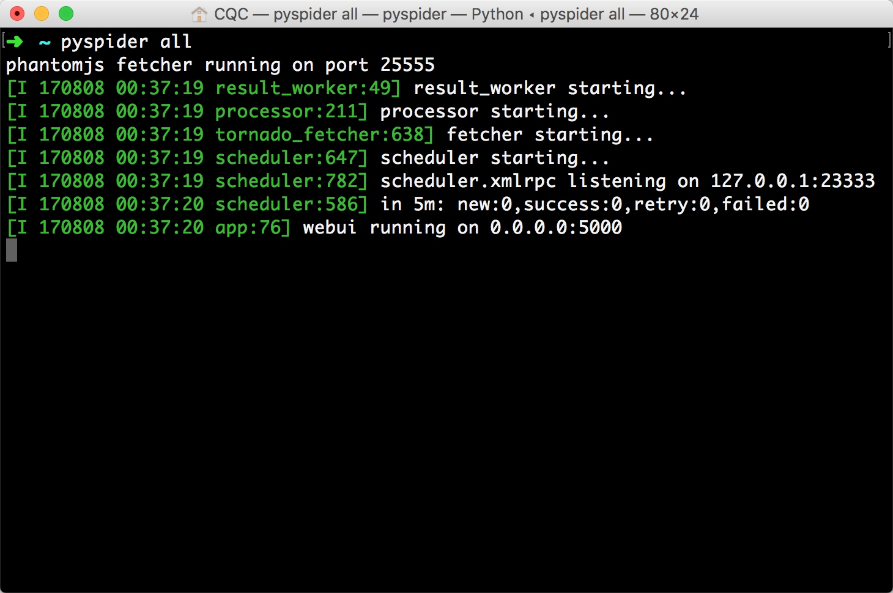
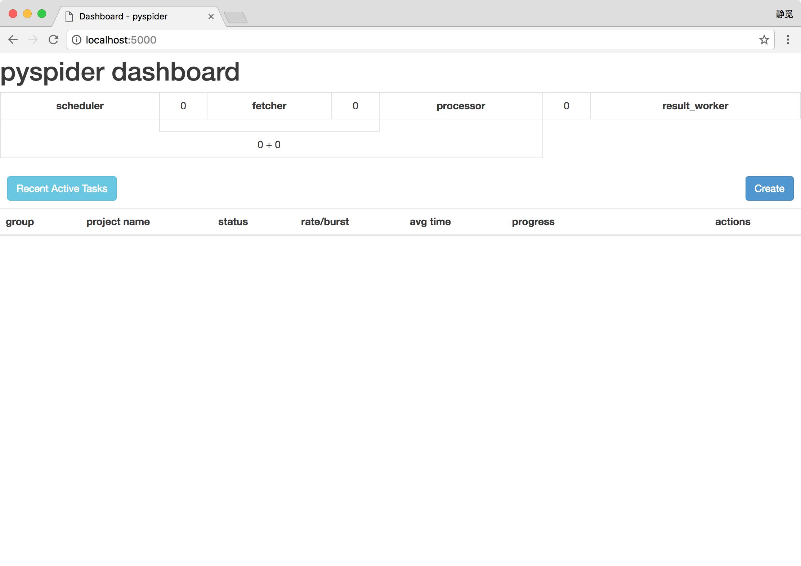
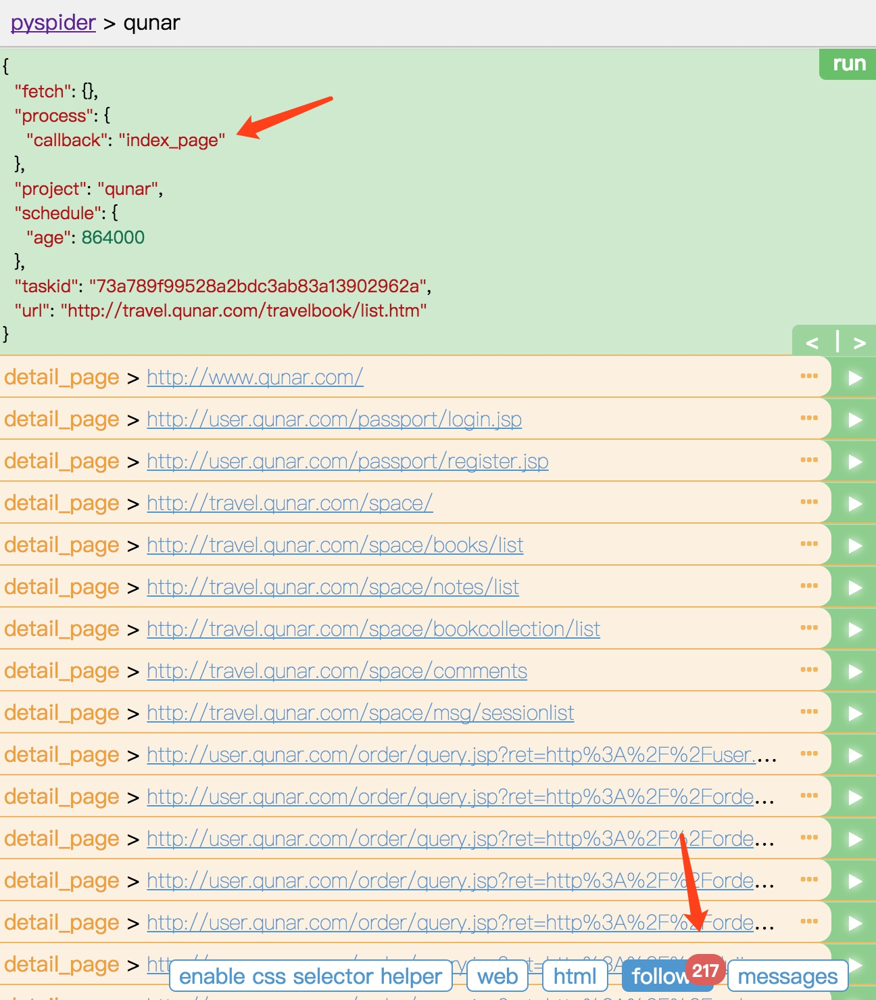
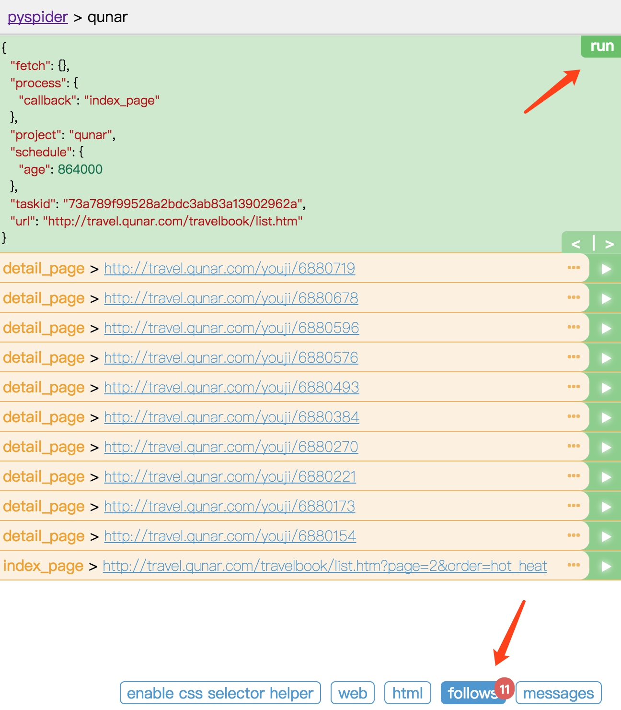
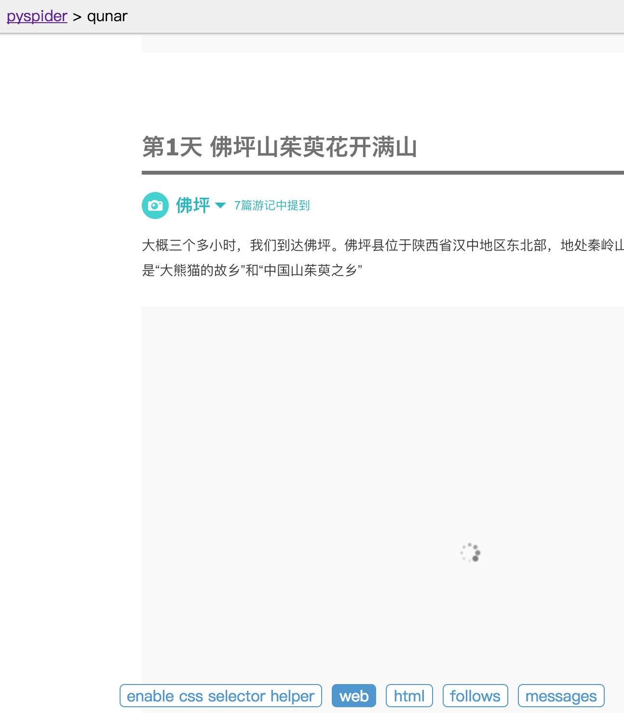
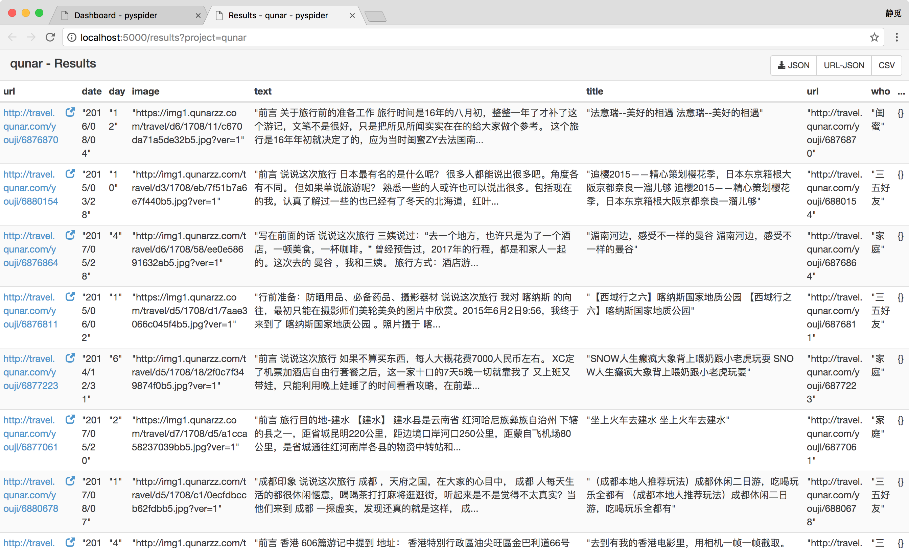

# PySpider的基本使用

本节用一个实例来讲解一下PySpider的基本用法。

## 环境准备

需要安装好PySpider和PhantomJS。

## 本节目标

本节我们要爬取的目标是去哪儿网的旅游攻略，链接为：[http://travel.qunar.com/travelbook/list.htm](http://travel.qunar.com/travelbook/list.htm)，将所有攻略的作者、标题、出发日期、人均费用、攻略正文等保存下来，存储到MongoDB，通过这个实例我们主要熟悉一下PySpider的基本用法。

## 实战

首先我们执行如下命令启动PySpider：

```
pyspider all
```
运行效果如图所示：




这样可以启动PySpider的所有组件，包括PhantomJS、ResultWorker、Processer、Fetcher、Scheduler、WebUI，这些都是PySpider运行必备的组件，可以看到最后一行输出提示WebUI运行在5000端口上运行起来了，此时我们可以打开浏览器，输入链接：[http://localhost:5000](http://localhost:5000)，这这时我们会看到如下页面：




此页面便是PySpider的WebUI，我们可以用它来管理项目、编写代码、在线调试、监控任务等等，功能强大，简便易用。

那么接下来我们先新建一个项目，点击右边的Create按钮，会弹出一个浮窗，在这里我们输入项目的名称和爬取的链接，然后再点击Create按钮，这样就成功创建了一个项目，如图所示：


接下来我们会看到PySpider的项目编辑和调试页面，如图所示：


其中左侧就是代码的调试页面，我们可以点击左侧右上角的run来单步调试我们的爬虫程序，同时在左侧下半部分可以预览当前的爬取页面。右侧是代码编辑页面，我们可以在右侧直接编辑代码和保存代码，不需要借助于IDE。

我们可以注意到在右侧PySpider已经帮我们生成了一段代码，其内容如下：

```python
from pyspider.libs.base_handler import *

class Handler(BaseHandler):
    crawl_config = {
    }

    @every(minutes=24 * 60)
    def on_start(self):
        self.crawl('http://travel.qunar.com/travelbook/list.htm', callback=self.index_page)

    @config(age=10 * 24 * 60 * 60)
    def index_page(self, response):
        for each in response.doc('a[href^="http"]').items():
            self.crawl(each.attr.href, callback=self.detail_page)

    @config(priority=2)
    def detail_page(self, response):
        return {
            "url": response.url,
            "title": response.doc('title').text(),
        }
```

这里的Handler就是PySpider爬虫的主类，我们可以在此处定义爬取、解析、存储的逻辑，整个爬虫的功能只需要一个Handler即可完成。

接下来我们可以看到一个crawl_config属性，我们可以将本项目爬到此爬取配置统一定义到这里，如定义Headers、设置代理等等，配置之后全局生效。

然后接下来就是on_start()方法，这个方法是爬取入口，初始的爬取请求会在这里产生，通过 crawl()方法即可新建一个爬取请求，第一个参数是爬取的URL，由于我们在新建项目的时候指定了URL，所以在这里自动替换成了我们所定义的URL，同时crawl()方法还有一个参数叫做callback，它指定了这个页面爬取成功后用哪个方法进行解析，此处指定为index_page()方法，意思就是说如果这个URL对应的页面爬取成功了，那就将Response交给index_page()方法解析。

index_page()方法恰好接收这个Response参数，在这里Response对接了PyQuery，我们直接调用doc()方法传入相应的CSS选择器就可以像PyQuery一样解析此页面，在这里默认是 a[href^="http“]，也就是说它解析了页面的所有链接，然后将其遍历，再次调用了crawl()方法生成了新的爬取请求，同时再指定了callback为detail_page，意思是说这些页面爬取成功了就调用detail_page()方法解析。所以index_page()在这里就实现了两个功能，一是将爬取的结果进行解析，二是生成新的爬取请求。

而同样的道理，detail_page()同样接收Response作为参数，在这里detail_page()抓取的就是详情页的信息，所以在这里就不会生成新的请求了，这里就只对Response对象做解析即可，解析之后将结果以字典的形式返回。当然在这里我们也可以做下后续处理，如将结果保存到数据库等。

以上便是PySpider运行的基本流程，流程看起来非常简单，那么接下来我们改写一下代码来实现攻略的爬取吧。

首先我们现在可以先点击坐栏右上角的run按钮，这时即可看到在页面下方follows便会出现一个标注，包含一个数字1，这代表有新的爬取请求产生，如图所示：


同时我们可以在左栏左上角会出现当前run的配置文件，可以看到这里有一个callback为on_start，这就证明我们点击了run之后实际上是执行了on_start()方法，而在on_start()方法中我们利用crawl()方法生成了一个爬取请求，那下方的follows部分的数字1就代表了这一个爬取请求。

接下来我们再接着点击下方的follows按钮，即可看到我们生成的爬取请求的链接，于此同时在它的右侧还有一个箭头按钮，如图所示：


点击它我们就可以对此链接进行爬取，也就是爬取攻略的首页内容，点击之后我们即看到了如下结果：



这时我们注意到在上方的callback已经变成了index_page，这就代表当前运行了index_page()方法，index_page()接收到的response参数就是刚才我们生成的第一个爬取请求的Response对象，在index_page()方法里通过doc()方法，传入了提取所有a节点的CSS选择器，然后获取了它的属性href，这样实际上就是获取了第一个爬取页面中的所有链接，然后在index_page()方法里遍历了所有链接，同时总是crawl()方法，就把这一个个的链接构造成新的爬取请求了，所以我们可以在最下方follows按钮部分看到有217的数字标记，这代表新生成了217个爬取请求，同时这些请求的URL都呈现在当前页面了。

此时我们再点击下方的web按钮，即可预览当前爬取结果的页面，如图所示：


可以看到当前看到的页面结果和浏览器看到的几乎是完全一致的，在这里我们可以方便地查看页面请求的结果。

另外点击html按钮即可查看当前页面的源代码，如图所示：


如果解析时需要分析代码的结构可以直接参考页面源码，也是非常有用的。

我们刚才在index_page()方法中是提取了所有的链接并生成了新的爬取请求，但是很明显我们需要爬取的肯定不是所有的链接，我们只需要攻略详情的页面链接就够了，所以在这里我们需要将当前index_page()里提取链接时的CSS选择器修改一下。

接下来就需要另外一个工具了，我们可以首先切换到web页面，然后下拉之后找到攻略的标题，然后点击下方的 enable css selector helper，随后在页面中点击标题，这时候我们可以看到标题外多了一个红框，同时在上方出现了一个CSS选择器，那么这就是当前标题对应的CSS选择器，如图所示：


这时我们可以在右侧代码中选中要更改的区域，然后点击左栏的右箭头，此时在上方出现的标题的CSS选择器就会被替换到右侧代码中了，如图所示：


这样我们就成功完成了CSS选择器的替换，非常便捷。

这时我们再重新点击左栏右上角的run按钮，即可重新执行index_page()方法，这时我们就可以观察到此时的follows就变成了10个，也就是说现在我们提取的就只有当前页面的攻略，每页10个，所以这里就显示为10个，如图所示：


不过其实还不够，因为我们现在抓取的是第一页的内容，我们还需要抓取后续页面，所以这里我们还需要一个爬取链接，那就是爬取下一页的攻略列表页面，所以在这里再利用crawl()方法添加一个下一页的爬取请求，在index_page()方法里面添加如下代码，然后点击save保存，代码如下；

```python
next = response.doc('.next').attr.href
self.crawl(next, callback=self.index_page)
```

在这里我们利用CSS选择器选中了下一页的链接，然后获取了它的href属性，也就获取了页面的URL，然后将其传给crawl()方法，同时指定回调函数，注意在这里回调函数仍然指定为index_page()方法，因为下一页的结构也是同此页相同，所以我们仍然用此方法解析。

接下来我们重新点击run按钮，这时我们应该就可以看到11个爬取请求了，在follows按钮上会显示11，这就代表我们成功添加了下一页的爬取请求了，如图所示：



好，那现在索引列表页的解析过程我们就完成了，下一步就是解析攻略详情页，我们任意选取一个详情页进入，点击前10个爬取请求中的任意一个的右箭头，执行详情页的爬取，如图所示：


这时我们切换到web页面预览一下效果，下拉之后发现头图正文中的一些图片一直都显示加载中，如图所示：




查看一下源代码也没有看到img节点。


出现此现象的原因是PySpider默认是发送的HTTP请求，请求的HTML文档中本身就是不包含img节点的，所以在这里没有显示。但是在浏览器中我们看到了图片是因为这张图片是后期经过JavaScript出现的，那这时我们该怎样来获取呢？

很幸运的是PySpider内部对接了PhantomJS，而PhantomJS的用法想必大家也有所了解了，那么我们怎样来调用呢？只需要修改一个参数即可。

在这里我们将 index_page()中生成抓取详情页的请求方法添加一个参数fetch_type，改写后index_page()变为如下内容：

```python
def index_page(self, response):
    for each in response.doc('li > .tit > a').items():
        self.crawl(each.attr.href, callback=self.detail_page, fetch_type='js')
    next = response.doc('.next').attr.href
    self.crawl(next, callback=self.index_page)
```
只是添加了一个fetch_type参数，接下来我们来实验一下它的抓取效果。

我们点击左栏上方的左箭头返回，重新调用index_page()方法生成新的爬取详情页的Request。


然后重新再点击新生成的详情页Request的爬取按钮，这时我们便可以看到页面变成了这样子：


图片被成功渲染出来了，这就是启用了PhantomJS渲染后的结果，我们只需要添加一个fetch_type参数即可，非常方便。

那么最后我们就是将详情页中我们需要的信息提取出来了，提取的过程在这里不再赘述，最终detail_page()方法改写如下：

```python
def detail_page(self, response):
    return {
        'url': response.url,
        'title': response.doc('#booktitle').text(),
        'date': response.doc('.when .data').text(),
        'day': response.doc('.howlong .data').text(),
        'who': response.doc('.who .data').text(),
        'text': response.doc('#b_panel_schedule').text(),
        'image': response.doc('.cover_img').attr.src
    }
```

在这里我们分别提取了页面的链接、标题、出行日期、出行天数、人物、攻略正文、头图信息，构造成一个字典。

重新运行，即可发现输出结果如下：


在左栏中输出了我们最终构造的字典信息，这就是一篇攻略的抓取结果。


随后我们返回爬虫的主页面，然后将爬虫的status设置成DEBUG或RUNNING，然后点击右侧的Run按钮即可开始爬取。


最左侧我们可以定义项目的分组，如果项目多了可以方便进行管理，rate/burst代表了当前的爬取速率。rate代表了1秒发出多少个请求，burst相当于流量控制中的令牌桶算法的令牌数，二者设置的越大，爬取速率越快，当然也不能无限大，需要考虑本机性能和爬取过快被封的问题。process中的5m、1h、1d指的是最近5分钟、1小时、1天内的请求情况，all代表所有的请求情况。请求在这里有颜色表示，蓝色的代表等待被执行的Request，绿色代表成功的Request、黄色代表请求失败后等待重试的Request、红色代表失败次数过多而被忽略的Request，在这里都可以直观地看到爬取的进度和请求情况。

另外点击Active Tasks即可查看到最近的请求的详细状况：


点击Reuslts即可查看到所有的爬取结果：



我们可以选择点击右上角的按钮即可获取数据的Json、CSV格式，直接下载即可，非常方便。

以上我们就介绍了PySpider的基本使用。本节代码：[https://github.com/Python3WebSpider/Qunar](https://github.com/Python3WebSpider/Qunar)

