### PySpider入门

本篇会通过介绍PySpider爬取美空网模特照片的案例来学习一下PySpider的用法。

#### 本篇目标

爬取美空网的模特照片并保存到本地。
爬取地址：[http://www.moko.cc/channels/post/23/1.html](http://www.moko.cc/channels/post/23/1.html)

#### 启动PySpider

首先选定一个目录，启动PySpider时它会创建一个data文件夹，其中存储了项目，任务，抓取结果等内容，每次启动前确保data文件夹在启动时的目录下，这样才能保证每次启动时能读取到之前的项目，调度状态等。

启动PySpider很简单，输入如下命令：

```
pyspider all
```

该命令会启动PySpider所有组件。

启动之后，打开[http://localhost:5000/](http://localhost:5000/)即可看到如下操作界面。

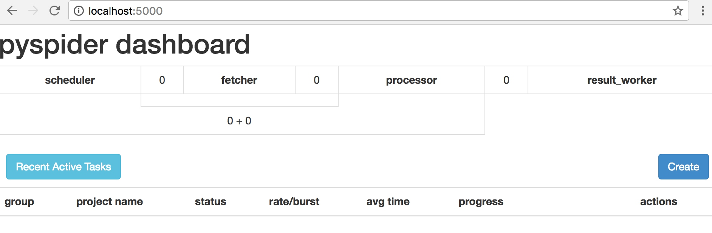

#### 创建项目

点击Create按钮，会弹出一个窗口，填入项目名称和起始地址即可，然后再点击Create。


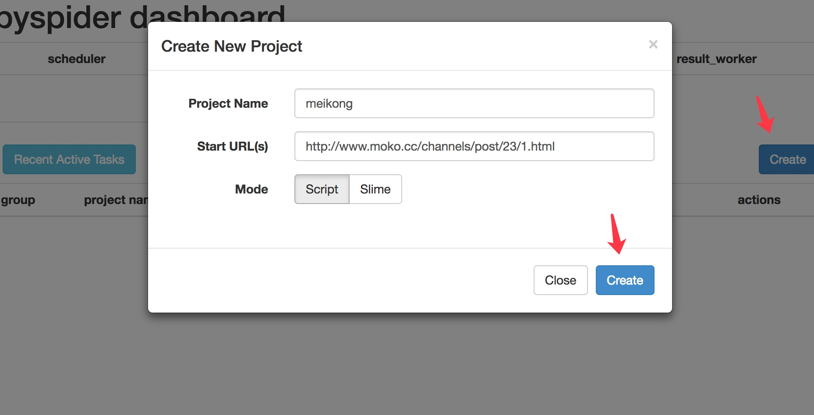

创建完成之后发现会进入到PySpider的项目管理页面，其中左侧上部分显示了抓取状态。

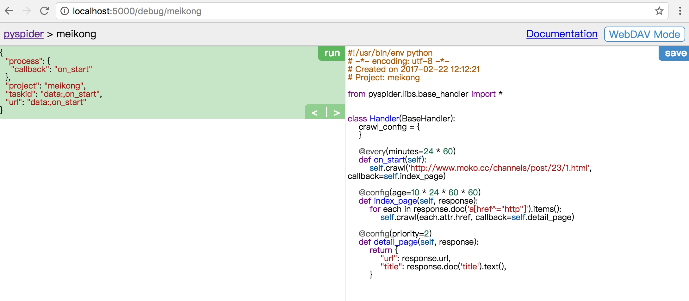


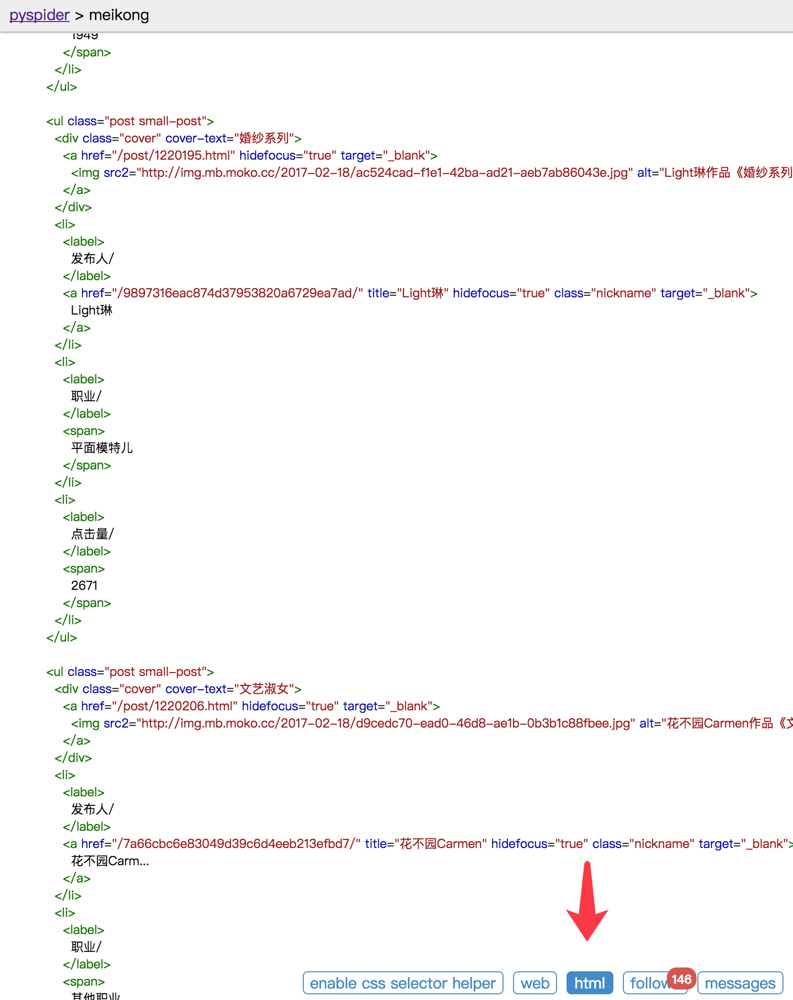


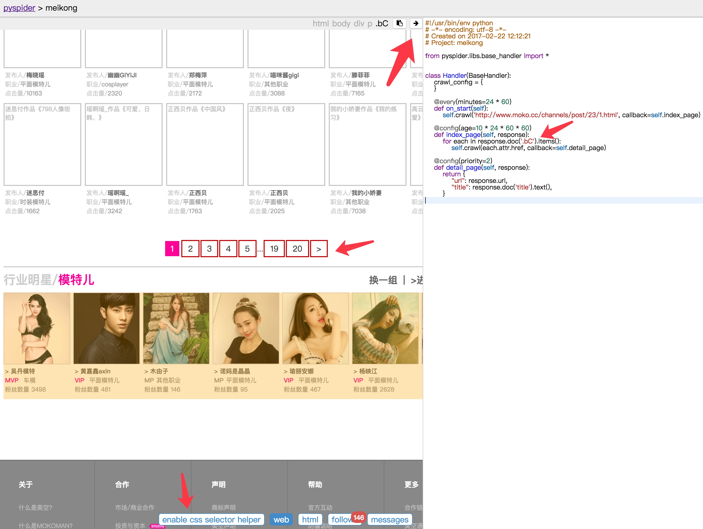


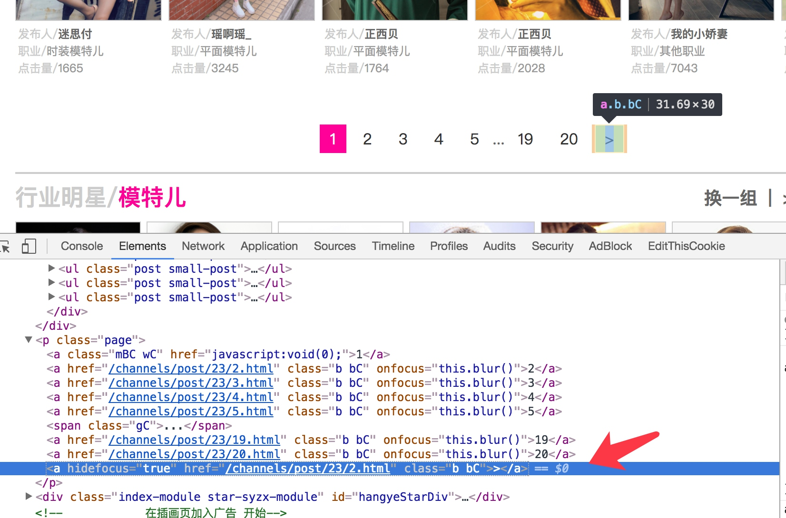

```python
@config(age=10 * 24 * 60 * 60)
def index_page(self, response):
    for item in response.doc('.small-post .cover a').items():
        self.crawl(item.attr.href, callback=self.detail_page)
    next =  response.doc('.page .bC:last-child').attr.href
    self.crawl(next, callback=self.index_page)
```

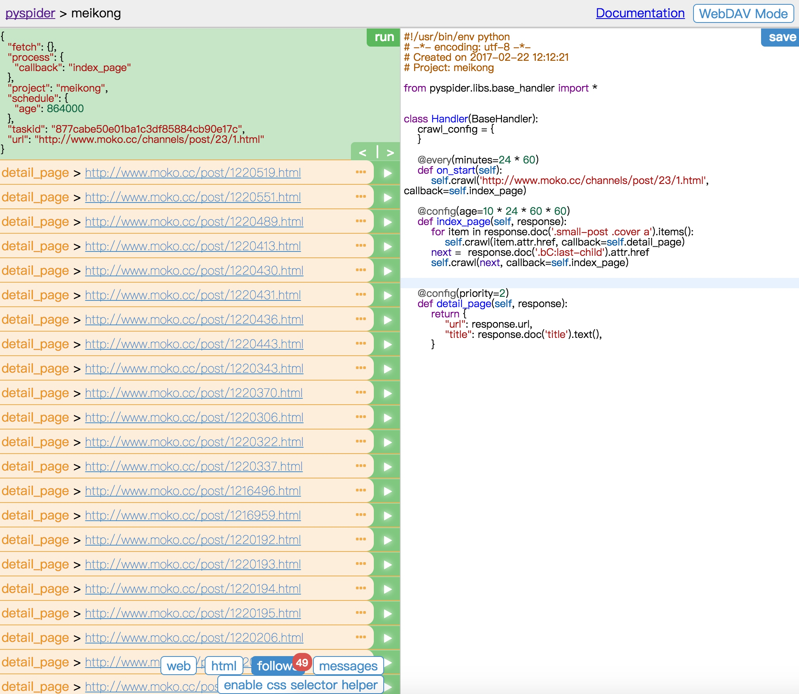

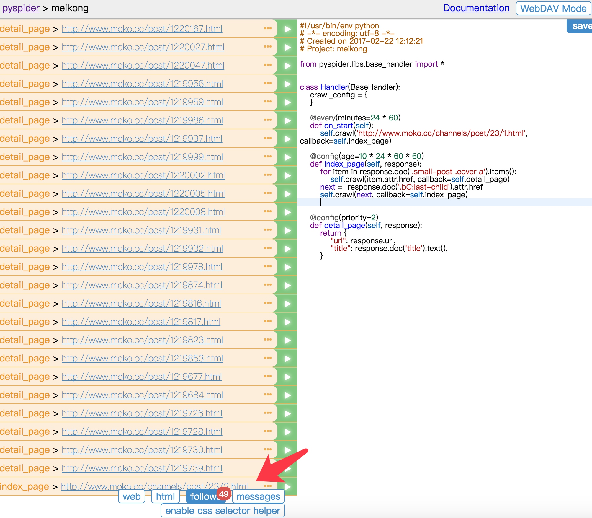


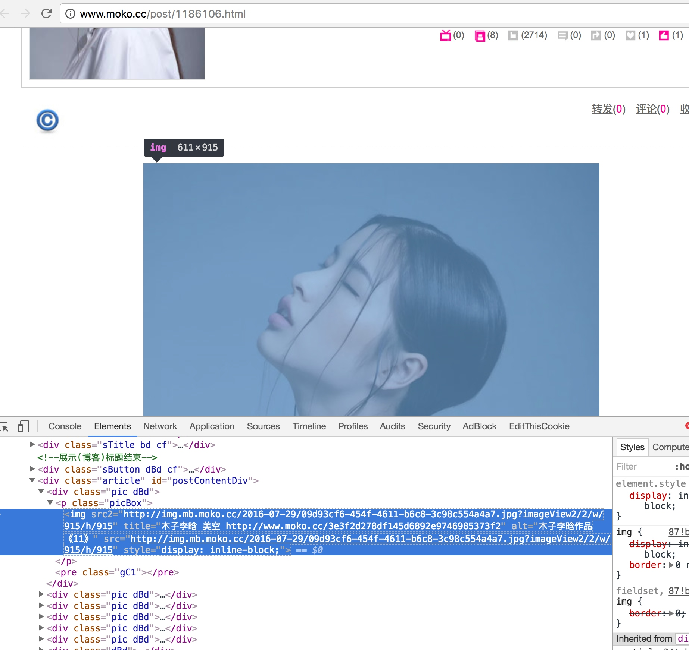

```python
@config(priority=2)
def detail_page(self, response):
    name = response.doc('#workNickName').text()
    for index, image in enumerate(response.doc('#postContentDiv .pic img').items()):
        self.crawl(image.attr.src2, callback=self.save_image, save={'name': name, 'index': index + 1})
```

```python
def save_image(self, response):
    content = response.content
    name = response.save['name']
    index = response.save['index']
    path = self.folder + name
    if not os.path.exists(path):
        os.makedirs(path)
    image_path = path + '/' + str(index) + '.jpg'
    f = open(image_path + '', 'wb')
    f.write(content)
    f.close()
```

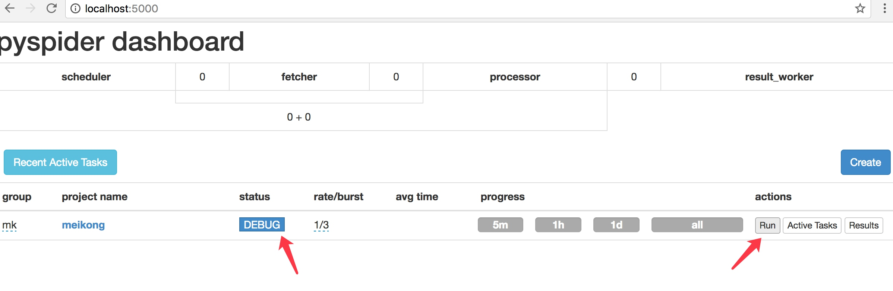


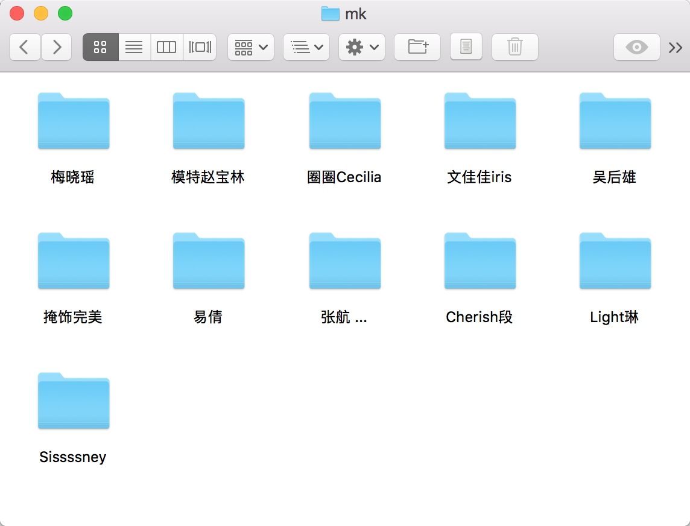


[https://github.com/Germey/MeiKong](https://github.com/Germey/MeiKong)
