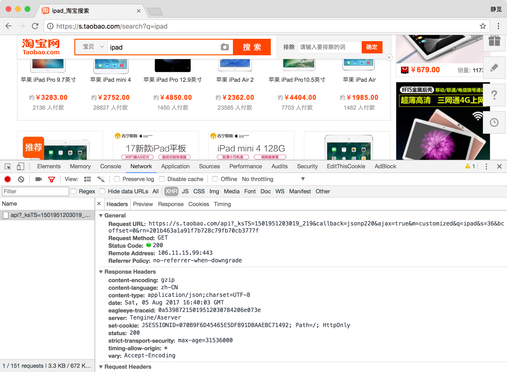
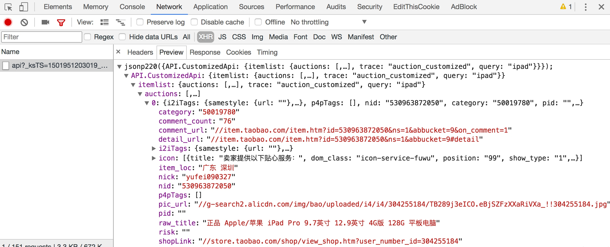
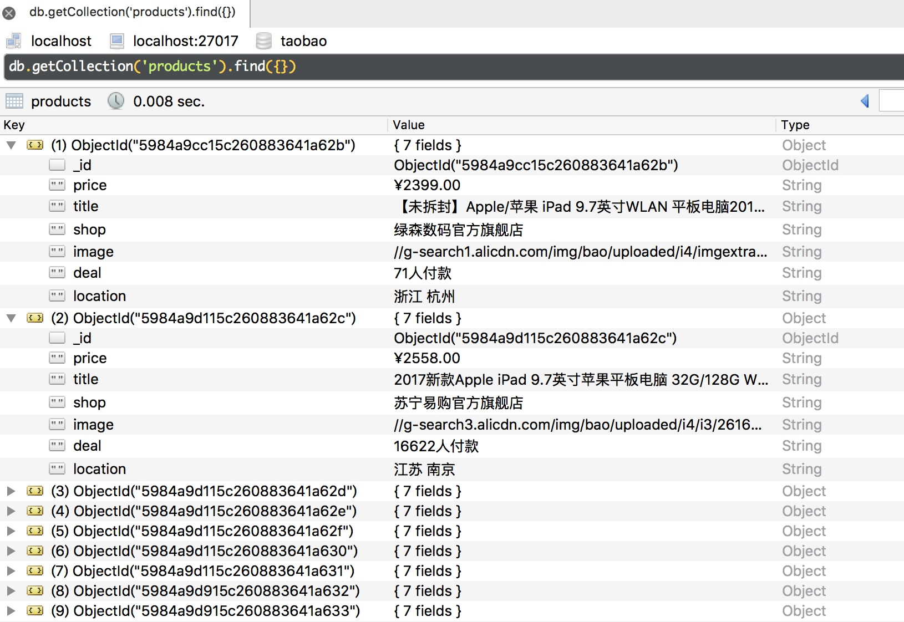

# 7.3 Selenium抓取淘宝商品

在前面一章我们已经成功尝试分析 Ajax 来抓取了相关数据，但是并不是所有的页面都是可以分析 Ajax 来就可以完成抓取的，比如淘宝。它的整个页面数据确实也是通过Ajax获取的，但是这些 Ajax 接口参数比较复杂，可能会包含加密密钥等参数，所以我们如果想自己构造 Ajax 参数是比较困难的，对于这种页面我们最方便快捷的抓取方法就是通过 Selenium，本节我们就来用 Selenium 来模拟浏览器操作，抓取淘宝的商品信息，并将结果保存到 MongoDB。

### 1. 本节目标

本节我们要利用 Selenium 抓取淘宝商品并用 PyQuery 解析得到商品的图片、名称、价格、购买人数、店铺名称、店铺所在地信息，并将其保存到MongoDB。

### 2. 准备工作

本节首先以 Chrome 为例来讲解 Selenium 的用法，在本节开始之前请确保已经正确安装好了 Chrome 浏览器并配置好了 ChromeDriver，另外还需要正确安装好 Python 的 Selenium 库，最后还对接了 PhantomJS 和 Firefox，请确保安装好了 PhantomJS 和 Firefox 并配置好了 GeckoDriver，如上环境配置过程均可参考第一章的说明。

### 3. 接口分析

首先我们来看下淘宝的接口，看看它的接口相比一般 Ajax 多了怎样的内容。

打开淘宝页面，搜索一个商品，比如 iPad，此时打开开发者工具，截获 Ajax 请求，我们可以发现会获取商品列表的接口。



它的链接包含了几个 GET 参数，如果我们要想构造 Ajax 链接直接请求再好不过了，它的返回内容是 Json 格式。



但是这个 Ajax 接口包含了几个参数，其中 _ksTS、rn 参数不能直接发现其规律，如果我们要去探寻它的生成规律也不是做不到，但这样相对会比较繁琐，所以如果我们直接用Selenium 来模拟浏览器的话就不需要再关注这些接口参数了，只要在浏览器里面可以看到的我们都可以爬取。这也是为什么我们选用 Selenium 爬取淘宝的原因。

### 4. 页面分析

我们本节的目标是爬取商品信息，例如：


这样的一个结果就包含了一个商品的基本信息，包括商品图片、名称、价格、购买人数、店铺名称、店铺所在地，我们要做的就是将这些信息都抓取下来。

抓取入口就是淘宝的搜索页面，这个链接是可以直接构造参数访问的，例如如果搜索 iPad，就可以直接访问：[https://s.taobao.com/search?q=iPad](https://s.taobao.com/search?q=iPad)，呈现的就是第一页的搜索结果，如图所示：


如果想要分页的话，我们注意到在页面下方有一个分页导航，包括前 5 页的链接，也包括下一页的链接，同时还有一个输入任意页码跳转的链接，如图所示：


在这里商品搜索结果一般最大都为 100 页，我们要获取的每一页的内容，只需要将页码从 1 到 100 顺次遍历即可，页码数是确定的。所以在这里我们可以直接在页面跳转文本框中输入要跳转的页码，然后点击确定按钮跳转即可到达页码页码对应的页面。

在这里我们不直接点击下一页的原因是：一旦爬取过程中出现异常退出，比如到了 50 页退出了，我们如果点击下一页就无法快速切换到对应的后续页面，而且爬取过程中我们也需要记录当前的页码数，而且一旦点击下一页之后页面加载失败，我们还需要做异常检测检测当前页面是加载到了第几页，因此整个流程相对复杂，所以在这里我们直接选用跳页的方式来爬取页面。

当我们成功加载出某一页商品列表时，利用 Selenium 即可获取页面源代码，然后我们再用相应的解析库解析即可，在这里我们选用 PyQuery 进行解析。

下面我们用代码来实现一下整个抓取过程。

### 5. 获取商品列表

首先我们需要构造一个抓取的 URL：[https://s.taobao.com/search?q=iPad](https://s.taobao.com/search?q=iPad)，URL 非常简洁，参数 q 就是要搜索的关键字，我们只需要改变链接的参数 q 即可获取不同商品的列表，在这里我们将商品的关键字定义成一个变量，然后构造出这样的一个 URL。

构造出 URL 之后我们就需要用 Selenium 进行抓取了，我们实现如下抓取列表页的方法：

```python
from selenium import webdriver
from selenium.common.exceptions import TimeoutException
from selenium.webdriver.common.by import By
from selenium.webdriver.support import expected_conditions as EC
from selenium.webdriver.support.wait import WebDriverWait
from urllib.parse import quote

browser = webdriver.Chrome()
wait = WebDriverWait(browser, 10)
KEYWORD = 'iPad'

def index_page(page):
    """
    抓取索引页
    :param page: 页码
    """
    print('正在爬取第', page, '页')
    try:
        url = 'https://s.taobao.com/search?q=' + quote(KEYWORD)
        browser.get(url)
        if page > 1:
            input = wait.until(
                EC.presence_of_element_located((By.CSS_SELECTOR, '#mainsrp-pager div.form > input')))
            submit = wait.until(
                EC.element_to_be_clickable((By.CSS_SELECTOR, '#mainsrp-pager div.form > span.btn.J_Submit')))
            input.clear()
            input.send_keys(page)
            submit.click()
        wait.until(
            EC.text_to_be_present_in_element((By.CSS_SELECTOR, '#mainsrp-pager li.item.active > span'), str(page)))
        wait.until(EC.presence_of_element_located((By.CSS_SELECTOR, '.m-itemlist .items .item')))
        get_products()
    except TimeoutException:
        index_page(page)
```

在这里我们首先构造了一个 WebDriver 对象，使用的浏览器是 Chrome，然后指定一个关键词，如 iPad，然后我们定义了一个 get_index() 方法，用于抓取商品列表页。

在该方法里我们首先访问了这个链接，然后判断了当前的页码，如果大于 1 ，那就进行跳页操作，否则等待页面加载完成。

等待加载我们使用了 WebDriverWait 对象，它可以指定等待条件，同时指定一个最长等待时间，在这里指定为最长 10 秒。如果在这个时间内成功匹配了等待条件，也就是说页面元素成功加载出来了，那就立即返回相应结果并继续向下执行，否则到了最大等待时间还没有加载出来就直接抛出超时异常。

比如我们最终要等待商品信息加载出来，在这里就指定了 presence_of_element_located 这个条件，然后传入了  .m-itemlist .items .item 这个选择器，而这个选择器对应的页面内容就是每个商品的信息块，可以到网页里面查看一下。如果加载成功，就会执行后续的 get_products() 方法，提取商品信息。

关于翻页的操作，我们在这里是首先获取了页码输入框，赋值为 input，然后获取了提交按钮，赋值为 submit，分别是下图中的两个元素：


首先我们清空了输入框，调用 clear() 方法即可，随后调用 send_keys() 方法将页码填充到输入框中，然后点击确定按钮即可。

那么怎样知道有没有跳转到对应的页码呢？我们可以注意到成功跳转某一页后页码都会高亮显示：


我们只需要判断当前高亮的页码数是当前的页码数即可，所以在这里使用了另一个等待条件  text_to_be_present_in_element，它会等待某一文本出现在某一个节点里面即返回成功，在这里我们将高亮的页码节点对应的 CSS 选择器和当前要跳转的页码通过参数传递给这个等待条件，这样它就会检测当前高亮的页码节点里是不是我们传过来的页码数，如果是，那就证明页面成功跳转到了这一页，页面跳转成功。

那么这样，刚才我们所实现的 get_index() 方法就可以做到传入对应的页码，然后加载出对应页码的商品列表后，再去调用 get_products() 方法进行页面解析。

### 6. 解析商品列表

接下来我们就可以实现 get_products() 方法来解析商品列表了，在这里我们直接获取页面源代码，然后用 PyQuery 进行解析，实现如下：

```python
from pyquery import PyQuery as pq
def get_products():
    """
    提取商品数据
    """
    html = browser.page_source
    doc = pq(html)
    items = doc('#mainsrp-itemlist .items .item').items()
    for item in items:
        product = {
            'image': item.find('.pic .img').attr('data-src'),
            'price': item.find('.price').text(),
            'deal': item.find('.deal-cnt').text(),
            'title': item.find('.title').text(),
            'shop': item.find('.shop').text(),
            'location': item.find('.location').text()
        }
        print(product)
        save_to_mongo(product)
```

首先我们调用了 page_source 属性获取了页码的源代码，然后构造了 PyQuery 解析对象，首先我们提取了商品列表，使用的 CSS 选择器是 #mainsrp-itemlist .items .item，它会匹配到整个页面的每个商品，因此它的匹配结果是多个，所以在这里我们又对它进行了一次遍历，用 for 循环将每个结果分别进行解析，在这里每个结果我们用 for 循环把它赋值为 item 变量，每个 item 变量都是一个 PyQuery 对象，然后我们再调用它的 find() 方法，传入 CSS 选择器，就可以获取单个商品的特定内容了。

比如在这里我们查看一下商品信息源码，如图所示：


在这里我们观察一下商品图片的源码，它是一个 img 节点，包含了 id、class、data-src、alt、src等属性，在这里我们之所以可以看到这张图片是因为它的 src 属性被赋值为图片的 URL，在这里我们就把它的 src 属性提取出来就可以获取商品的图片了，不过这里我们还注意到有一个 data-src 属性，它的内容也是图片的 URL，观察后发现此 URL 是图片的完整大图，而 src 是压缩后的小图，所以这里我们抓取 data-src 属性来作为商品的图片。

所以我们需要先利用 find() 方法先找到图片的这个节点，然后再调用 attr() 方法获取商品的 data-src 属性即可，这样就成功提取了商品图片链接。然后我们用同样的方法提取商品的价格、成交量、名称、店铺、店铺所在地等信息，然后将所有提取结果赋值为一个字典，叫做 product，随后调用 save_to_mongo() 将其保存到 MongoDB 即可。

### 7. 保存到MongoDB

接下来我们再将商品信息保存到 MongoDB，实现如下：

```python
MONGO_URL = 'localhost'
MONGO_DB = 'taobao'
MONGO_COLLECTION = 'products'
client = pymongo.MongoClient(MONGO_URL)
db = client[MONGO_DB]
def save_to_mongo(result):
    """
    保存至MongoDB
    :param result: 结果
    """
    try:
        if db[MONGO_COLLECTION].insert(result):
            print('存储到MongoDB成功')
    except Exception:
        print('存储到MongoDB失败')
```

我们首先创建了一个 MongoDB 的连接对象，然后指定了数据库，在方法里随后指定了 Collection 的名称，然后直接调用 insert() 方法即可将数据插入到 MongoDB，此处的 result 变量就是在 get_products() 方法里传来的 product，包含了单个商品的信息，这样我们就成功实现了数据的插入。

### 8. 遍历每页

刚才我们所定义的 get_index() 方法需要接收一个参数 page，page 即代表页码数，所以在这里我们再实现页码遍历即可，代码如下：

```python
MAX_PAGE = 100
def main():
    """
    遍历每一页
    """
    for i in range(1, MAX_PAGE + 1):
        index_page(i)
```

实现非常简单，只需要调用一个 for 循环即可，在这里定义最大的页码数 100，range() 方法的返回结果就是 1 到 100 的列表，顺次遍历调用 index_page() 方法即可。

这样我们的淘宝商品爬虫就完成了，最后调用 main() 方法即可运行。

### 9. 运行

我们将代码运行起来，可以发现首先会弹出一个 Chrome 浏览器，然后顺次访问淘宝页面，然后控制台便会输出相应的提取结果，如图所示：


可以发现这些商品信息结果都是一个字典形式，然后被存储到了 MongoDB 里面。

我们再看一下 MongoDB 中的结果：



可以看到所有的信息都被保存到 MongoDB 里了，爬取成功。

### 10. 对接Firefox

要对接 Firefox 浏览器非常简单，只需要更改一处即可：

```python
browser = webdriver.Firefox()
```

更改了 browser 对象的创建方式，这样爬取的时候就会使用 Firefox 浏览器了。

### 11. 对接PhantomJS

但是此次爬取有个不太友好的地方就是 Chrome 和 Firefox浏览器必须要开启，确实不太方便，所以在这里我们还可以对接 PhantomJS，它是一个无界面浏览器，还是只需要将WebDriver 的声明修改一下即可。

修改如下：

```python
browser = webdriver.PhantomJS()
```

这样在抓取过程中就不会有浏览器弹出了。

另外我们还可以设置缓存和禁用图片加载的功能，进一步提高爬取效率，修改如下：

```python
SERVICE_ARGS = ['--load-images=false', '--disk-cache=true']
browser = webdriver.PhantomJS(service_args=SERVICE_ARGS)
```

这样我们就可以禁用 PhantomJS 的图片加载同时开启缓存，可以发现页面爬取速度进一步提升。

### 12. 本节代码

本节代码地址为：[https://github.com/Python3WebSpider/TaobaoProduct](https://github.com/Python3WebSpider/TaobaoProduct)。

### 13. 结语

本节我们用 Selenium 演示了淘宝页面的抓取，利用它我们不用再去分析 Ajax 请求，真正做到可见即可爬。