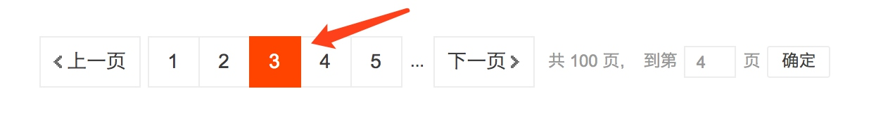
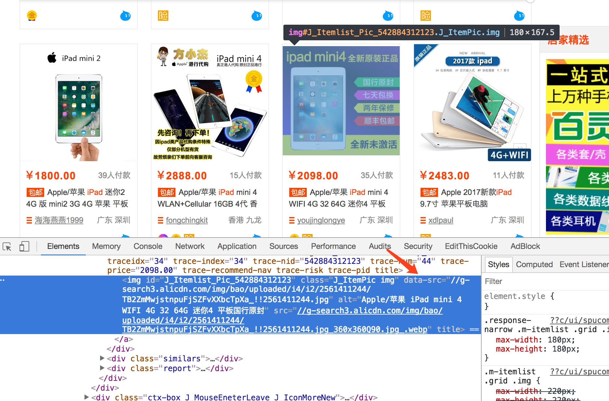

# 7.4 使用 Selenium 爬取淘宝商品

在前一章中，我们已经成功尝试分析 Ajax 来抓取相关数据，但是并不是所有页面都可以通过分析 Ajax 来完成抓取。比如，淘宝，它的整个页面数据确实也是通过 Ajax 获取的，但是这些 Ajax 接口参数比较复杂，可能会包含加密密钥等，所以如果想自己构造 Ajax 参数，还是比较困难的。对于这种页面，最方便快捷的抓取方法就是通过 Selenium。本节中，我们就用 Selenium 来模拟浏览器操作，抓取淘宝的商品信息，并将结果保存到 MongoDB。

### 1. 本节目标

本节中，我们要利用 Selenium 抓取淘宝商品并用 pyquery 解析得到商品的图片、名称、价格、购买人数、店铺名称和店铺所在地信息，并将其保存到 MongoDB。

### 2. 准备工作

本节中，我们首先以 Chrome 为例来讲解 Selenium 的用法。在开始之前，请确保已经正确安装好 Chrome 浏览器并配置好了 ChromeDriver；另外，还需要正确安装 Python 的 Selenium 库；最后，还对接了 PhantomJS 和 Firefox，请确保安装好 PhantomJS 和 Firefox 并配置好了 GeckoDriver。如果环境没有配置好，可参考第 1 章。

### 3. 接口分析

首先，我们来看下淘宝的接口，看看它比一般 Ajax 多了怎样的内容。

打开淘宝页面，搜索商品，比如 iPad，此时打开开发者工具，截获 Ajax 请求，我们可以发现获取商品列表的接口，如图 7-19 所示。


图 7-19 列表接口


它的链接包含了几个 GET 参数，如果要想构造 Ajax 链接，直接请求再好不过了，它的返回内容是 JSON 格式，如图 7-20 所示。


图 7-20 Json 数据

但是这个 Ajax 接口包含几个参数，其中_ksTS、rn 参数不能直接发现其规律，如果要去探寻它的生成规律，也不是做不到，但这样相对会比较烦琐，所以如果直接用 Selenium 来模拟浏览器的话，就不需要再关注这些接口参数了，只要在浏览器里面可以看到的，都可以爬取。这也是我们选用 Selenium 爬取淘宝的原因。

### 4. 页面分析

本节的目标是爬取商品信息。图 7-21 是一个商品条目，其中包含商品的基本信息，包括商品图片、名称、价格、购买人数、店铺名称和店铺所在地，我们要做的就是将这些信息都抓取下来。


图 7-21 商品条目

抓取入口就是淘宝的搜索页面，这个链接可以通过直接构造参数访问。例如，如果搜索 iPad，就可以直接访问 [https://s.taobao.com/search?q=iPad](https://s.taobao.com/search?q=iPad)，呈现的就是第一页的搜索结果，如图 7-22 所示：


图 7-22 搜索结果

在页面下方，有一个分页导航，其中既包括前 5 页的链接，也包括下一页的链接，同时还有一个输入任意页码跳转的链接，如图 7-23 所示。


图 7-23 分页导航

这里商品的搜索结果一般最大都为 100 页，要获取每一页的内容，只需要将页码从 1 到 100 顺序遍历即可，页码数是确定的。所以，直接在页面跳转文本框中输入要跳转的页码，然后点击 “确定” 按钮即可跳转到页码对应的页面。

这里不直接点击 “下一页” 的原因是：一旦爬取过程中出现异常退出，比如到 50 页退出了，此时点击 “下一页” 时，就无法快速切换到对应的后续页面了。此外，在爬取过程中，也需要记录当前的页码数，而且一旦点击 “下一页” 之后页面加载失败，还需要做异常检测，检测当前页面是加载到了第几页。整个流程相对比较复杂，所以这里我们直接用跳转的方式来爬取页面。

当我们成功加载出某一页商品列表时，利用 Selenium 即可获取页面源代码，然后再用相应的解析库解析即可。这里我们选用 pyquery 进行解析。下面我们用代码来实现整个抓取过程。

### 5. 获取商品列表

首先，需要构造一个抓取的 URL：[https://s.taobao.com/search?q=iPad](https://s.taobao.com/search?q=iPad)。这个 URL 非常简洁，参数 q 就是要搜索的关键字。只要改变这个参数，即可获取不同商品的列表。这里我们将商品的关键字定义成一个变量，然后构造出这样的一个 URL。

然后，就需要用 Selenium 进行抓取了。我们实现如下抓取列表页的方法：


```python
from selenium import webdriver
from selenium.common.exceptions import TimeoutException
from selenium.webdriver.common.by import By
from selenium.webdriver.support import expected_conditions as EC
from selenium.webdriver.support.wait import WebDriverWait
from urllib.parse import quote

browser = webdriver.Chrome()
wait = WebDriverWait(browser, 10)
KEYWORD = 'iPad'

def index_page(page):
    """
    抓取索引页
    :param page: 页码
    """
    print(' 正在爬取第 ', page, ' 页 ')
    try:
        url = 'https://s.taobao.com/search?q=' + quote(KEYWORD)
        browser.get(url)
        if page > 1:
            input = wait.until(EC.presence_of_element_located((By.CSS_SELECTOR, '#mainsrp-pager div.form> input')))
            submit = wait.until(EC.element_to_be_clickable((By.CSS_SELECTOR, '#mainsrp-pager div.form> span.btn.J_Submit')))
            input.clear()
            input.send_keys(page)
            submit.click()
        wait.until(EC.text_to_be_present_in_element((By.CSS_SELECTOR, '#mainsrp-pager li.item.active> span'), str(page)))
        wait.until(EC.presence_of_element_located((By.CSS_SELECTOR, '.m-itemlist .items .item')))
        get_products()
    except TimeoutException:
        index_page(page)
```

这里首先构造了一个 WebDriver 对象，使用的浏览器是 Chrome，然后指定一个关键词，如 iPad，接着定义了 index_page() 方法，用于抓取商品列表页。

在该方法里，我们首先访问了搜索商品的链接，然后判断了当前的页码，如果大于 1，就进行跳页操作，否则等待页面加载完成。

等待加载时，我们使用了 WebDriverWait 对象，它可以指定等待条件，同时指定一个最长等待时间，这里指定为最长 10 秒。如果在这个时间内成功匹配了等待条件，也就是说页面元素成功加载出来了，就立即返回相应结果并继续向下执行，否则到了最大等待时间还没有加载出来时，就直接抛出超时异常。

比如，我们最终要等待商品信息加载出来，就指定了 presence_of_element_located 这个条件，然后传入了.m-itemlist .items .item 这个选择器，而这个选择器对应的页面内容就是每个商品的信息块，可以到网页里面查看一下。如果加载成功，就会执行后续的 get_products() 方法，提取商品信息。

关于翻页操作，这里首先获取页码输入框，赋值为 input，然后获取 “确定” 按钮，赋值为 submit，分别是图 7-24 中的两个元素。


图 7-24 跳转选项

首先，我们清空了输入框，此时调用 clear() 方法即可。随后，调用 send_keys() 方法将页码填充到输入框中，然后点击 “确定” 按钮即可。

那么，怎样知道有没有跳转到对应的页码呢？我们可以注意到，成功跳转某一页后，页码都会高亮显示，如图 7-25 所示。



图 7-25 高亮显示

我们只需要判断当前高亮的页码数是当前的页码数即可，所以这里使用了另一个等待条件 text_to_be_present_in_element，它会等待指定的文本出现在某一个节点里面时即返回成功。这里我们将高亮的页码节点对应的 CSS 选择器和当前要跳转的页码通过参数传递给这个等待条件，这样它就会检测当前高亮的页码节点是不是我们传过来的页码数，如果是，就证明页面成功跳转到了这一页，页面跳转成功。

这样刚才实现的 index_page() 方法就可以传入对应的页码，待加载出对应页码的商品列表后，再去调用 get_products() 方法进行页面解析。

### 6. 解析商品列表

接下来，我们就可以实现 get_products 方法来解析商品列表了。这里我们直接获取页面源代码，然后用 pyquery 进行解析，实现如下：

```python
from pyquery import PyQuery as pq
def get_products():
    """提取商品数据"""
    html = browser.page_source
    doc = pq(html)
    items = doc('#mainsrp-itemlist .items .item').items()
    for item in items:
        product = {'image': item.find('.pic .img').attr('data-src'),
            'price': item.find('.price').text(),
            'deal': item.find('.deal-cnt').text(),
            'title': item.find('.title').text(),
            'shop': item.find('.shop').text(),
            'location': item.find('.location').text()}
        print(product)
        save_to_mongo(product)
```

首先，调用 page_source 属性获取页码的源代码，然后构造了 PyQuery 解析对象，接着提取了商品列表，此时使用的 CSS 选择器是 #mainsrp-itemlist .items .item，它会匹配整个页面的每个商品。它的匹配结果是多个，所以这里我们又对它进行了一次遍历，用 for 循环将每个结果分别进行解析，每次循环把它赋值为 item 变量，每个 item 变量都是一个 PyQuery 对象，然后再调用它的 find() 方法，传入 CSS 选择器，就可以获取单个商品的特定内容了。

比如，查看一下商品信息的源码，如图 7-26 所示。



图 7-26 商品信息源码

可以发现，它是一个 img 节点，包含 id、class、data-src、alt 和 src 等属性。这里之所以可以看到这张图片，是因为它的 src 属性被赋值为图片的 URL。把它的 src 属性提取出来，就可以获取商品的图片了。不过我们还注意 data-src 属性，它的内容也是图片的 URL，观察后发现此 URL 是图片的完整大图，而 src 是压缩后的小图，所以这里抓取 data-src 属性来作为商品的图片。

因此，我们需要先利用 find() 方法找到图片的这个节点，然后再调用 attr() 方法获取商品的 data-src 属性，这样就成功提取了商品图片链接。然后用同样的方法提取商品的价格、成交量、名称、店铺和店铺所在地等信息，接着将所有提取结果赋值为一个字典 product，随后调用 save_to_mongo() 将其保存到 MongoDB 即可。

### 7. 保存到 MongoDB

接下来，我们再将商品信息保存到 MongoDB，实现如下：

```python
MONGO_URL = 'localhost'
MONGO_DB = 'taobao'
MONGO_COLLECTION = 'products'
client = pymongo.MongoClient(MONGO_URL)
db = client[MONGO_DB]
def save_to_mongo(result):
    """
    保存至 MongoDB
    :param result: 结果
    """
    try:
        if db[MONGO_COLLECTION].insert(result):
            print(' 存储到 MongoDB 成功 ')
    except Exception:
        print(' 存储到 MongoDB 失败 ')
```

这里首先创建了一个 MongoDB 的连接对象，然后指定了数据库，随后指定了 Collection 的名称，接着直接调用 insert 方法将数据插入到 MongoDB。此处的 result 变量就是在 get_products 方法里传来的 product，包含单个商品的信息。

### 8. 遍历每页

刚才我们所定义的 index_page() 方法需要接收参数 page，page 代表页码。这里我们实现页码遍历即可，代码如下：

```python
MAX_PAGE = 100
def main():
    """遍历每一页"""
    for i in range(1, MAX_PAGE + 1):
        index_page(i)
```


其实现非常简单，只需要调用一个 for 循环即可。这里定义最大的页码数为 100，range() 方法的返回结果就是 1 到 100 的列表，顺序遍历，调用 index_page() 方法即可。

这样我们的淘宝商品爬虫就完成了，最后调用 main() 方法即可运行。

### 9. 运行

运行代码，可以发现首先会弹出一个 Chrome 浏览器，然后会访问淘宝页面，接着控制台便会输出相应的提取结果，如图 7-27 所示。


图 7-27 运行结果

可以发现，这些商品信息的结果都是字典形式，它们被存储到 MongoDB 里面。

再看一下 MongoDB 中的结果，如图 7-28 所示。


图 7-28 保存结果

可以看到，所有的信息都保存到 MongoDB 里了，这说明爬取成功。

### 10. Chrome Headless 模式

从 Chrome 59 版本开始，已经开始支持 Headless 模式，也就是无界面模式，这样爬取的时候就不会弹出浏览器了。如果要使用此模式，请把 Chrome 升级到 59 版本及以上。启用 Headless 模式的方式如下：

```python
chrome_options = webdriver.ChromeOptions()
chrome_options.add_argument('--headless')
browser = webdriver.Chrome(chrome_options=chrome_options)
```

首先，创建 ChromeOptions 对象，接着添加 headless 参数，然后在初始化 Chrome 对象的时候通过 chrome_options 传递这个 ChromeOptions 对象，这样我们就可以成功启用 Chrome 的 Headless 模式了。

### 11. 对接 Firefox

要对接 Firefox 浏览器非常简单，只需要更改一处即可：

```python
browser = webdriver.Firefox()
```

这里更改了 browser 对象的创建方式，这样爬取的时候就会使用 Firefox 浏览器了。

### 12. 对接 PhantomJS

如果不想使用 Chrome 的 Headless 模式，还可以使用 PhantomJS（它是一个无界面浏览器）来抓取。抓取时，同样不会弹出窗口，还是只需要将 WebDriver 的声明修改一下即可：

```python
browser = webdriver.PhantomJS()
```
另外，它还支持命令行配置。比如，可以设置缓存和禁用图片加载的功能，进一步提高爬取效率：
```python
SERVICE_ARGS = ['--load-images=false', '--disk-cache=true']
browser = webdriver.PhantomJS(service_args=SERVICE_ARGS)
```

这样我们就可以禁用 PhantomJS 的图片加载同时开启缓存，可以发现页面爬取速度进一步提升。

最后，给出本节的代码地址：[https://github.com/Python3WebSpider/TaobaoProduct](https://github.com/Python3WebSpider/TaobaoProduct)。

本节中，我们用 Selenium 演示了淘宝页面的抓取。利用它，我们不用去分析 Ajax 请求，真正做到可见即可爬。