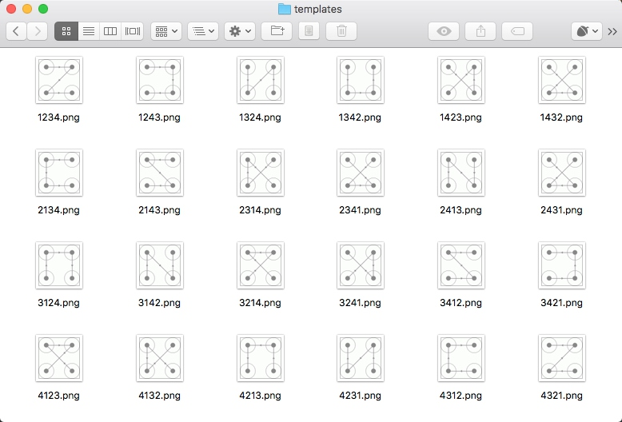

# 微博宫格验证码的识别

本节我们来介绍一下新浪微博宫格验证码的识别，此验证码是一种新型交互式验证码，每个宫格之间会有一条指示连线，指示了我们应该的滑动轨迹，我们需要按照滑动轨迹依次从起始宫格一直滑动到终止宫格才可以完成验证，如图所示：


鼠标滑动后的轨迹会以黄色的连线来标识，如图所示：


我们可以访问新浪微博移动版登录页面就可以看到如上验证码，链接[https://passport.weibo.cn/signin/login](https://passport.weibo.cn/signin/login)，当然也不是每次都会出现验证码，一般当频繁登录或者账号存在安全风险的时候会出现。

接下来我们就来试着破解一下此类验证码。

## 破解思路

要破解首先要从探寻规律入手，那么首先我们找到的规律就是此验证码的四个宫格一定是有连线经过的，而且每一条连线上都会相应的指示箭头，连线的形状多样，如C型、Z型、X型等等，如图所示：


而同时我们发现同一种类型它的连线轨迹是相同的，唯一不同的就是连线的方向，如图所示：


这两种验证码的连线轨迹是相同的，但是由于连线上面的指示箭头不同导致滑动的宫格顺序就有所不同。

所以要完全识别滑动宫格顺序的话就需要具体识别出箭头的朝向，而观察一下整个验证码箭头朝向一共可能有8种，而且会出现在不同的位置，如果要写一个箭头方向识别算法的话需要都考虑到不同箭头所在的位置，我们需要找出各个位置的箭头的像素点坐标，同时识别算法还需要计算其像素点变化规律，这个工作量就变得比较大。

这时我们可以考虑用模板匹配的方法，模板匹配的意思就是将一些识别目标提前保存下来并做好标记，称作模板。在匹配的时候来对比要新识别的目标和每一个模板哪个是匹配的，如果找到匹配的模板，则被匹配到的模板就和新识别的目标是相同的，这样就成功识别出了要新识别的目标了。模板匹配在图像识别中也是非常常用的一种方法，实现简单而且易用性好。

模板匹配方法如果要效果好的话，我们必须要收集到足够多的模板才可以，而对于微博宫格验证码来说，宫格就4个，验证码的样式最多就是4 * 3 * 2 * 1 = 24种，所以我们可以直接将所有模板都收集下来。

所以接下来我们需要考虑的就是用何种模板来进行匹配，是只匹配箭头还是匹配整个验证码全图呢？我们来权衡一下这两种方式的匹配精度和工作量。

首先是精度问题。如果要匹配箭头的话，我们比对的目标只有几个像素点范围的箭头，而且我们需要精确知道各个箭头所在的像素点，一旦像素点有所偏差，那么匹配模板的时候会直接错位，导致匹配结果大打折扣。如果匹配全图，我们无需关心箭头所在位置，同时还有连线帮助辅助匹配，所以匹配精度上显然是全图匹配精度更高。

其次是工作量的问题。如果要匹配箭头的话，我们需要将所有不同朝向的箭头模板都保存下来，而相同位置箭头的朝向可能不一，相同朝向的箭头位置可能不一，这时候我们需要都算出各个箭头的位置并将其逐个截出来保存成模板，同时在匹配的时候也需要依次去探寻验证码对应位置是否有匹配模板。如果匹配全图的话，我们不需要关心每个箭头的位置和朝向，只需要将验证码全图保存下来即可，在匹配的时候也不需要再去计算箭头的位置，所以工作量上明显是匹配全图更小。

所以综上考虑，我们选用全图匹配的方式来进行识别。

## 代码实战

在开始之前，我们需要做一下准备工作，先将24张验证码全图保存下来，保存工作难道需要手工来做吗？当然不是的，因为验证码是随机的，一共有24种，所以我们可以写一段程序来批量保存一些验证码图片，然后从中筛选出需要的图片就好了，代码如下：

```python
import time
from io import BytesIO
from PIL import Image
from selenium import webdriver
from selenium.common.exceptions import TimeoutException
from selenium.webdriver.common.by import By
from selenium.webdriver.support.ui import WebDriverWait
from selenium.webdriver.support import expected_conditions as EC


USERNAME = ''
PASSWORD = ''

class CrackWeiboSlide():
    def __init__(self):
        self.url = 'https://passport.weibo.cn/signin/login'
        self.browser = webdriver.Chrome()
        self.wait = WebDriverWait(self.browser, 20)
        self.username = USERNAME
        self.password = PASSWORD

    def __del__(self):
        self.browser.close()

    def open(self):
        """
        打开网页输入用户名密码并点击
        :return: None
        """
        self.browser.get(self.url)
        username = self.wait.until(EC.presence_of_element_located((By.ID, 'loginName')))
        password = self.wait.until(EC.presence_of_element_located((By.ID, 'loginPassword')))
        submit = self.wait.until(EC.element_to_be_clickable((By.ID, 'loginAction')))
        username.send_keys(self.username)
        password.send_keys(self.password)
        submit.click()

    def get_position(self):
        """
        获取验证码位置
        :return: 验证码位置元组
        """
        try:
            img = self.wait.until(EC.presence_of_element_located((By.CLASS_NAME, 'patt-shadow')))
        except TimeoutException:
            print('未出现验证码')
            self.open()
        time.sleep(2)
        location = img.location
        size = img.size
        top, bottom, left, right = location['y'], location['y'] + size['height'], location['x'], location['x'] + size[
            'width']
        return (top, bottom, left, right)

    def get_screenshot(self):
        """
        获取网页截图
        :return: 截图对象
        """
        screenshot = self.browser.get_screenshot_as_png()
        screenshot = Image.open(BytesIO(screenshot))
        return screenshot

    def get_image(self, name='captcha.png'):
        """
        获取验证码图片
        :return: 图片对象
        """
        top, bottom, left, right = self.get_position()
        print('验证码位置', top, bottom, left, right)
        screenshot = self.get_screenshot()
        captcha = screenshot.crop((left, top, right, bottom))
        captcha.save(name)
        return captcha

    def main(self):
        """
        批量获取验证码
        :return: 图片对象
        """
        count = 0
        while True:
            self.open()
            self.get_image(str(count) + '.png')
            count += 1

if __name__ == '__main__':
    crack = CrackWeiboSlide()
    crack.main()
```

其中这里需要将USERNAME和PASSWORD修改为自己微博的用户名密码，运行一段时间后便可以发现在本地多了很多以数字命名的验证码，如图所示：


在这里我们只需要挑选出不同的24张验证码图片并命名保存就好了，名称可以直接取作宫格的滑动的顺序，如某张验证码图片如下：


我们将其命名为4132.png即可，也就是代表滑动顺序为4-1-3-2，按照这样的规则，我们将验证码整理为如下24张图：



如上的24张图就是我们的模板，接下来我们在识别的时候只需要遍历模板进行匹配即可。

上面的代码已经实现了将验证码保存下来的功能，通过调用get_image()方法我们便可以得到验证码图片对象，得到验证码对象之后我们就需要对其进行模板匹配了，定义如下的方法进行匹配：

```python
from os import listdir

def detect_image(self, image):
    """
    匹配图片
    :param image: 图片
    :return: 拖动顺序
    """
    for template_name in listdir(TEMPLATES_FOLDER):
        print('正在匹配', template_name)
        template = Image.open(TEMPLATES_FOLDER + template_name)
        if self.same_image(image, template):
            # 返回顺序
            numbers = [int(number) for number in list(template_name.split('.')[0])]
            print('拖动顺序', numbers)
            return numbers
```

在这里TEMPLATES_FOLDER就是模板所在的文件夹，在这里我们用listdir()方法将所有模板的文件名称获取出来，然后对其进行遍历，通过same_image()方法对验证码和模板进行比对，如果成功匹配，那么就将匹配到的模板文件名转为列表，如匹配到了3124.png，则返回结果[3, 1, 2, 4]。

比对的方法实现如下：

```python
def is_pixel_equal(self, image1, image2, x, y):
    """
    判断两个像素是否相同
    :param image1: 图片1
    :param image2: 图片2
    :param x: 位置x
    :param y: 位置y
    :return: 像素是否相同
    """
    # 取两个图片的像素点
    pixel1 = image1.load()[x, y]
    pixel2 = image2.load()[x, y]
    threshold = 20
    if abs(pixel1[0] - pixel2[0]) < threshold and abs(pixel1[1] - pixel2[1]) < threshold and abs(
            pixel1[2] - pixel2[2]) < threshold:
        return True
    else:
        return False

def same_image(self, image, template):
    """
    识别相似验证码
    :param image: 待识别验证码
    :param template: 模板
    :return:
    """
    # 相似度阈值
    threshold = 0.99
    count = 0
    for x in range(image.width):
        for y in range(image.height):
            # 判断像素是否相同
            if self.is_pixel_equal(image, template, x, y):
                count += 1
    result = float(count) / (image.width * image.height)
    if result > threshold:
        print('成功匹配')
        return True
    return False
```

在这里比对图片也是利用了遍历像素的方法，same_image()方法接收两个参数，image为待检测的验证码图片对象，template是模板对象，由于二者大小是完全一致的，所以在这里我们遍历了图片的所有像素点，比对二者同一位置的像素点是否相同，如果相同就计数加1，最后计算一下相同的像素点占总像素的比例，如果该比例超过一定阈值那就判定为图片完全相同，匹配成功。在这里设定阈值为0.99，即如果二者有0.99以上的相似比则代表匹配成功。

这样通过上面的方法，依次匹配24个模板，如果验证码图片正常，总能找到一个匹配的模板，这样最后就可以得到宫格的滑动顺序了。

得到了滑动顺序之后，我们接下来就是根据滑动顺序来拖动鼠标连接各个宫格了，方法实现如下：

```python
def move(self, numbers):
    """
    根据顺序拖动
    :param numbers:
    :return:
    """
    # 获得四个按点
    circles = self.browser.find_elements_by_css_selector('.patt-wrap .patt-circ')
    dx = dy = 0
    for index in range(4):
        circle = circles[numbers[index] - 1]
        # 如果是第一次循环
        if index == 0:
            # 点击第一个按点
            ActionChains(self.browser) \
                .move_to_element_with_offset(circle, circle.size['width'] / 2, circle.size['height'] / 2) \
                .click_and_hold().perform()
        else:
            # 小幅移动次数
            times = 30
            # 拖动
            for i in range(times):
                ActionChains(self.browser).move_by_offset(dx / times, dy / times).perform()
                time.sleep(1 / times)
        # 如果是最后一次循环
        if index == 3:
            # 松开鼠标
            ActionChains(self.browser).release().perform()
        else:
            # 计算下一次偏移
            dx = circles[numbers[index + 1] - 1].location['x'] - circle.location['x']
            dy = circles[numbers[index + 1] - 1].location['y'] - circle.location['y']
```

在这里方法接收的参数就是宫格的点按顺序，如[3, 1, 2, 4]。首先我们利用find_elements_by_css_selector()方法获取到四个宫格元素，是一个列表形式，每个元素代表一个宫格，接下来我们遍历了宫格的点按顺序，再做一系列对应操作。其中如果是第一个宫格，那就直接鼠标点击并保持动作，否则则移动到下一个宫格。如果是最后一个宫格，那就松开鼠标，否则记录移动到下一个宫格的偏移量。

通过四次循环，我们便可以成功操作浏览器完成宫格验证码的拖拽填充，松开鼠标之后即可识别成功。

至此，微博宫格验证码的识别就全部完成了。

识别完成之后验证码窗口会自动关闭，接下来直接点击登录按钮即可完成微博登录。


本节的源代码为[https://github.com/Python3WebSpider/CrackWeiboSlide](https://github.com/Python3WebSpider/CrackWeiboSlide)

