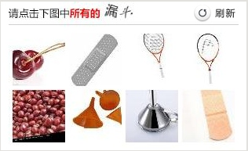
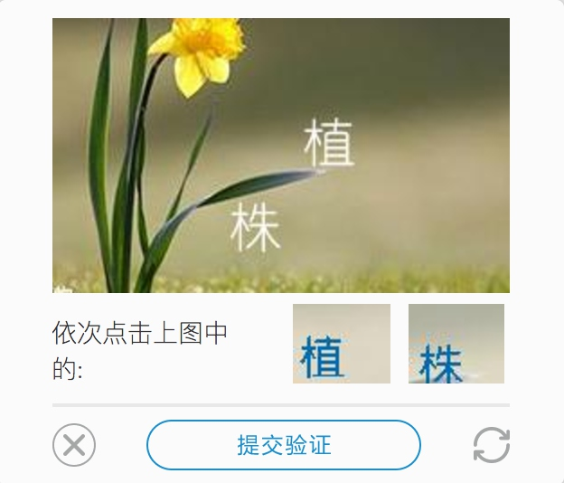
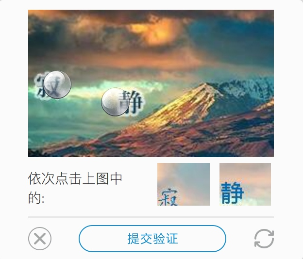

# 8.3 点触验证码的识别

除了极验验证码，还有另一种常见且应用广泛的验证码，即点触验证码。

可能你对这个名字比较陌生，但是肯定见过类似的验证码，比如 12306 就是典型的点触验证码，如图 8-18 所示。



图 8-18 12306 验证码

直接点击图中符合要求的图。所有答案均正确，验证才会成功。如果有一个答案错误，验证就会失败。这种验证码就称为点触验证码。

还有一个专门提供点触验证码服务的站点 TouClick，其官方网站为 https://www.touclick.com/。本节就以 TouClick 为例讲解此类验证码的识别过程。

### 1. 本节目标

我们的目标是用程序来识别并通过点触验证码的验证。

### 2. 准备工作

我们使用的 Python 库是 Selenium，使用的浏览器为 Chrome。请确保已经正确安装好 Selenium 库、Chrome 浏览器，并配置好 ChromeDriver，相关流程可以参考第 1 章的说明。

### 3. 了解点触验证码

TouClick 官方网站的验证码样式如图 8-19 所示：



图 8-19 验证码样式

与 12306 站点相似，不过这次是点击图片中的文字而非图片。点触验证码有很多种，它们的交互形式略有不同，但其基本原理都是类似的。

接下来，我们统一实现此类点触验证码的识别过程。

### 4. 识别思路

如果依靠图像识别点触验证码，则识别难度非常大。例如，12306 的识别难点有两点，第一点是文字识别，如图 8-20 所示。


图 8-20 12306 验证码

点击图中所有漏斗，“漏斗” 二字经过变形、放缩、模糊处理，如果要借助前面的 OCR 技术来识别，识别的精准度会大打折扣，甚至得不到任何结果。

第二点是图像的识别。我们需要将图像重新转化文字，可以借助各种识图接口，但识别的准确率非常低，经常会出现匹配不正确或无法匹配的情况。而且图片清晰度不够，识别难度会更大，更何况需要同时正确识别八张图片，验证才能通过。

综上所述，此种方法基本是不可行的。

我们再以 TouClick 为例，如图 8-21 所示。


图 8-21 验证码示例

我们需要从这幅图片中识别出 “植株” 二字，但是图片背景或多或少会有干扰，导致 OCR 几乎不会识别出结果。如果直接识别白色的文字不就好了吗？但是如果换一张验证码呢？文字颜色就又不同了，因此此方法是不可行的，如图 8-22 所示。


图 8-22 验证码示例

这张验证码图片的文字又变成了蓝色，而且还又有白色阴影，识别的难度又会大大增加。

这张验证码图片的文字变成了蓝色，有白色阴影，识别的难度会大大增加。

那么，此类验证码该如何识别？互联网上有很多验证码服务平台，平台 7×24 小时提供验证码识别服务，一张图片几秒就会获得识别结果，准确率可达 90% 以上。

我个人比较推荐的一个平台是超级鹰，其官网为 https://www.chaojiying.com。其提供的服务种类非常广泛，可识别的验证码类型非常多，其中就包括点触验证码。

超级鹰平台同样支持简单的图形验证码识别。如果 OCR 识别有难度，同样可以用本节介绍的方法借助此平台来识别。超级鹰平台提供了如下一些服务。

* 英文数字：提供最多 20 位英文数字的混合识别
* 中文汉字：提供最多 7 个汉字的识别
* 纯英文：提供最多 12 位的英文的识别
* 纯数字：提供最多 11 位的数字的识别
* 任意特殊字符：提供不定长汉字英文数字、拼音首字母、计算题、成语混合、	集装箱号等字符的识别
* 坐标选择识别：如复杂计算题、选择题四选一、问答题、点击相同的字、物品、动物等返回多个坐标的识别

具体如有变动以官网为准：[https://www.chaojiying.com/price.html](https://www.chaojiying.com/price.html)。

这里需要处理的就是坐标多选识别的情况。我们先将验证码图片提交给平台，平台会返回识别结果在图片中的坐标位置，然后我们再解析坐标模拟点击。

下面我们就用程序来实现。

### 5. 注册账号

先注册超级鹰账号并申请软件 ID，注册页面链接为 https://www.chaojiying.com/user/reg/。在后台开发商中心添加软件 ID。最后充值一些题分，充值多少可以根据价格和识别量自行决定。

### 6. 获取 API

在官方网站下载对应的 Python API，链接为：https://www.chaojiying.com/api-14.html。此 API 是 Python 2 版本的，是用 requests 库来实现的。我们可以简单更改几个地方，即可将其修改为 Python 3 版本。

修改之后的 API 如下所示：

```python
import requests
from hashlib import md5

class Chaojiying(object):

    def __init__(self, username, password, soft_id):
        self.username = username
        self.password = md5(password.encode('utf-8')).hexdigest()
        self.soft_id = soft_id
        self.base_params = {
            'user': self.username,
            'pass2': self.password,
            'softid': self.soft_id,
        }
        self.headers = {
            'Connection': 'Keep-Alive',
            'User-Agent': 'Mozilla/4.0 (compatible; MSIE 8.0; Windows NT 5.1; Trident/4.0)',
        }
        

    def post_pic(self, im, codetype):
        """
        im: 图片字节
        codetype: 题目类型 参考 http://www.chaojiying.com/price.html
        """
        params = {'codetype': codetype,}
        params.update(self.base_params)
        files = {'userfile': ('ccc.jpg', im)}
        r = requests.post('http://upload.chaojiying.net/Upload/Processing.php', data=params, files=files, headers=self.headers)
        return r.json()

    def report_error(self, im_id):
        """im_id: 报错题目的图片 ID"""
        params = {'id': im_id,}
        params.update(self.base_params)
        r = requests.post('http://upload.chaojiying.net/Upload/ReportError.php', data=params, headers=self.headers)
        return r.json()
```

这里定义了一个 Chaojiying 类，其构造函数接收三个参数，分别是超级鹰的用户名、密码以及软件 ID，保存以备使用。

最重要的一个方法叫作 post_pic()，它需要传入图片对象和验证码类型的代号。该方法会将图片对象和相关信息发给超级鹰的后台进行识别，然后将识别成功的 JSON 返回。

另一个方法叫作 report_error()，它是发生错误的时候的回调。如果验证码识别错误，调用此方法会返回相应的题分。

接下来，以 TouClick 的官网为例，来演示点触验证码的识别过程，链接为 http://admin.touclick.com/。

### 7. 初始化

首先初始化一些变量，如 WebDriver、Chaojiying 对象等，代码实现如下所示：

```python
EMAIL = 'cqc@cuiqingcai.com'
PASSWORD = ''
# 超级鹰用户名、密码、软件 ID、验证码类型
CHAOJIYING_USERNAME = 'Germey'
CHAOJIYING_PASSWORD = ''
CHAOJIYING_SOFT_ID = 893590
CHAOJIYING_KIND = 9102

class CrackTouClick():
    def __init__(self):
        self.url = 'http://admin.touclick.com/login.html'
        self.browser = webdriver.Chrome()
        self.wait = WebDriverWait(self.browser, 20)
        self.email = EMAIL
        self.password = PASSWORD
        self.chaojiying = Chaojiying(CHAOJIYING_USERNAME, CHAOJIYING_PASSWORD, CHAOJIYING_SOFT_ID)
```

这里的账号和密码请自行修改。

### 8. 获取验证码

接下来的第一步就是完善相关表单，模拟点击呼出验证码，代码实现如下所示：

```python
def open(self):
    """
    打开网页输入用户名密码
    :return: None
    """
    self.browser.get(self.url)
    email = self.wait.until(EC.presence_of_element_located((By.ID, 'email')))
    password = self.wait.until(EC.presence_of_element_located((By.ID, 'password')))
    email.send_keys(self.email)
    password.send_keys(self.password)
    
def get_touclick_button(self):
    """
    获取初始验证按钮
    :return:
    """
    button = self.wait.until(EC.element_to_be_clickable((By.CLASS_NAME, 'touclick-hod-wrap')))
    return button
```

open() 方法负责填写表单，get_touclick_button() 方法获取验证码按钮，之后触发点击即可。

接下来，类似极验验证码图像获取一样，获取验证码图片的位置和大小，从网页截图里截取相应的验证码图片，代码实现如下所示：

```python
def get_touclick_element(self):
    """
    获取验证图片对象
    :return: 图片对象
    """
    element = self.wait.until(EC.presence_of_element_located((By.CLASS_NAME, 'touclick-pub-content')))
    return element

def get_position(self):
    """
    获取验证码位置
    :return: 验证码位置元组
    """
    element = self.get_touclick_element()
    time.sleep(2)
    location = element.location
    size = element.size
    top, bottom, left, right = location['y'], location['y'] + size['height'], location['x'], location['x'] + size['width']
    return (top, bottom, left, right)

def get_screenshot(self):
    """
    获取网页截图
    :return: 截图对象
    """
    screenshot = self.browser.get_screenshot_as_png()
    screenshot = Image.open(BytesIO(screenshot))
    return screenshot

def get_touclick_image(self, name='captcha.png'):
    """
    获取验证码图片
    :return: 图片对象
    """
    top, bottom, left, right = self.get_position()
    print(' 验证码位置 ', top, bottom, left, right)
    screenshot = self.get_screenshot()
    captcha = screenshot.crop((left, top, right, bottom))
    return captcha
```

get_touclick_image() 方法即为从网页截图中截取对应的验证码图片，其中验证码图片的相对位置坐标由 get_position() 方法返回得到。最后我们得到的是 Image 对象。

### 9. 识别验证码

调用 Chaojiying 对象的 post_pic() 方法，即可把图片发送给超级鹰后台，这里发送的图像是字节流格式，代码实现如下所示：

```python
image = self.get_touclick_image()
bytes_array = BytesIO()
image.save(bytes_array, format='PNG')
# 识别验证码
result = self.chaojiying.post_pic(bytes_array.getvalue(), CHAOJIYING_KIND)
print(result)
```

运行之后，result 变量就是超级鹰后台的识别结果。可能运行需要等待几秒。

返回的结果是一个 JSON。如果识别成功，典型的返回结果如下所示：

```python
{'err_no': 0, 'err_str': 'OK', 'pic_id': '6002001380949200001', 'pic_str': '132,127|56,77', 'md5': '1f8e1d4bef8b11484cb1f1f34299865b'}
```
其中，pic_str 就是识别的文字的坐标，是以字符串形式返回的，每个坐标都以 | 分隔。接下来我们只需要将其解析，然后模拟点击，代码实现如下所示：
```python
def get_points(self, captcha_result):
    """
    解析识别结果
    :param captcha_result: 识别结果
    :return: 转化后的结果
    """
    groups = captcha_result.get('pic_str').split('|')
    locations = [[int(number) for number in group.split(',')] for group in groups]
    return locations

def touch_click_words(self, locations):
    """
    点击验证图片
    :param locations: 点击位置
    :return: None
    """
    for location in locations:
        print(location)
        ActionChains(self.browser).move_to_element_with_offset(self.get_touclick_element(), location[0], location[1]).click().perform()
        time.sleep(1)
```

这里用 get_points() 方法将识别结果变成列表的形式。touch_click_words() 方法则通过调用 move_to_element_with_offset() 方法依次传入解析后的坐标，点击即可。

这样我们就模拟完成坐标的点选，运行效果如图 8-23 所示。



图 8-23 点选效果

最后点击提交验证的按钮，等待验证通过，再点击登录按钮即可成功登录。后续实现在此不再赘述。

这样我们就借助在线验证码平台完成了点触验证码的识别。此方法是一种通用方法，我们也可以用此方法来识别 12306 等验证码。

### 10. 本节代码

本节代码地址为：[https://github.com/Python3WebSpider/CrackTouClick](https://github.com/Python3WebSpider/CrackTouClick)。

### 11. 结语

本节我们通过在线打码平台辅助完成了验证码的识别。这种识别方法非常强大，几乎任意的验证码都可以识别。如果遇到难题，借助打码平台无疑是一个极佳的选择。