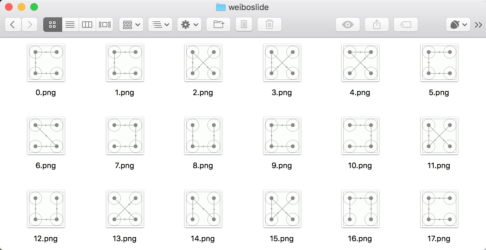

# 8.4 微博宫格验证码的识别

本节我们将介绍新浪微博宫格验证码的识别。微博宫格验证码是一种新型交互式验证码，每个宫格之间会有一条指示连线，指示了应该的滑动轨迹。我们要按照滑动轨迹依次从起始宫格滑动到终止宫格，才可以完成验证，如图 8-24 所示。


图 8-24 验证码示例

鼠标滑动后的轨迹会以黄色的连线来标识，如图 8-25 所示。


图 8-25 滑动过程

访问新浪微博移动版登录页面，就可以看到如上验证码，链接为 https://passport.weibo.cn/signin/login。不是每次登录都会出现验证码，当频繁登录或者账号存在安全风险的时候，验证码才会出现。

### 1. 本节目标

我们的目标是用程序来识别并通过微博宫格验证码的验证。

### 2. 准备工作

本次我们使用的 Python 库是 Selenium，使用的浏览器为 Chrome，请确保已经正确安装好 Selenium 库、Chrome 浏览器，并配置好 ChromeDriver，相关流程可以参考第 1 章的说明。

### 3. 识别思路

识别从探寻规律入手。规律就是，此验证码的四个宫格一定是有连线经过的，每一条连线上都会相应的指示箭头，连线的形状多样，包括 C 型、Z 型、X 型等，如图 8-26、图 8-27 和图 8-28 所示。


图 8-26 C 型


图 8-27 Z 型


图 8-28 X 型

而同时我们发现同一种类型它的连线轨迹是相同的，唯一不同的就是连线的方向，如图 8-29、8-30 所示：


图 8-29 反向连线


图 8-30 正向连线

这两种验证码的连线轨迹是相同的。但是由于连线上面的指示箭头不同，导致滑动的宫格顺序有所不同。

如果要完全识别滑动宫格顺序，就需要具体识别出箭头的朝向。而整个验证码箭头朝向一共有 8 种，而且会出现在不同的位置。如果要写一个箭头方向识别算法，需要考虑不同箭头所在的位置，找出各个位置箭头的像素点坐标，计算像素点变化规律，这个工作量就会变得比较大。

这时我们可以考虑用模板匹配的方法，就是将一些识别目标提前保存并做好标记，这称作模板。这里将验证码图片做好拖动顺序的标记当做模板。对比要新识别的目标和每一个模板，如果找到匹配的模板，则就成功识别出要新识别的目标。在图像识别中，模板匹配也是常用的方法，实现简单且易用性好。

我们必须要收集到足够多的模板，模板匹配方法的效果才会好。而对于微博宫格验证码来说，宫格只有 4 个，验证码的样式最多 4×3×2×1=24 种，则我们可以将所有模板都收集下来。

接下来我们需要考虑的就是，用何种模板来进行匹配，只匹配箭头还是匹配整个验证码全图呢？我们权衡一下这两种方式的匹配精度和工作量。

* 首先是精度问题。如果是匹配箭头，比对的目标只有几个像素点范围的箭头，我们需要精确知道各个箭头所在的像素点，一旦像素点有偏差，那么会直接错位，导致匹配结果大打折扣。如果是匹配全图，我们无需关心箭头所在位置，同时还有连线帮助辅助匹配。显然，全图匹配的精度更高。
* 其次是工作量的问题。如果是匹配箭头，我们需要保存所有不同朝向的箭头模板，而相同位置箭头的朝向可能不一，相同朝向的箭头位置可能不一，那么我们需要算出每个箭头的位置并将其逐个截出保存成模板，依次探寻验证码对应位置是否有匹配模板。如果是匹配全图，我们不需要关心每个箭头的位置和朝向，只需要将验证码全图保存下来即可，在匹配的时候也不需要计算箭头的位置。显然，匹配全图的工作量更少。

综上考虑，我们选用全图匹配的方式来进行识别。找到匹配的模板之后，我们就可以得到事先为模板定义的拖动顺序，然后模拟拖动即可。

### 4. 获取模板

我们需要做一下准备工作。先保存 24 张验证码全图。因为验证码是随机的，一共有 24 种。我们可以写一段程序来批量保存验证码图片，然后从中筛选出需要的图片，代码如下所示：

```python
import time
from io import BytesIO
from PIL import Image
from selenium import webdriver
from selenium.common.exceptions import TimeoutException
from selenium.webdriver.common.by import By
from selenium.webdriver.support.ui import WebDriverWait
from selenium.webdriver.support import expected_conditions as EC


USERNAME = ''
PASSWORD = ''

class CrackWeiboSlide():
    def __init__(self):
        self.url = 'https://passport.weibo.cn/signin/login'
        self.browser = webdriver.Chrome()
        self.wait = WebDriverWait(self.browser, 20)
        self.username = USERNAME
        self.password = PASSWORD

    def __del__(self):
        self.browser.close()

    def open(self):
        """
        打开网页输入用户名密码并点击
        :return: None
        """
        self.browser.get(self.url)
        username = self.wait.until(EC.presence_of_element_located((By.ID, 'loginName')))
        password = self.wait.until(EC.presence_of_element_located((By.ID, 'loginPassword')))
        submit = self.wait.until(EC.element_to_be_clickable((By.ID, 'loginAction')))
        username.send_keys(self.username)
        password.send_keys(self.password)
        submit.click()

    def get_position(self):
        """
        获取验证码位置
        :return: 验证码位置元组
        """
        try:
            img = self.wait.until(EC.presence_of_element_located((By.CLASS_NAME, 'patt-shadow')))
        except TimeoutException:
            print(' 未出现验证码 ')
            self.open()
        time.sleep(2)
        location = img.location
        size = img.size
        top, bottom, left, right = location['y'], location['y'] + size['height'], location['x'], location['x'] + size['width']
        return (top, bottom, left, right)

    def get_screenshot(self):
        """
        获取网页截图
        :return: 截图对象
        """
        screenshot = self.browser.get_screenshot_as_png()
        screenshot = Image.open(BytesIO(screenshot))
        return screenshot

    def get_image(self, name='captcha.png'):
        """
        获取验证码图片
        :return: 图片对象
        """
        top, bottom, left, right = self.get_position()
        print(' 验证码位置 ', top, bottom, left, right)
        screenshot = self.get_screenshot()
        captcha = screenshot.crop((left, top, right, bottom))
        captcha.save(name)
        return captcha

    def main(self):
        """
        批量获取验证码
        :return: 图片对象
        """
        count = 0
        while True:
            self.open()
            self.get_image(str(count) + '.png')
            count += 1

if __name__ == '__main__':
    crack = CrackWeiboSlide()
    crack.main()
```

其中这里需要将 USERNAME 和 PASSWORD 修改为自己微博的用户名密码，运行一段时间后便可以发现在本地多了很多以数字命名的验证码，如图 8-31 所示。



图 8-31 获取结果

这里我们只需要挑选出不同的 24 张验证码图片并命名保存。名称可以直接取作宫格的滑动的顺序，如图 8-32 所示。


图 8-32 验证码示例

我们将其命名为 4132.png 即可，代表滑动顺序为 4-1-3-2，按照这样的规则，我们将验证码整理为如下 24 张图，如图 8-33 所示：


图 8-33 整理结果

如上的 24 张图就是我们的模板，接下来我们在识别的时候只需要遍历模板进行匹配即可。

### 5. 模板匹配

调用 get_image() 方法，得到验证码图片对象。然后，对验证码图片对象进行模板匹配，定义如下所示的方法：

```python
from os import listdir

def detect_image(self, image):
    """
    匹配图片
    :param image: 图片
    :return: 拖动顺序
    """
    for template_name in listdir(TEMPLATES_FOLDER):
        print(' 正在匹配 ', template_name)
        template = Image.open(TEMPLATES_FOLDER + template_name)
        if self.same_image(image, template):
            # 返回顺序
            numbers = [int(number) for number in list(template_name.split('.')[0])]
            print(' 拖动顺序 ', numbers)
            return numbers
```

TEMPLATES_FOLDER 就是模板所在的文件夹。这里通过 listdir() 方法获取所有模板的文件名称，然后对其进行遍历，通过 same_image() 方法对验证码和模板进行比对。如果匹配成功，那么就将匹配到的模板文件名转换为列表。如模板文件 3124.png 匹配到了，则返回结果为 [3, 1, 2, 4]。

比对的方法实现如下：

```python
def is_pixel_equal(self, image1, image2, x, y):
    """
    判断两个像素是否相同
    :param image1: 图片 1
    :param image2: 图片 2
    :param x: 位置 x
    :param y: 位置 y
    :return: 像素是否相同
    """
    # 取两个图片的像素点
    pixel1 = image1.load()[x, y]
    pixel2 = image2.load()[x, y]
    threshold = 20
    if abs(pixel1[0] - pixel2[0]) <threshold and abs(pixel1[1] - pixel2[1]) < threshold and abs(pixel1[2] - pixel2[2]) < threshold:
        return True
    else:
        return False

def same_image(self, image, template):
    """
    识别相似验证码
    :param image: 待识别验证码
    :param template: 模板
    :return:
    """
    # 相似度阈值
    threshold = 0.99
    count = 0
    for x in range(image.width):
        for y in range(image.height):
            # 判断像素是否相同
            if self.is_pixel_equal(image, template, x, y):
                count += 1
    result = float(count) / (image.width * image.height)
    if result > threshold:
        print(' 成功匹配 ')
        return True
    return False
```

在这里比对图片也利用了遍历像素的方法。same_image() 方法接收两个参数，image 为待检测的验证码图片对象，template 是模板对象。由于二者大小是完全一致的，所以在这里我们遍历了图片的所有像素点。比对二者同一位置的像素点，如果像素点相同，计数就加 1。最后计算相同的像素点占总像素的比例。如果该比例超过一定阈值，那就判定图片完全相同，则匹配成功。这里阈值设定为 0.99，即如果二者有 0.99 以上的相似比，则代表匹配成功。

通过上面的方法，依次匹配 24 个模板。如果验证码图片正常，我们总能找到一个匹配的模板，这样就可以得到宫格的滑动顺序了。

### 6. 模拟拖动

接下来，根据滑动顺序拖动鼠标，连接各个宫格，方法实现如下所示：

```python
def move(self, numbers):
    """
    根据顺序拖动
    :param numbers:
    :return:
    """
    # 获得四个按点
    circles = self.browser.find_elements_by_css_selector('.patt-wrap .patt-circ')
    dx = dy = 0
    for index in range(4):
        circle = circles[numbers[index] - 1]
        # 如果是第一次循环
        if index == 0:
            # 点击第一个按点
            ActionChains(self.browser) \
                .move_to_element_with_offset(circle, circle.size['width'] / 2, circle.size['height'] / 2) \
                .click_and_hold().perform()
        else:
            # 小幅移动次数
            times = 30
            # 拖动
            for i in range(times):
                ActionChains(self.browser).move_by_offset(dx /times, dy /times).perform()
                time.sleep(1 /times)
        # 如果是最后一次循环
        if index == 3:
            # 松开鼠标
            ActionChains(self.browser).release().perform()
        else:
            # 计算下一次偏移
            dx = circles[numbers[index + 1] - 1].location['x'] - circle.location['x']
            dy = circles[numbers[index + 1] - 1].location['y'] - circle.location['y']
```

这里方法接收的参数就是宫格的点按顺序，如 [3,1,2,4]。首先我们利用 find_elements_by_css_  
selector() 方法获取到 4 个宫格元素，它是一个列表形式，每个元素代表一个宫格。接下来遍历宫格的点按顺序，做一系列对应操作。

其中如果当前遍历的是第一个宫格，那就直接鼠标点击并保持动作，否则移动到下一个宫格。如果当前遍历的是最后一个宫格，那就松开鼠标，如果不是最后一个宫格，则计算移动到下一个宫格的偏移量。

通过 4 次循环，我们便可以成功操作浏览器完成宫格验证码的拖拽填充，松开鼠标之后即可识别成功。运行效果如图 8-34 所示。


图 8-34 运行效果

鼠标会慢慢从起始位置移动到终止位置。最后一个宫格松开之后，验证码的识别便完成了。

至此，微博宫格验证码的识别就全部完成。验证码窗口会自动关闭。直接点击登录按钮即可登录微博。

### 7. 本节代码

本节代码地址为：[https://github.com/Python3WebSpider/CrackWeiboSlide](https://github.com/Python3WebSpider/CrackWeiboSlide)。

### 8. 结语

本节介绍了一种常用的模板匹配识别图片的方式，模拟了鼠标拖拽动作来实现验证码的识别。如果遇到类似的验证码，我们可以采用同样的思路进行识别。