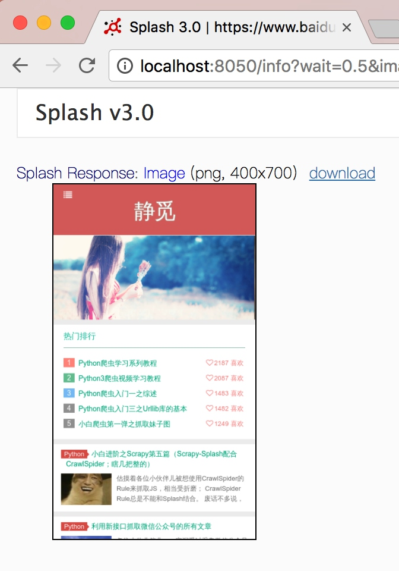

# Splash的使用

Splash是一个JavaScript渲染服务，是一个带有HTTP API的轻量级浏览器，同时它对接了Python中的Twisted和QT库。

## 功能

利用Splash我们可以实现如下功能：
* 异步方式处理多个网页渲染过程
* 获取渲染后的页面的源代码或截图
* 通过关闭图片渲染或者使用Adblock规则来加快页面渲染速度
* 可执行特定的JavaScript脚本
* 可通过Lua脚本来控制页面渲染过程
* 获取渲染的详细过程并通过HAR（HTTP Archive）格式呈现

## 实例引入

首先我们可以通过Splash提供的Web页面来测试Splash的渲染过程，在这之前请确保已经正确安装并正常运行了Splash服务，例如我们在本机8050端口运行了Splash服务，打开[http://localhost:8050/](http://localhost:8050/)即可看到其Web页面。


在右侧呈现的是一个渲染示例，我们可以看到在上方有一个输入框，默认是[http://google.com](http://google.com)，我们在这里换成百度测试一下，将内容更改为：[https://www.baidu.com](https://www.baidu.com)，然后点击按钮，开始渲染。


可以看到网页的返回结果呈现了渲染截图、HAR加载统计数据、网页的源代码。

通过HAR的结果我们可以看到Splash执行了整个网页的渲染过程，包括CSS、JavaScript的加载等过程，呈现的页面和我们在浏览器得到的结果完全一致。

那么这个过程是由什么来控制的呢？我们重新返回首页可以看到实际上是有一段脚本，内容如下：

```lua
function main(splash, args)
  assert(splash:go(args.url))
  assert(splash:wait(0.5))
  return {
    html = splash:html(),
    png = splash:png(),
    har = splash:har(),
  }
end
```

这个脚本是实际是Lua语言写的脚本，Lua也是一门编程语言，简洁易用。

即使我们不懂这个语言的语法，但通过脚本表面意思我们也可以大致了解到它是首先调用go()方法去加载页面，然后调用wait()方法等待了一定的时间，最后返回了页面的源码、截图和HAR信息。

所以到这里我们可以大体了解到Splash是通过Lua脚本来控制了页面的加载过程，加载过程完全模拟浏览器，最后可返回各种格式的结果，如网页源码、截图等。

所以接下来我们要学会用Splash的话，一是需要了解其中Lua脚本的写法，二是需要了解相关API的用法，那么本届我们就来介绍一下这两部分内容。

## Splash Lua脚本

Splash可以通过Lua脚本执行一系列渲染操作，这样我们就可以用Splash来模拟类似Chrome、PhantomJS的操作了。

### 基本认识

首先我们先对Splash Lua脚本的用法有一个基本的认识，先了解一下它的入口和执行方式。

#### 入口及返回值

首先我们来看一个基本实例：

```lua
function main(splash, args)
  splash:go("http://www.baidu.com")
  splash:wait(0.5)
  local title = splash:evaljs("document.title")
  return {title=title}
end
```

我们将代码粘贴到刚才我们所打开的[http://localhost:8050/](http://localhost:8050/)的代码编辑区域，然后点击按钮来测试一下。

这样我们就会看到其返回了网页的标题，这里我们是通过evaljs()方法传入JavaScript脚本，而 document.title 的执行结果就是返回网页标题，执行完毕后赋值给一个title变量，随后将其返回，这样就可以看到其返回结果就是网页标题了。


注意到我们在这里定义的函数名称叫做main()，这个名称必须是固定的，Splash会默认调用这个方法。

方法的返回值可以是字典形式、也可以是字符串形式，最后都会转化为一个Splash HTTP Response，例如：

```lua
function main(splash)
    return {hello="world!"}
end
```

这样即返回了一个字典形式的内容。

```lua
function main(splash)
    return 'hello'
end
```

这样即返回了一个字符串形式的内容，同样是可以的。

#### 异步处理

Splash是支持异步处理的，但是这里我们并没有显式地指明回调函数，其回调的跳转是在Splash内部完成的，我们先来看一个例子：

```lua
function main(splash, args)
  local example_urls = {"www.baidu.com", "www.taobao.com", "www.zhihu.com"}
  local urls = args.urls or example_urls
  local results = {}
  for index, url in ipairs(urls) do
    local ok, reason = splash:go("http://" .. url)
    if ok then
      splash:wait(2)
      results[url] = splash:png()
    end
  end
  return results
end
```

运行后的返回结果是三个站点的截图：


在脚本内调用了wait()函数，这类似于Python中的sleep()，参数为等待的秒数，当Splash执行到此函数时，它会转而去处理其他的任务，然后在指定的时间过后再回来继续处理。

在这里值得注意的是Lua脚本中的字符串拼接，和Python不同，这里的字符串拼接使用的是 .. 操作符，而不是 +，如有必要可以简单了解一下Lua脚本的语法，链接：[http://www.runoob.com/lua/lua-basic-syntax.html](http://www.runoob.com/lua/lua-basic-syntax.html)。

另外这里我们做了加载时的异常检测，go()方法会返回加载页面的结果状态，如果页面出现4XX或5XX状态码，ok变量就会为空，就不会返回加载后的图片。

### Splash对象属性

我们注意到在前面的例子中main()函数的第一个参数是splash，这个对象非常重要，类似于在Selenium中的WebDriver对象：

```python
from selenium import webdriver
browser = webdriver.Chrome()
```

如上所示，现在的splash对象就如同此处Selenium中的browser对象，我们可以调用它的一些属性和方法来控制加载过程，接下来我们首先看下它的属性。

#### args

splash对象的args属性可以获取加载时配置的参数，它可以获取加载的URL，如果为GET请求它还可以获取GET请求参数，如果为POST请求它可以获取表单提交的数据。Splash支持第二个参数直接作为args，例如：

```lua
function main(splash, args)
    local url = args.url
end
```

在这里第二个参数args就相当于splash.args属性，以上代码等价于：

```lua
function main(splash)
    local url = splash.args.url
end
```

#### js_enabled

这个属性是Splash的JavaScript执行开关，我们可以将其配置为True或False来控制是否可以执行JavaScript代码，默认为True，例如我们在这里禁用一下JavaScript的执行：

```lua
function main(splash, args)
  splash:go("https://www.baidu.com")
  splash.js_enabled = false
  local title = splash:evaljs("document.title")
  return {title=title}
end
```

禁用之后，我们重新调用了evaljs()方法执行JavaScript代码，那么运行结果就会抛出异常：

```json
{
    "error": 400,
    "type": "ScriptError",
    "info": {
        "type": "JS_ERROR",
        "js_error_message": null,
        "source": "[string \"function main(splash, args)\r...\"]",
        "message": "[string \"function main(splash, args)\r...\"]:4: unknown JS error: None",
        "line_number": 4,
        "error": "unknown JS error: None",
        "splash_method": "evaljs"
    },
    "description": "Error happened while executing Lua script"
}
```

不过一般来说我们不用设置此属性开关，默认开启即可。

#### resource_timeout

此属性可以设置加载的超时时间，单位是秒，如果设置为0或nil（类似Python中的None）就代表不检测超时，我们用一个实例感受一下：

```lua
function main(splash)
    splash.resource_timeout = 0.1
    assert(splash:go('https://www.taobao.com'))
    return splash:png()
end
```

例如这里我们将超时时间设置为0.1秒，如果在0.1秒之内没有得到响应就会抛出异常，错误如下：

```json
{
    "error": 400,
    "type": "ScriptError",
    "info": {
        "error": "network5",
        "type": "LUA_ERROR",
        "line_number": 3,
        "source": "[string \"function main(splash)\r...\"]",
        "message": "Lua error: [string \"function main(splash)\r...\"]:3: network5"
    },
    "description": "Error happened while executing Lua script"
}
```

此属性适合在网页加载速度较慢的情况下设置，如果超过了某个时间无响应则直接抛出异常并忽略即可。


#### images_enabled

此属性可以设置图片是否加载，默认情况下是加载的，但是禁用之后可以节省网络流量并提高网页加载速度，但是值得注意的是禁用图片加载之后可能会影响JavaScript渲染，因为禁用图片之后它的外层DOM节点的高度会受影响，进而影响DOM节点的位置，所以如果JavaScript如果使用了相关变量的话，其执行就会受到影响，不过一般情况下不会。

另外值得注意的是Splash使用了缓存，所以如果你一开始加载出来了网页图片，然后禁用了图片加载，然后再重新加载页面，之前加载好的图片可能还会显示出来，这时可以重启一下Splash即可解决。

禁用图片加载的示例如下：

```lua
function main(splash, args)
  splash.images_enabled = false
  assert(splash:go('https://www.jd.com'))
  return {png=splash:png()}
end
```

这样返回的页面截图就不会带有任何图片，加载速度也会快很多。

#### plugins_enabled

此属性可以控制浏览器插件是否开启，如Flash插件。默认此属性是False不开启，可以使用如下代码控制其开启和关闭：

```lua
splash.plugins_enabled = true/false
```

#### scroll_position

此属性可以控制页面的滚动偏移，通过设置此属性我们可以控制页面上下或左右滚动，还是比较常用的一个属性，我们用一个实例感受一下：

```lua
function main(splash, args)
  assert(splash:go('https://www.taobao.com'))
  splash.scroll_position = {y=400}
  return {png=splash:png()}
end
```

这样我们就可以控制页面向下滚动400像素值，结果如下：


如果要控制左右滚动可以传入x参数，代码如下：

```lua
splash.scroll_position = {x=100, y=200}
```

### Splash对象方法

#### go()

go()方法就是用来请求某个链接的方法，而且它可以模拟GET和POST请求，同时支持传入Headers、Form Data等数据，用法如下：

```lua
ok, reason = splash:go{url, baseurl=nil, headers=nil, http_method="GET", body=nil, formdata=nil}
```

参数说明如下：
* url即请求的URL。
* baseurl，可选参数，默认为空，资源加载相对路径。
* headers，可选参数，默认为空，请求的Headers。
* http_method，可选参数，默认为GET，同时支持POST。
* body，可选参数，默认为空，POST的时候的表单数据，使用的Content-type为application/json。
* formdata，可选参数，默认为空，POST的时候表单数据，使用的Content-type为application/x-www-form-urlencoded。

返回的结果是结果ok和原因reason的组合，如果ok为空，代表网页加载出现了错误，此时reason变量中包含了错误的原因，否则证明页面加载成功，示例如下：

```python
function main(splash, args)
  local ok, reason = splash:go{"http://httpbin.org/post", http_method="POST", body="name=Germey"}
  if ok then
        return splash:html()
  end
end
```

在这里我们模拟了一个POST请求，并传入了POST的表单数据，如果成功，则返回页面源代码。

运行结果如下：

```html
<html><head></head><body><pre style="word-wrap: break-word; white-space: pre-wrap;">{
  "args": {}, 
  "data": "", 
  "files": {}, 
  "form": {
    "name": "Germey"
  }, 
  "headers": {
    "Accept": "text/html,application/xhtml+xml,application/xml;q=0.9,*/*;q=0.8", 
    "Accept-Encoding": "gzip, deflate", 
    "Accept-Language": "en,*", 
    "Connection": "close", 
    "Content-Length": "11", 
    "Content-Type": "application/x-www-form-urlencoded", 
    "Host": "httpbin.org", 
    "Origin": "null", 
    "User-Agent": "Mozilla/5.0 (X11; Linux x86_64) AppleWebKit/602.1 (KHTML, like Gecko) splash Version/9.0 Safari/602.1"
  }, 
  "json": null, 
  "origin": "60.207.237.85", 
  "url": "http://httpbin.org/post"
}
</pre></body></html>
```

通过结果可以看到我们成功实现了POST请求并发送了表单数据。

#### wait()

此函数可以控制页面等待时间，使用方法如下：

```lua
ok, reason = splash:wait{time, cancel_on_redirect=false, cancel_on_error=true}
```

参数说明如下：
* time，等待的秒数。
* cancel_on_redirect，可选参数，默认False，如果发生了重定向就停止等待，并返回重定向结果。
* cancel_on_error，可选参数，默认False，如果发生了加载错误就停止等待。

返回结果同样是结果ok和原因reason的组合。

我们用一个实例感受一下：

```python
function main(splash)
    splash:go("https://www.taobao.com")
    splash:wait(2)
    return {html=splash:html()}
end
```

如上代码可以实现访问淘宝并等待2秒，随后返回页面源代码的功能。

#### jsfunc()

此方法可以直接调用JavaScript定义的方法，需要用双中括号包围，相当于实现了JavaScript方法到Lua脚本的转换，示例如下：

```lua
function main(splash, args)
  local get_div_count = splash:jsfunc([[
  function () {
    var body = document.body;
    var divs = body.getElementsByTagName('div');
    return divs.length;
  }
  ]])
  splash:go("https://www.baidu.com")
  return ("There are %s DIVs"):format(
    get_div_count())
end
```

运行结果：

```
There are 21 DIVs
```

首选我们声明了一个方法，然后在页面加载成功后调用了此方法计算出了页面中的`<div>`标签的个数。

但这只是Splash提供的Web页面功能，更多的功能我们可以使用它提供的HTTP API来完成JavaScript渲染过程。

关于更多JavaScript到Lua脚本的转换细节可以参考官方文档介绍：[https://splash.readthedocs.io/en/stable/scripting-ref.html#splash-jsfunc](https://splash.readthedocs.io/en/stable/scripting-ref.html#splash-jsfunc)。

#### evaljs()

此方法可以执行JavaScript代码并返回最后一条语句的返回结果，使用方法如下：

```lua
result = splash:evaljs(js)
```

比如我们可以用下面的代码来获取页面的标题：

```lua
local title = splash:evaljs("document.title")
```

#### runjs()

此方法可以执行JavaScript代码，和evaljs()功能类似，但是此方法更偏向于执行某些动作或声明某些方法，evaljs()偏向于获取某些执行结果，例如：

```lua
function main(splash, args)
  splash:go("https://www.baidu.com")
  splash:runjs("foo = function() { return 'bar' }")
  local result = splash:evaljs("foo()")
  return result
end
```

在这里我们用runjs()先声明了一个JavaScript定义的方法，然后通过evaljs()来调用得到结果。

运行结果如下：

```
bar
```

#### autoload()

此方法可以设置在每个页面访问时自动加载的对象，使用方法如下：

```lua
ok, reason = splash:autoload{source_or_url, source=nil, url=nil}
```

参数说明如下：
* source_or_url，JavaScript代码或者JavaScript库链接。
* source，JavaScript代码。
* url，JavaScript库链接

但是此方法只负责加载JavaScript代码或库，不执行任何操作，如果要执行操作可以调用evaljs()或runjs()方法，示例如下：

```lua
function main(splash, args)
  splash:autoload([[
    function get_document_title(){
      return document.title;
    }
  ]])
  splash:go("https://www.baidu.com")
  return splash:evaljs("get_document_title()")
end
```

在这里我们调用autoload()声明了一个JavaScript方法，然后通过evaljs()调用了此方法执行。

运行结果：

```
百度一下，你就知道
```

另外我们也可以加载某些函数库，如jQuery，示例如下：

```lua
function main(splash, args)
  assert(splash:autoload("https://code.jquery.com/jquery-2.1.3.min.js"))
  assert(splash:go("https://www.taobao.com"))
  local version = splash:evaljs("$.fn.jquery")
  return 'JQuery version: ' .. version
end
```

运行结果：

```
JQuery version: 2.1.3
```

#### call_later()

此方法可以通过设置定时任务和延迟时间实现任务延时执行，并且可以在执行前通过cancel()方法重新执行定时任务，示例如下：

```lua
function main(splash, args)
  local snapshots = {}
  local timer = splash:call_later(function()
    snapshots["a"] = splash:png()
    splash:wait(1.0)
    snapshots["b"] = splash:png()
  end, 0.2)
  splash:go("https://www.taobao.com")
  splash:wait(3.0)
  return snapshots
end
```

在这里我们设置了一个定时任务，0.2秒的时候获取网页截图，然后等待1秒，1.2秒时再次获取网页截图，访问的页面是淘宝，最后将截图结果返回。

运行结果如下：


我们可以发现第一次截图网页还没有加载出来，截图为空，第二次网页便加载成功了。

#### http_get()

此方法可以模拟发送HTTP的GET请求，使用方法如下：

```lua
response = splash:http_get{url, headers=nil, follow_redirects=true}
```

参数说明如下：
* url，请求链接。
* headers，可选参数，默认为空，请求的Headers。
* follow_redirects，可选参数，默认为True，是否启动自动重定向。

我们用一个实例来感受一下：

```lua
function main(splash, args)
  local treat = require("treat")
  local response = splash:http_get("http://httpbin.org/get")
	return {
    html=treat.as_string(response.body),
    url=response.url,
    status=response.status
    }
end
```

运行结果：

```
Splash Response: Object
html: String (length 355)
{
  "args": {}, 
  "headers": {
    "Accept-Encoding": "gzip, deflate", 
    "Accept-Language": "en,*", 
    "Connection": "close", 
    "Host": "httpbin.org", 
    "User-Agent": "Mozilla/5.0 (X11; Linux x86_64) AppleWebKit/602.1 (KHTML, like Gecko) splash Version/9.0 Safari/602.1"
  }, 
  "origin": "60.207.237.85", 
  "url": "http://httpbin.org/get"
}
status: 200
url: "http://httpbin.org/get"
```

#### http_post()

和http_get()方法类似，此方法是模拟发送一个POST请求，不过多了一个参数body，使用方法如下：

```lua
response = splash:http_post{url, headers=nil, follow_redirects=true, body=nil}
```

参数说明如下：
* url，请求链接。
* headers，可选参数，默认为空，请求的Headers。
* follow_redirects，可选参数，默认为True，是否启动自动重定向。
* body，可选参数，默认为空，即表单数据。

我们用一个实例感受一下：

```lua
function main(splash, args)
  local treat = require("treat")
  local json = require("json")
  local response = splash:http_post{"http://httpbin.org/post",     
  	body=json.encode({name="Germey"}),
  	headers={["content-type"]="application/json"}
	}
	return {
    html=treat.as_string(response.body),
    url=response.url,
    status=response.status
    }
end
```

运行结果：

```
Splash Response: Object
html: String (length 533)
{
  "args": {}, 
  "data": "{\"name\": \"Germey\"}", 
  "files": {}, 
  "form": {}, 
  "headers": {
    "Accept-Encoding": "gzip, deflate", 
    "Accept-Language": "en,*", 
    "Connection": "close", 
    "Content-Length": "18", 
    "Content-Type": "application/json", 
    "Host": "httpbin.org", 
    "User-Agent": "Mozilla/5.0 (X11; Linux x86_64) AppleWebKit/602.1 (KHTML, like Gecko) splash Version/9.0 Safari/602.1"
  }, 
  "json": {
    "name": "Germey"
  }, 
  "origin": "60.207.237.85", 
  "url": "http://httpbin.org/post"
}
status: 200
url: "http://httpbin.org/post"
```

可以看到在这里我们成功模拟提交了POST请求并发送了表单数据。


#### set_content()

此方法可以用来设置页面的内容，示例如下：

```lua
function main(splash)
    assert(splash:set_content("<html><body><h1>hello</h1></body></html>"))
    return splash:png()
end
```

运行结果：


#### html()

此方法可以用来获取网页的源代码，非常简单又常用的方法，示例如下：

```lua
function main(splash, args)
  splash:go("https://httpbin.org/get")
  return splash:html()
end
```

运行结果：

```
<html><head></head><body><pre style="word-wrap: break-word; white-space: pre-wrap;">{
  "args": {}, 
  "headers": {
    "Accept": "text/html,application/xhtml+xml,application/xml;q=0.9,*/*;q=0.8", 
    "Accept-Encoding": "gzip, deflate", 
    "Accept-Language": "en,*", 
    "Connection": "close", 
    "Host": "httpbin.org", 
    "User-Agent": "Mozilla/5.0 (X11; Linux x86_64) AppleWebKit/602.1 (KHTML, like Gecko) splash Version/9.0 Safari/602.1"
  }, 
  "origin": "60.207.237.85", 
  "url": "https://httpbin.org/get"
}
</pre></body></html>
```

#### png()

此方法可以用来获取png格式的网页截图，示例如下：

```lua
function main(splash, args)
  splash:go("https://www.taobao.com")
  return splash:png()
end
```

#### jpeg()

此方法可以用来获取jpeg格式的网页截图，示例如下：

```lua
function main(splash, args)
  splash:go("https://www.taobao.com")
  return splash:jpeg()
end
```

#### har()

此方法可以用来获取页面加载过程描述，示例如下：

```lua
function main(splash, args)
  splash:go("https://www.baidu.com")
  return splash:har()
end
```

运行结果如下：


在这里显示了页面加载过程中的每个请求记录详情。

#### url()

此方法可以获取当前正在访问的URL，示例如下：

```lua
function main(splash, args)
  splash:go("https://www.baidu.com")
  return splash:url()
end
```

运行结果如下：

```
https://www.baidu.com/
```

#### get_cookies()

此方法可以获取当前页面的Cookies，示例如下：

```lua
function main(splash, args)
  splash:go("https://www.baidu.com")
  return splash:get_cookies()
end
```

运行结果如下：

```lua
Splash Response: Array[2]
0: Object
domain: ".baidu.com"
expires: "2085-08-21T20:13:23Z"
httpOnly: false
name: "BAIDUID"
path: "/"
secure: false
value: "C1263A470B02DEF45593B062451C9722:FG=1"
1: Object
domain: ".baidu.com"
expires: "2085-08-21T20:13:23Z"
httpOnly: false
name: "BIDUPSID"
path: "/"
secure: false
value: "C1263A470B02DEF45593B062451C9722"
```

#### add_cookie()

此方法可以为当前页面添加Cookie，用法如下：

```lua
cookies = splash:add_cookie{name, value, path=nil, domain=nil, expires=nil, httpOnly=nil, secure=nil}
```

方法的各个参数代表了Cookie的各个属性。

示例如下：

```lua
function main(splash)
    splash:add_cookie{"sessionid", "237465ghgfsd", "/", domain="http://example.com"}
    splash:go("http://example.com/")
    return splash:html()
end
```


#### clear_cookies()

此方法可以清除所有的Cookies，示例如下：

```lua
function main(splash)
    splash:go("https://www.baidu.com/")
    splash:clear_cookies()
    return splash:get_cookies()
end
```

在这里我们清除了所有的Cookies，然后再调用get_cookies()并将结果返回。

运行结果：

```
Splash Response: Array[0]
```

可以看到Cookies被全部清空，没有任何结果。

#### get_viewport_size()

此方法可以获取当前浏览器页面的大小，即宽高，示例如下：

```lua
function main(splash)
    splash:go("https://www.baidu.com/")
    return splash:get_viewport_size()
end
```

运行结果：

```
Splash Response: Array[2]
0: 1024
1: 768
```

#### set_viewport_size()

此方法可以设置当前浏览器页面的大小，即宽高，用法如下：

```
splash:set_viewport_size(width, height)
```

例如这里我们访问一个宽度自适应的页面，示例如下：

```lua
function main(splash)
    splash:set_viewport_size(400, 700)
    assert(splash:go("http://cuiqingcai.com"))
    return splash:png()
end
```

运行结果如下：




#### set_viewport_full()

此方法可以设置浏览器全屏显示，示例如下：

```lua
function main(splash)
    splash:set_viewport_full()
    assert(splash:go("http://cuiqingcai.com"))
    return splash:png()
end
```

#### set_user_agent()

此方法可以设置浏览器的User-Agent，示例如下：

```lua
function main(splash)
  splash:set_user_agent('Splash')
  splash:go("http://httpbin.org/get")
  return splash:html()
end
```

在这里我们将浏览器的User-Agent设置为Splash，运行结果如下：

```
<html><head></head><body><pre style="word-wrap: break-word; white-space: pre-wrap;">{
  "args": {}, 
  "headers": {
    "Accept": "text/html,application/xhtml+xml,application/xml;q=0.9,*/*;q=0.8", 
    "Accept-Encoding": "gzip, deflate", 
    "Accept-Language": "en,*", 
    "Connection": "close", 
    "Host": "httpbin.org", 
    "User-Agent": "Splash"
  }, 
  "origin": "60.207.237.85", 
  "url": "http://httpbin.org/get"
}
</pre></body></html>
```

可以看到此处User-Agent被成功设置。

#### set_custom_headers()

此方法可以设置请求的Headers，示例如下：

```lua
function main(splash)
  splash:set_custom_headers({
     ["User-Agent"] = "Splash",
     ["Site"] = "Splash",
  })
  splash:go("http://httpbin.org/get")
  return splash:html()
end
```

在这里我们设置了Headers中的User-Agent和Site属性，运行结果：

```
<html><head></head><body><pre style="word-wrap: break-word; white-space: pre-wrap;">{
  "args": {}, 
  "headers": {
    "Accept": "text/html,application/xhtml+xml,application/xml;q=0.9,*/*;q=0.8", 
    "Accept-Encoding": "gzip, deflate", 
    "Accept-Language": "en,*", 
    "Connection": "close", 
    "Host": "httpbin.org", 
    "Site": "Splash", 
    "User-Agent": "Splash"
  }, 
  "origin": "60.207.237.85", 
  "url": "http://httpbin.org/get"
}
</pre></body></html>
```

可以看到结果的Headers中两个字段被成功设置。

#### select()

select()方法可以选中符合条件的第一个节点，如果有多个节点符合条件，则只会返回一个，其参数是CSS选择器，示例如下：

```lua
function main(splash)
  splash:go("https://www.baidu.com/")
  input = splash:select("#kw")
  input:send_text('Splash')
  splash:wait(3)
  return splash:png()
end
```

在这里我们首先访问了百度，然后选中了搜索框，随后调用了send_text()方法填写了文本，然后返回网页截图。

结果如下：


可以看到我们成功填写了输入框。

#### select_all()

此方法可以选中所有的符合条件的节点，其参数是CSS选择器。示例如下：

```lua
function main(splash)
  local treat = require('treat')
  assert(splash:go("http://quotes.toscrape.com/"))
  assert(splash:wait(0.5))
  local texts = splash:select_all('.quote .text')
  local results = {}
  for index, text in ipairs(texts) do
    results[index] = text.node.innerHTML
  end
  return treat.as_array(results)
end
```

在这里我们通过CSS选择器选中了节点的正文内容，随后遍历了所有节点，然后将其中的文本获取了下来。

运行结果：

```
Splash Response: Array[10]
0: "“The world as we have created it is a process of our thinking. It cannot be changed without changing our thinking.”"
1: "“It is our choices, Harry, that show what we truly are, far more than our abilities.”"
2: “There are only two ways to live your life. One is as though nothing is a miracle. The other is as though everything is a miracle.”
3: "“The person, be it gentleman or lady, who has not pleasure in a good novel, must be intolerably stupid.”"
4: "“Imperfection is beauty, madness is genius and it's better to be absolutely ridiculous than absolutely boring.”"
5: "“Try not to become a man of success. Rather become a man of value.”"
6: "“It is better to be hated for what you are than to be loved for what you are not.”"
7: "“I have not failed. I've just found 10,000 ways that won't work.”"
8: "“A woman is like a tea bag; you never know how strong it is until it's in hot water.”"
9: "“A day without sunshine is like, you know, night.”"
```

可以发现我们成功将10个节点的正文内容获取了下来。


#### mouse_click()

此方法可以模拟鼠标点击操作，传入的参数为坐标值x、y，也可以直接选中某个节点直接调用此方法，示例如下：

```lua
function main(splash)
  splash:go("https://www.baidu.com/")
  input = splash:select("#kw")
  input:send_text('Splash')
  submit = splash:select('#su')
  submit:mouse_click()
  splash:wait(3)
  return splash:png()
end
```

在这里我们首先选中了页面的输入框，输入了文本，然后选中了提交按钮，调用了mouse_click()方法提交查询，然后页面等待三秒，返回截图，结果如下：


可以看到在这里我们成功获取了查询后的页面内容，模拟了百度搜索操作。

以上我们介绍了Splash的常用API操作，还有一些API在这不再一一介绍，更加详细和权威的说明可以参见官方文档：[https://splash.readthedocs.io/en/stable/scripting-ref.html](https://splash.readthedocs.io/en/stable/scripting-ref.html)，此页面介绍了splash对象的所有API操作，另外还有针对于页面元素的API操作，链接为：[https://splash.readthedocs.io/en/stable/scripting-element-object.html](https://splash.readthedocs.io/en/stable/scripting-element-object.html)。

## Splash API调用

在上文中我们说明了Splash Lua脚本的用法，但这些脚本是在Splash页面里面测试运行的，我们如何才能利用Splash来渲染页面呢？怎样才能和Python程序结合使用并抓取JavaScript渲染的页面呢？

其实Splash给我们提供了一些HTTP API接口，我们只需要请求这些接口并传递相应的参数即可获取页面渲染后的结果，下面我们对这些接口进行介绍：

### render.html

此接口用于获取JavaScript渲染的页面的HTML代码，接口地址就是Splash的运行地址加此接口名称，例如：[http://localhost:8050/render.html](http://localhost:8050/render.html)，我们可以用curl来测试一下：

```
curl http://localhost:8050/render.html?url=https://www.baidu.com
```

我们给此接口传递了一个url参数指定渲染的URL，返回结果即页面渲染后的源代码。

如果用Python实现的话，代码如下：

```python
import requests
url = 'http://localhost:8050/render.html?url=https://www.baidu.com'
response = requests.get(url)
print(response.text)
```

这样我们就可以成功输出百度页面渲染后的源代码了。

另外此接口还可以指定其他参数，如wait指定等待秒数，如果我们要确保页面完全加载出来可以增加等待时间，例如：

```python
import requests
url = 'http://localhost:8050/render.html?url=https://www.taobao.com&wait=5'
response = requests.get(url)
print(response.text)
```

如果增加了此等待时间后，得到响应的时间就会相应变长，如在这里我们会等待大约5秒多钟即可获取JavaScript渲染后的淘宝页面源代码。

另外此接口还支持代理设置、图片加载设置、请求Headers设置、请求方法设置，具体的用法可以参见官方文档：[https://splash.readthedocs.io/en/stable/api.html#render-html](https://splash.readthedocs.io/en/stable/api.html#render-html)。

### render.png

此接口可以获取网页截图，参数相比render.html又多了几个，如width、height来控制宽高，返回的是PNG格式的图片二进制数据。

示例如下：

```
curl http://localhost:8050/render.png?url=https://www.taobao.com&wait=5&width=1000&height=700
```

在这里我们还传入了width和height来放缩页面大小为1000x700像素。

如果用Python实现，我们可以将返回的二进制数据保存为PNG格式的图片，实现如下：

```python
import requests

url = 'http://localhost:8050/render.png?url=https://www.jd.com&wait=5&width=1000&height=700'
response = requests.get(url)
with open('taobao.png', 'wb') as f:
    f.write(response.content)
```

得到的图片如下：


这样我们就成功获取了京东首页渲染完成后的页面截图，详细的参数设置可以参考官网文档：[https://splash.readthedocs.io/en/stable/api.html#render-png](https://splash.readthedocs.io/en/stable/api.html#render-png)

### render.jpeg

此接口和render.png类似，不过它返回的是JPEG格式的图片二进制数据。

另外此接口相比render.png还多了一个参数quality，可以用来设置图片质量。

### render.har

此接口用于获取页面加载的HAR数据，示例如下：

```
curl http://localhost:8050/render.har?url=https://www.jd.com&wait=5
```

返回结果非常多，是一个Json格式的数据，里面包含了页面加载过程中的HAR数据。

结果如下：


### render.json

此接口包含了前面接口的所有功能，返回结果是Json格式，示例如下：

```
curl http://localhost:8050/render.json?url=https://httpbin.org
```

结果如下：

```json
{"title": "httpbin(1): HTTP Client Testing Service", "url": "https://httpbin.org/", "requestedUrl": "https://httpbin.org/", "geometry": [0, 0, 1024, 768]}
```

可以看到这里以Json形式返回了相应的请求数据。

我们可以通过传入不同的参数控制其返回的结果，如传入html=1，返回结果即会增加源代码数据，传入png=1，返回结果机会增加页面PNG截图数据，传入har=1则会获得页面HAR数据，例如：

```
curl http://localhost:8050/render.json?url=https://httpbin.org&html=1&har=1
```

这样返回的Json结果便会包含网页源代码和HAR数据。

还有更多参数设置可以参考官方文档：[https://splash.readthedocs.io/en/stable/api.html#render-json](https://splash.readthedocs.io/en/stable/api.html#render-json)。

### execute

此接口才是最为强大的接口，我们在前面说了很多Splash Lua脚本的操作，用此接口便可以实现和Lua脚本的对接。

前面的render.html、render.png等接口对于一般的JavaScript渲染页面是足够了，但是如果要实现一些交互操作的话还是无能为力的，所以这里就需要使用此execute接口来对接Lua脚本和网页进行交互了。

我们先实现一个最简单的脚本，直接返回数据：

```lua
function main(splash)
    return 'hello'
end
```

然后将此脚本转化为URL编码后的字符串，拼接到execute接口后面，示例如下：

```
curl http://localhost:8050/execute?lua_source=function+main%28splash%29%0D%0A++return+%27hello%27%0D%0Aend
```

运行结果：

```
hello
```

在这里我们通过lua_source参数传递了转码后的Lua脚本，通过execute接口获取了最终脚本的执行结果。

那么在这里我们更加关心的肯定是如何用Python来实现，上例用Python实现如下：

```python
import requests
from urllib.parse import quote

lua = '''
function main(splash)
    return 'hello'
end
'''

url = 'http://localhost:8050/execute?lua_source=' + quote(lua)
response = requests.get(url)
print(response.text)
```

运行结果：

```
hello
```

在这里我们用Python中的三引号来将Lua脚本包括起来，然后用urllib.parse里的quote将脚本进行URL转码，随后构造了Splash请求URL，将其作为lua_source参数传递，这样运行结果就会显示Lua脚本执行后的结果。

我们再来一个实例看一下：

```python
import requests
from urllib.parse import quote

lua = '''
function main(splash, args)
  local treat = require("treat")
  local response = splash:http_get("http://httpbin.org/get")
	return {
    html=treat.as_string(response.body),
    url=response.url,
    status=response.status
    }
end
'''

url = 'http://localhost:8050/execute?lua_source=' + quote(lua)
response = requests.get(url)
print(response.text)
```

运行结果：

```json
{"url": "http://httpbin.org/get", "status": 200, "html": "{\n  \"args\": {}, \n  \"headers\": {\n    \"Accept-Encoding\": \"gzip, deflate\", \n    \"Accept-Language\": \"en,*\", \n    \"Connection\": \"close\", \n    \"Host\": \"httpbin.org\", \n    \"User-Agent\": \"Mozilla/5.0 (X11; Linux x86_64) AppleWebKit/602.1 (KHTML, like Gecko) splash Version/9.0 Safari/602.1\"\n  }, \n  \"origin\": \"60.207.237.85\", \n  \"url\": \"http://httpbin.org/get\"\n}\n"}
```

返回结果是Json形式，我们成功获取了请求的URL、状态码和网页源代码。

如此一来，我们之前所说的Lua脚本均可以用此方式与Python进行对接，这样的话，所有网页的动态渲染、模拟点击、表单提交、页面滑动、延时等待后的一些结果均可以自由控制，获取页面源码和截图都不在话下。

到现在为止，我们就可以用Python和Splash实现JavaScript渲染的页面的抓取了，除了Selenium，本节所说的Splash同样可以做到非常强大的渲染功能，同时它也不需要浏览器即可渲染，使用非常方便。