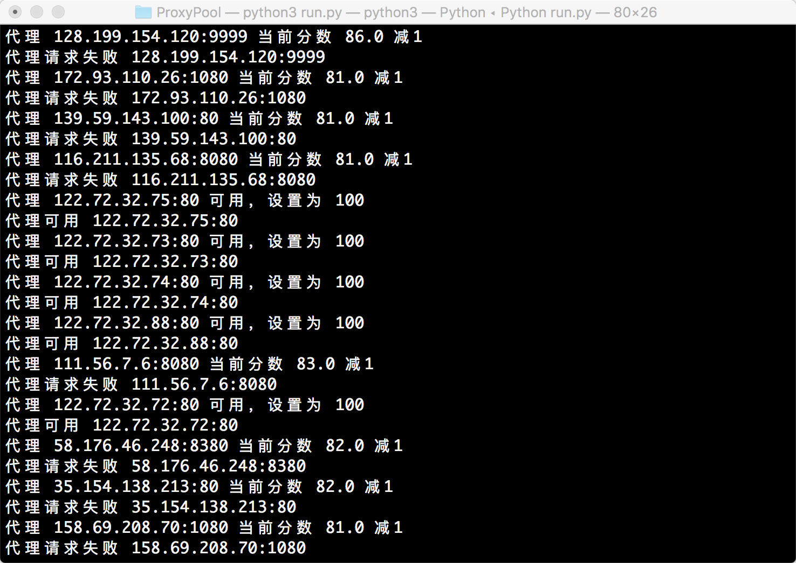
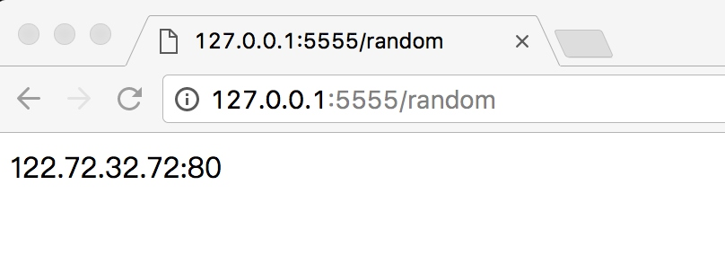

# 9.2 代理池的维护

我们在上一节了解了利用代理可以解决目标网站封 IP 的问题。在网上有大量公开的免费代理，或者我们也可以购买付费的代理 IP，但是代理不论是免费的还是付费的，都不能保证都是可用的，因为可能此 IP 被其他人使用来爬取同样的目标站点而被封禁，或者代理服务器突然发生故障或网络繁忙。一旦我们选用了一个不可用的代理，这势必会影响爬虫的工作效率。

所以，我们需要提前做筛选，将不可用的代理剔除掉，保留可用代理。接下来我们就搭建一个高效易用的代理池。

### 1. 准备工作

首先需要成功安装 Redis 数据库并启动服务，另外还需要安装 aiohttp、requests、redis-py、pyquery、Flask 库，可以参考第 1 章的安装说明。

### 2. 代理池的目标

我们需要做到下面的几个目标，来实现易用高效的代理池。

- 基本模块分为 4 块：存储模块、获取模块、检测模块、接口模块。

- 存储模块：负责存储抓取下来的代理。首先要保证代理不重复，要标识代理的可用情况，还要动态实时处理每个代理，所以一种比较高效和方便的存储方式就是使用 Redis 的 Sorted Set，即有序集合。

- 获取模块：需要定时在各大代理网站抓取代理。代理可以是免费公开代理也可以是付费代理，代理的形式都是 IP 加端口，此模块尽量从不同来源获取，尽量抓取高匿代理，抓取成功之后将可用代理保存到数据库中。

- 检测模块：需要定时检测数据库中的代理。这里需要设置一个检测链接，最好是爬取哪个网站就检测哪个网站，这样更加有针对性，如果要做一个通用型的代理，那可以设置百度等链接来检测。另外，我们需要标识每一个代理的状态，如设置分数标识，100 分代表可用，分数越少代表越不可用。检测一次，如果代理可用，我们可以将分数标识立即设置为 100 满分，也可以在原基础上加 1 分；如果代理不可用，可以将分数标识减 1 分，当分数减到一定阈值后，代理就直接从数据库移除。通过这样的标识分数，我们就可以辨别代理的可用情况，选用的时候会更有针对性。

- 接口模块：需要用 API 来提供对外服务的接口。其实我们可以直接连接数据库来取对应的数据，但是这样就需要知道数据库的连接信息，并且要配置连接，而比较安全和方便的方式就是提供一个 Web API 接口，我们通过访问接口即可拿到可用代理。另外，由于可用代理可能有多个，那么我们可以设置一个随机返回某个可用代理的接口，这样就能保证每个可用代理都可以取到，实现负载均衡。

以上内容是设计代理的一些基本思路。接下来我们设计整体的架构，然后用代码实现代理池。

### 3. 代理池的架构

根据上文的描述，代理池的架构如图 9-1 所示。


图 9-1 代理池架构

代理池分为 4 个模块：存储模块、获取模块、检测模块、接口模块。

- 存储模块使用 Redis 的有序集合，用来做代理的去重和状态标识，同时它也是中心模块和基础模块，将其他模块串联起来。

- 获取模块定时从代理网站获取代理，将获取的代理传递给存储模块，并保存到数据库。

- 检测模块定时通过存储模块获取所有代理，并对代理进行检测，根据不同的检测结果对代理设置不同的标识。

- 接口模块通过 Web API 提供服务接口，接口通过连接数据库并通过 Web 形式返回可用的代理。

### 4. 代理池的实现

接下来我们分别用代码来实现一下这四个模块。

#### 存储模块

这里我们使用 Redis 的有序集合，集合的每一个元素都是不重复的，对于代理池来说，集合的元素就变成了一个个代理，也就是 IP 加端口的形式，如 60.207.237.111:8888，这样的一个代理就是集合的一个元素。另外，有序集合的每一个元素都有一个分数字段，分数是可以重复的，可以是浮点数类型，也可以是整数类型。该集合会根据每一个元素的分数对集合进行排序，数值小的排在前面，数值大的排在后面，这样就可以实现集合元素的排序了。

对于代理池来说，这个分数可以作为判断一个代理是否可用的标志，100 为最高分，代表最可用，0 为最低分，代表最不可用。如果要获取可用代理，可以从代理池中随机获取分数最高的代理，注意是随机，这样可以保证每个可用代理都会被调用到。

分数是我们判断代理稳定性的重要标准，设置分数规则如下所示。

- 分数 100 为可用，检测器会定时循环检测每个代理可用情况，一旦检测到有可用的代理就立即置为 100，检测到不可用就将分数减 1，分数减至 0 后代理移除。

- 新获取的代理的分数为 10，如果测试可行，分数立即置为 100，不可行则分数减 1，分数减至 0 后代理移除。

这只是一种解决方案，当然可能还有更合理的方案。之所以设置此方案有如下几个原因。

- 在检测到代理可用时，分数立即置为 100，这样可以保证所有可用代理有更大的机会被获取到。你可能会问，为什么不将分数加 1 而是直接设为最高 100 呢？设想一下，有的代理是从各大免费公开代理网站获取的，常常一个代理并没有那么稳定，平均 5 次请求可能有两次成功，3 次失败，如果按照这种方式来设置分数，那么这个代理几乎不可能达到一个高的分数，也就是说即便它有时是可用的，但是筛选的分数最高，那这样的代理几乎不可能被取到。如果想追求代理稳定性，可以用上述方法，这种方法可确保分数最高的代理一定是最稳定可用的。所以，这里我们采取 “可用即设置 100” 的方法，确保只要可用的代理都可以被获取到。

- 在检测到代理不可用时，分数减 1，分数减至 0 后，代理移除。这样一个有效代理如果要被移除需要连续不断失败 100 次，也就是说当一个可用代理如果尝试了 100 次都失败了，就一直减分直到移除，一旦成功就重新置回 100。尝试机会越多，则这个代理拯救回来的机会越多，这样就不容易将曾经的一个可用代理丢弃，因为代理不可用的原因很可能是网络繁忙或者其他人用此代理请求太过频繁，所以在这里将分数为 100。

- 新获取的代理的分数设置为 10，代理如果不可用，分数就减 1，分数减到 0，代理就移除，如果代理可用，分数就置为 100。由于很多代理是从免费网站获取的，所以新获取的代理无效的比例非常高，可能可用的代理不足 10%。所以在这里我们将分数设置为 10，检测的机会没有可用代理的 100 次那么多，这也可以适当减少开销。

上述代理分数的设置思路不一定是最优思路，但据个人实测，它的实用性还是比较强的。

现在我们需要定义一个类来操作数据库的有序集合，定义一些方法来实现分数的设置、代理的获取等。代码实现如下所示：

```python
MAX_SCORE = 100
MIN_SCORE = 0
INITIAL_SCORE = 10
REDIS_HOST = 'localhost'
REDIS_PORT = 6379
REDIS_PASSWORD = None
REDIS_KEY = 'proxies'

import redis
from random import choice


class RedisClient(object):
    def __init__(self, host=REDIS_HOST, port=REDIS_PORT, password=REDIS_PASSWORD):
        """
        初始化
        :param host: Redis 地址
        :param port: Redis 端口
        :param password: Redis 密码
        """
        self.db = redis.StrictRedis(host=host, port=port, password=password, decode_responses=True)
    
    def add(self, proxy, score=INITIAL_SCORE):
        """
        添加代理，设置分数为最高
        :param proxy: 代理
        :param score: 分数
        :return: 添加结果
        """
        if not self.db.zscore(REDIS_KEY, proxy):
            return self.db.zadd(REDIS_KEY, score, proxy)
    
    def random(self):
        """
        随机获取有效代理，首先尝试获取最高分数代理，如果不存在，按照排名获取，否则异常
        :return: 随机代理
        """
        result = self.db.zrangebyscore(REDIS_KEY, MAX_SCORE, MAX_SCORE)
        if len(result):
            return choice(result)
        else:
            result = self.db.zrevrange(REDIS_KEY, 0, 100)
            if len(result):
                return choice(result)
            else:
                raise PoolEmptyError
    
    def decrease(self, proxy):
        """
        代理值减一分，小于最小值则删除
        :param proxy: 代理
        :return: 修改后的代理分数
        """
        score = self.db.zscore(REDIS_KEY, proxy)
        if score and score > MIN_SCORE:
            print(' 代理 ', proxy, ' 当前分数 ', score, ' 减 1')
            return self.db.zincrby(REDIS_KEY, proxy, -1)
        else:
            print(' 代理 ', proxy, ' 当前分数 ', score, ' 移除 ')
            return self.db.zrem(REDIS_KEY, proxy)
    
    def exists(self, proxy):
        """
        判断是否存在
        :param proxy: 代理
        :return: 是否存在
        """
        return not self.db.zscore(REDIS_KEY, proxy) == None
    
    def max(self, proxy):
        """
        将代理设置为 MAX_SCORE
        :param proxy: 代理
        :return: 设置结果
        """
        print(' 代理 ', proxy, ' 可用，设置为 ', MAX_SCORE)
        return self.db.zadd(REDIS_KEY, MAX_SCORE, proxy)
    
    def count(self):
        """
        获取数量
        :return: 数量
        """
        return self.db.zcard(REDIS_KEY)
    
    def all(self):
        """
        获取全部代理
        :return: 全部代理列表
        """return self.db.zrangebyscore(REDIS_KEY, MIN_SCORE, MAX_SCORE)```

首先我们定义了一些常量，如 MAX_SCORE、MIN_SCORE、INITIAL_SCORE 分别代表最大分数、最小分数、初始分数。REDIS_HOST、REDIS_PORT、REDIS_PASSWORD 分别代表了 Redis 的连接信息，即地址、端口、密码。REDIS_KEY 是有序集合的键名，我们可以通过它来获取代理存储所使用的有序集合。

接下来定义了一个 RedisClient 类，这个类可以用来操作 Redis 的有序集合，其中定义了一些方法来对集合中的元素进行处理，它的主要功能如下所示。

* \_\_init\_\_() 方法是初始化的方法，其参数是 Redis 的连接信息，默认的连接信息已经定义为常量，在__init__() 方法中初始化了一个 StrictRedis 的类，建立 Redis 连接。
* add() 方法向数据库添加代理并设置分数，默认的分数是 INITIAL_SCORE 也就是 10，返回结果是添加的结果。
* random() 方法是随机获取代理的方法，首先获取 100 分的代理，然后随机选择一个返回。如果不存在 100 分的代理，则此方法按照排名来获取，选取前 100 名，然后随机选择一个返回，否则抛出异常。
* decrease() 方法是在代理检测无效的时候设置分数减 1 的方法，代理传入后，此方法将代理的分数减 1，如果分数达到最低值，那么代理就删除。
* exists() 方法可判断代理是否存在集合中。
* max() 方法将代理的分数设置为 MAX_SCORE，即 100，也就是当代理有效时的设置。
* count() 方法返回当前集合的元素个数。
* all() 方法返回所有的代理列表，供检测使用。

定义好了这些方法，我们可以在后续的模块中调用此类来连接和操作数据库。如想要获取随机可用的代理，只需要调用 random() 方法即可，得到的就是随机的可用代理。

#### 获取模块

获取模块的逻辑相对简单，首先定义一个 Crawler 来从各大网站抓取代理，示例如下：

```python
import json
from .utils import get_page
from pyquery import PyQuery as pq

class ProxyMetaclass(type):
    def __new__(cls, name, bases, attrs):
        count = 0
        attrs['__CrawlFunc__'] = []
        for k, v in attrs.items():
            if 'crawl_' in k:
                attrs['__CrawlFunc__'].append(k)
                count += 1
        attrs['__CrawlFuncCount__'] = count
        return type.__new__(cls, name, bases, attrs)

class Crawler(object, metaclass=ProxyMetaclass):
    def get_proxies(self, callback):
        proxies = []
        for proxy in eval("self.{}()".format(callback)):
            print(' 成功获取到代理 ', proxy)
            proxies.append(proxy)
        return proxies

    def crawl_daili66(self, page_count=4):
        """
        获取代理 66
        :param page_count: 页码
        :return: 代理
        """
        start_url = 'http://www.66ip.cn/{}.html'
        urls = [start_url.format(page) for page in range(1, page_count + 1)]
        for url in urls:
            print('Crawling', url)
            html = get_page(url)
            if html:
                doc = pq(html)
                trs = doc('.containerbox table tr:gt(0)').items()
                for tr in trs:
                    ip = tr.find('td:nth-child(1)').text()
                    port = tr.find('td:nth-child(2)').text()
                    yield ':'.join([ip, port])

    def crawl_proxy360(self):
        """
        获取 Proxy360
        :return: 代理
        """
        start_url = 'http://www.proxy360.cn/Region/China'
        print('Crawling', start_url)
        html = get_page(start_url)
        if html:
            doc = pq(html)
            lines = doc('div[name="list_proxy_ip"]').items()
            for line in lines:
                ip = line.find('.tbBottomLine:nth-child(1)').text()
                port = line.find('.tbBottomLine:nth-child(2)').text()
                yield ':'.join([ip, port])

    def crawl_goubanjia(self):
        """
        获取 Goubanjia
        :return: 代理
        """
        start_url = 'http://www.goubanjia.com/free/gngn/index.shtml'
        html = get_page(start_url)
        if html:
            doc = pq(html)
            tds = doc('td.ip').items()
            for td in tds:
                td.find('p').remove()
                yield td.text().replace(' ', '')

```

方便起见，我们将获取代理的每个方法统一定义为以 crawl 开头，这样扩展的时候只需要添加 crawl 开头的方法即可。

在这里实现了几个示例，如抓取代理 66、Proxy360、Goubanjia 三个免费代理网站，这些方法都定义成了生成器，通过 yield 返回一个个代理。程序首先获取网页，然后用 pyquery 解析，解析出 IP 加端口的形式的代理然后返回。

然后定义了一个 get_proxies() 方法，将所有以 crawl 开头的方法调用一遍，获取每个方法返回的代理并组合成列表形式返回。

你可能会想知道，如何获取所有以 crawl 开头的方法名称呢？其实这里借助了元类来实现。我们定义了一个 ProxyMetaclass，Crawler 类将它设置为元类，元类中实现了 \_\_new\_\_() 方法，这个方法有固定的几个参数，第四个参数 attrs 中包含了类的一些属性。我们可以遍历 attrs 这个参数即可获取类的所有方法信息，就像遍历字典一样，键名对应方法的名称。然后判断方法的开头是否 crawl，如果是，则将其加入到 \_\_CrawlFunc\_\_属性中。这样我们就成功将所有以 crawl 开头的方法定义成了一个属性，动态获取到所有以 crawl 开头的方法列表。

所以，如果要做扩展，我们只需要添加一个以 crawl 开头的方法。例如抓取快代理，我们只需要在 Crawler 类中增加 crawl_kuaidaili() 方法，仿照其他几个方法将其定义成生成器，抓取其网站的代理，然后通过 yield 返回代理即可。这样，我们可以非常方便地扩展，而不用关心类其他部分的实现逻辑。

代理网站的添加非常灵活，不仅可以添加免费代理，也可以添加付费代理。一些付费代理的提取方式也类似，也是通过 Web 的形式获取，然后进行解析。解析方式可能更加简单，如解析纯文本或 JSON，解析之后以同样的形式返回即可，在此不再代码实现，可以自行扩展。

既然定义了 Crawler 类，接下来再定义一个 Getter 类，用来动态地调用所有以 crawl 开头的方法，然后获取抓取到的代理，将其加入到数据库存储起来：

```python
from db import RedisClient
from crawler import Crawler

POOL_UPPER_THRESHOLD = 10000

class Getter():
    def __init__(self):
        self.redis = RedisClient()
        self.crawler = Crawler()
    
    def is_over_threshold(self):
        """判断是否达到了代理池限制"""
        if self.redis.count()>= POOL_UPPER_THRESHOLD:
            return True
        else:
            return False
    
    def run(self):
        print(' 获取器开始执行 ')
        if not self.is_over_threshold():
            for callback_label in range(self.crawler.__CrawlFuncCount__):
                callback = self.crawler.__CrawlFunc__[callback_label]
                proxies = self.crawler.get_proxies(callback)
                for proxy in proxies:
                    self.redis.add(proxy)
```

Getter 类就是获取器类，它定义了一个变量 POOL_UPPER_THRESHOLD 来表示代理池的最大数量，这个数量可以灵活配置，然后定义了 is_over_threshold() 方法来判断代理池是否已经达到了容量阈值。is_over_threshold() 方法调用了 RedisClient 的 count() 方法来获取代理的数量，然后进行判断，如果数量达到阈值，则返回 True，否则返回 False。如果不想加这个限制，可以将此方法永久返回 True。

接下来定义 run() 方法。该方法首先判断了代理池是否达到阈值，然后在这里就调用了 Crawler 类的__CrawlFunc__属性，获取到所有以 crawl 开头的方法列表，依次通过 get_proxies() 方法调用，得到各个方法抓取到的代理，然后再利用 RedisClient 的 add() 方法加入数据库，这样获取模块的工作就完成了。

#### 检测模块

我们已经成功将各个网站的代理获取下来了，现在就需要一个检测模块来对所有代理进行多轮检测。代理检测可用，分数就设置为 100，代理不可用，分数减 1，这样就可以实时改变每个代理的可用情况。如要获取有效代理只需要获取分数高的代理即可。

由于代理的数量非常多，为了提高代理的检测效率，我们在这里使用异步请求库 aiohttp 来进行检测。

requests 作为一个同步请求库，我们在发出一个请求之后，程序需要等待网页加载完成之后才能继续执行。也就是这个过程会阻塞等待响应，如果服务器响应非常慢，比如一个请求等待十几秒，那么我们使用 requests 完成一个请求就会需要十几秒的时间，程序也不会继续往下执行，而在这十几秒的时间里程序其实完全可以去做其他的事情，比如调度其他的请求或者进行网页解析等。

异步请求库就解决了这个问题，它类似 JavaScript 中的回调，即在请求发出之后，程序可以继续执行去做其他的事情，当响应到达时，程序再去处理这个响应。于是，程序就没有被阻塞，可以充分利用时间和资源，大大提高效率。

对于响应速度比较快的网站来说，requests 同步请求和 aiohttp 异步请求的效果差距没那么大。可对于检测代理来说，检测一个代理一般需要十多秒甚至几十秒的时间，这时候使用 aiohttp 异步请求库的优势就大大体现出来了，效率可能会提高几十倍不止。

所以，我们的代理检测使用异步请求库 aiohttp，实现示例如下所示：

```python
VALID_STATUS_CODES = [200]
TEST_URL = 'http://www.baidu.com'
BATCH_TEST_SIZE = 100

class Tester(object):
    def __init__(self):
        self.redis = RedisClient()
    
    async def test_single_proxy(self, proxy):
        """
        测试单个代理
        :param proxy: 单个代理
        :return: None
        """
        conn = aiohttp.TCPConnector(verify_ssl=False)
        async with aiohttp.ClientSession(connector=conn) as session:
            try:
                if isinstance(proxy, bytes):
                    proxy = proxy.decode('utf-8')
                real_proxy = 'http://' + proxy
                print(' 正在测试 ', proxy)
                async with session.get(TEST_URL, proxy=real_proxy, timeout=15) as response:
                    if response.status in VALID_STATUS_CODES:
                        self.redis.max(proxy)
                        print(' 代理可用 ', proxy)
                    else:
                        self.redis.decrease(proxy)
                        print(' 请求响应码不合法 ', proxy)
            except (ClientError, ClientConnectorError, TimeoutError, AttributeError):
                self.redis.decrease(proxy)
                print(' 代理请求失败 ', proxy)
    
    def run(self):
        """
        测试主函数
        :return: None
        """
        print(' 测试器开始运行 ')
        try:
            proxies = self.redis.all()
            loop = asyncio.get_event_loop()
            # 批量测试
            for i in range(0, len(proxies), BATCH_TEST_SIZE):
                test_proxies = proxies[i:i + BATCH_TEST_SIZE]
                tasks = [self.test_single_proxy(proxy) for proxy in test_proxies]
                loop.run_until_complete(asyncio.wait(tasks))
                time.sleep(5)
        except Exception as e:
            print(' 测试器发生错误 ', e.args)
```

这里定义了一个类 Tester，__init__() 方法中建立了一个 RedisClient 对象，供该对象中其他方法使用。接下来定义了一个 test_single_proxy() 方法，这个方法用来检测单个代理的可用情况，其参数就是被检测的代理。注意，test_single_proxy() 方法前面加了 async 关键词，这代表这个方法是异步的。方法内部首先创建了 aiohttp 的 ClientSession 对象，此对象类似于 requests 的 Session 对象，可以直接调用该对象的 get() 方法来访问页面。在这里，代理的设置是通过 proxy 参数传递给 get() 方法，请求方法前面也需要加上 async 关键词来标明其是异步请求，这也是 aiohttp 使用时的常见写法。

测试的链接在这里定义为常量 TEST_URL。如果针对某个网站有抓取需求，建议将 TEST_URL 设置为目标网站的地址，因为在抓取的过程中，代理本身可能是可用的，但是该代理的 IP 已经被目标网站封掉了。例如，某些代理可以正常访问百度等页面，但是对知乎来说可能就被封了，所以我们可以将 TEST_URL 设置为知乎的某个页面的链接，当请求失败、代理被封时，分数自然会减下来，失效的代理就不会被取到了。

如果想做一个通用的代理池，则不需要专门设置 TEST_URL，可以将其设置为一个不会封 IP 的网站，也可以设置为百度这类响应稳定的网站。

我们还定义了 VALID_STATUS_CODES 变量，这个变量是一个列表形式，包含了正常的状态码，如可以定义成 [200]。当然某些目标网站可能会出现其他的状态码，可以自行配置。

程序在获取 Response 后需要判断响应的状态，如果状态码在 VALID_STATUS_CODES 列表里，则代表代理可用，可以调用 RedisClient 的 max() 方法将代理分数设为 100，否则调用 decrease() 方法将代理分数减 1，如果出现异常也同样将代理分数减 1。

另外，我们设置了批量测试的最大值 BATCH_TEST_SIZE 为 100，也就是一批测试最多 100 个，这可以避免代理池过大时一次性测试全部代理导致内存开销过大的问题。

随后，在 run() 方法里面获取了所有的代理列表，使用 aiohttp 分配任务，启动运行，这样就可以进行异步检测了。可参考 aiohttp 的官方示例：http://aiohttp.readthedocs.io/。

这样，测试模块的逻辑就完成了。

#### 接口模块

通过上述 3 个模块，我们已经可以做到代理的获取、检测和更新，数据库就会以有序集合的形式存储各个代理及其对应的分数，分数 100 代表可用，分数越小代表越不可用。

但是我们怎样方便地获取可用代理呢？可以用 RedisClient 类直接连接 Redis，然后调用 random() 方法。这样做没问题，效率很高，但是会有几个弊端。

- 如果其他人使用这个代理池，他需要知道 Redis 连接的用户名和密码信息，这样很不安全。

- 如果代理池需要部署在远程服务器上运行，而远程服务器的 Redis 只允许本地连接，那么我们就不能远程直连 Redis 来获取代理。

- 如果爬虫所在的主机没有连接 Redis 模块，或者爬虫不是由 Python 语言编写的，那么我们就无法使用 RedisClient 来获取代理。

- 如果 RedisClient 类或者数据库结构有更新，那么爬虫端必须同步这些更新，这样非常麻烦。

综上考虑，为了使代理池可以作为一个独立服务运行，我们最好增加一个接口模块，并以 Web API 的形式暴露可用代理。

这样一来，获取代理只需要请求接口即可，以上的几个缺点弊端也可以避免。

我们使用一个比较轻量级的库 Flask 来实现这个接口模块，实现示例如下所示：

```python
from flask import Flask, g
from db import RedisClient

__all__ = ['app']
app = Flask(__name__)

def get_conn():
    if not hasattr(g, 'redis'):
        g.redis = RedisClient()
    return g.redis

@app.route('/')
def index():
    return '<h2>Welcome to Proxy Pool System</h2>'

@app.route('/random')
def get_proxy():
    """
    获取随机可用代理
    :return: 随机代理
    """
    conn = get_conn()
    return conn.random()

@app.route('/count')
def get_counts():
    """
    获取代理池总量
    :return: 代理池总量
    """
    conn = get_conn()
    return str(conn.count())


if __name__ == '__main__':
    app.run()
```

在这里，我们声明了一个 Flask 对象，定义了 3 个接口，分别是首页、随机代理页、获取数量页。

运行之后，Flask 会启动一个 Web 服务，我们只需要访问对应的接口即可获取到可用代理。

#### 调度模块

调度模块就是调用以上所定义的 3 个模块，将这 3 个模块通过多进程的形式运行起来，示例如下所示：

```python
TESTER_CYCLE = 20
GETTER_CYCLE = 20
TESTER_ENABLED = True
GETTER_ENABLED = True
API_ENABLED = True

from multiprocessing import Process
from api import app
from getter import Getter
from tester import Tester

class Scheduler():
    def schedule_tester(self, cycle=TESTER_CYCLE):
        """定时测试代理"""
        tester = Tester()
        while True:
            print(' 测试器开始运行 ')
            tester.run()
            time.sleep(cycle)
    
    def schedule_getter(self, cycle=GETTER_CYCLE):
        """定时获取代理"""
        getter = Getter()
        while True:
            print(' 开始抓取代理 ')
            getter.run()
            time.sleep(cycle)
    
    def schedule_api(self):
        """开启 API"""
        app.run(API_HOST, API_PORT)
    
    def run(self):
        print(' 代理池开始运行 ')
        if TESTER_ENABLED:
            tester_process = Process(target=self.schedule_tester)
            tester_process.start()
        
        if GETTER_ENABLED:
            getter_process = Process(target=self.schedule_getter)
            getter_process.start()
        
        if API_ENABLED:
            api_process = Process(target=self.schedule_api)
            api_process.start()
```

3 个常量 TESTER_ENABLED、GETTER_ENABLED、API_ENABLED 都是布尔类型，表示测试模块、获取模块、接口模块的开关，如果都为 True，则代表模块开启。

启动入口是 run() 方法，这个方法分别判断 3 个模块的开关。如果开关开启，启动时程序就新建一个 Process 进程，设置好启动目标，然后调用 start() 方法运行，这样 3 个进程就可以并行执行，互不干扰。

3 个调度方法结构也非常清晰。比如，schedule_tester() 方法用来调度测试模块，首先声明一个 Tester 对象，然后进入死循环不断循环调用其 run() 方法，执行完一轮之后就休眠一段时间，休眠结束之后重新再执行。在这里，休眠时间也定义为一个常量，如 20 秒，即每隔 20 秒进行一次代理检测。

最后，只需要调用 Scheduler 的 run() 方法即可启动整个代理池。

以上内容便是整个代理池的架构和相应实现逻辑。

### 5. 运行

接下来我们将代码整合一下，将代理运行起来，运行之后的输出结果如图 9-2 所示：



图 9-2 运行结果

以上是代理池的控制台输出，可以看到可用代理设置为 100，不可用代理分数减 1。

接下来我们再打开浏览器，当前配置了运行在 5555 端口，所以打开：[http://127.0.0.1:5555](http://127.0.0.1:5555)，即可看到其首页，如图 9-3 所示：


图 9-3 首页页面

再访问 [http://127.0.0.1:5555/random](http://127.0.0.1:5555/random)，即可获取随机可用代理，如图 9-4 所示：



图 9-4 获取代理页面

我们只需要访问此接口即可获取一个随机可用代理，这非常方便。

获取代理的代码如下所示：

```python
import requests

PROXY_POOL_URL = 'http://localhost:5555/random'

def get_proxy():
    try:
        response = requests.get(PROXY_POOL_URL)
        if response.status_code == 200:
            return response.text
    except ConnectionError:
        return None
```
这样便可以获取到一个随机代理了，它是字符串类型，此代理可以按照上一节所示的方法设置，如 requests 的使用方法如下所示：
```python
import requests

proxy = get_proxy()
proxies = {
    'http': 'http://' + proxy,
    'https': 'https://' + proxy,
}
try:
    response = requests.get('http://httpbin.org/get', proxies=proxies)
    print(response.text)
except requests.exceptions.ConnectionError as e:
    print('Error', e.args)
```

有了代理池之后，我们再取出代理即可有效防止 IP 被封禁的情况。

### 6. 本节代码

本节代码地址为：[https://github.com/Python3WebSpider/ProxyPool](https://github.com/Python3WebSpider/ProxyPool)。

### 7. 结语

本节实现了一个比较高效的代理池，来获取随机可用的代理。接下来，我们会利用代理池来实现数据的抓取。