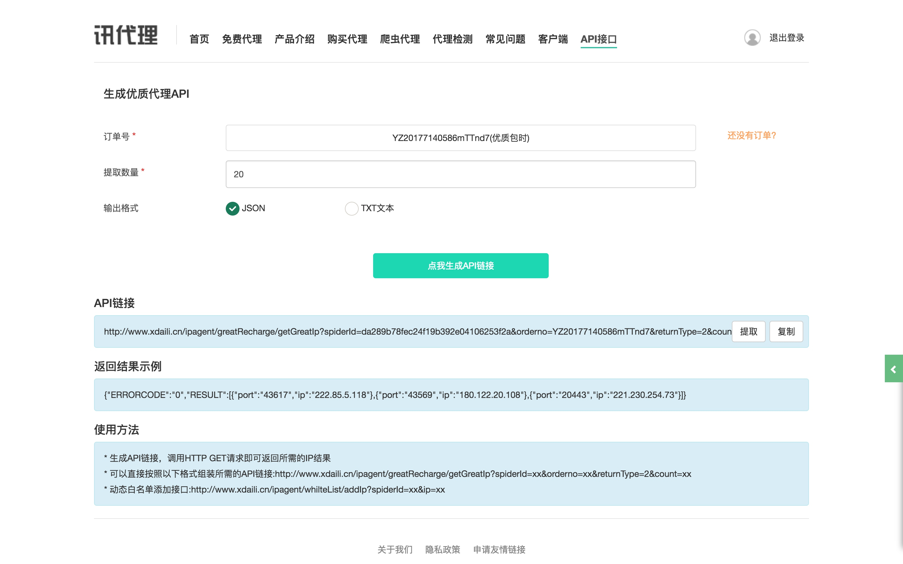
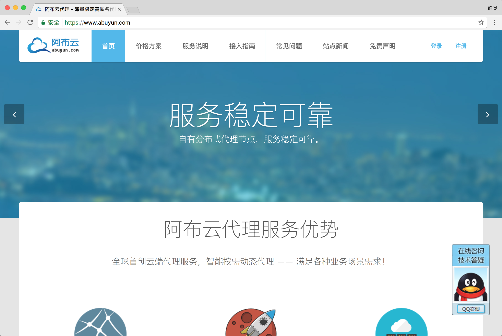

# 9.3 付费代理的使用

相对免费代理来说，付费代理的稳定性更高。本节将介绍爬虫付费代理的相关使用过程。

### 1. 付费代理分类

付费代理分为两类：

* 一类提供接口获取海量代理，按天或者按量收费，如讯代理。
* 一类搭建了代理隧道，直接设置固定域名代理，如阿布云代理。

本节分别以两家代表性的代理网站为例，讲解这两类代理的使用方法。

### 2. 讯代理

讯代理的代理效率较高（作者亲测），官网为 http://www.xdaili.cn/，如图 9-5 所示。


图 9-5 讯代理官网

讯代理上可供选购的代理有多种类别，包括如下几种（参考官网介绍）。

* 优质代理： 适合对代理 IP 需求量非常大，但能接受代理有效时长较短（10~30 分钟)，小部分不稳定的客户
* 独享动态： 适合对代理 IP 稳定性要求非常高，且可以自主控制的客户，支持地区筛选。
* 独享秒切： 适合对代理 IP 稳定性要求非常高，且可以自主控制的客户，快速获取 IP，地区随机分配
* 动态混拨： 适合对代理 IP 需求量大，代理 IP 使用时效短（3 分钟），切换快的客户
* 优质定制： 如果优质代理的套餐不能满足您的需求，请使用定制服务

一般选择第一类别优质代理即可，这种代理的量比较大，但是其稳定性不高，一些代理不可用。所以这种代理的使用就需要借助于上一节所说的代理池，自己再做一次筛选，以确保代理可用。

读者可以购买一天时长来试试效果。购买之后，讯代理会提供一个 API 来提取代理，如图 9-6 所示。



图 9-6 提取页面

比如在这里我的提取 API 为：[http://www.xdaili.cn/ipagent/greatRecharge/getGreatIp?spiderId=da289b78fec24f19b392e04106253f2a&orderno=YZ20177140586mTTnd7&returnType=2&count=20](http://www.xdaili.cn/ipagent/greatRecharge/getGreatIp?spiderId=da289b78fec24f19b392e04106253f2a&orderno=YZ20177140586mTTnd7&returnType=2&count=20)，可能已过期，在此仅做演示。

在这里指定了提取数量为 20，提取格式为 JSON，直接访问链接即可提取代理，结果如图 9-7 所示。


图 9-7 提取结果

接下来我们要做的就是解析这个 JSON，然后将其放入代理池中。

如果信赖讯代理的话，我们也可以不做代理池筛选，直接使用代理。不过我个人还是推荐使用代理池筛选，以提高代理可用概率。

根据上一节代理池的写法，我们只需要在 Crawler 中再加入一个 crawl 开头的方法即可。方法实现如下所示：

```python
def crawl_xdaili(self):
        """
        获取讯代理
        :return: 代理
        """
        url = 'http://www.xdaili.cn/ipagent/greatRecharge/getGreatIp?spiderId=da289b78fec24f19b392e04106253f2a&orderno=YZ20177140586mTTnd7&returnType=2&count=20'
        html = get_page(url)
        if html:
            result = json.loads(html)
            proxies = result.get('RESULT')
            for proxy in proxies:
                yield proxy.get('ip') + ':' + proxy.get('port')
```

这样我们就在代理池中接入了讯代理。获取讯代理的结果之后，解析 JSON，返回代理即可。

代理池运行之后就会抓取和检测该接口返回的代理，如果代理可用，那么分数就会被设为 100，通过代理池接口即可获取到这些可用代理。

### 3. 阿布云代理

阿布云代理提供了代理隧道，代理速度快且非常稳定，其官网为 https://www.abuyun.com/，如图 9-8 所示。



图 9-8 阿布云官网

阿布云代理主要分为两种：专业版和动态版，另外还有定制版（参考官网介绍）。

* 专业版，多个请求锁定一个代理 IP，海量 IP 资源池需求，近 300 个区域全覆盖，代理 IP 可连续使用 1 分钟，适用于请求 IP 连续型业务
* 动态版，每个请求一个随机代理 IP，海量 IP 资源池需求，近 300 个区域全覆盖，适用于爬虫类业务
* 定制版，灵活按照需求定制，定制 IP 区域，定制 IP 使用时长，定制 IP 每秒请求数

关于专业版和动态版的更多介绍可以查看官网：[https://www.abuyun.com/http-proxy/dyn-intro.html](https://www.abuyun.com/http-proxy/dyn-intro.html)。

对于爬虫来说，我们推荐使用动态版，购买之后可以在后台看到代理隧道的用户名和密码，如图 9-9 所示。


图 9-9 阿布云代理后台

整个代理的连接域名为 proxy.abuyun.com，端口为 9020，它们均是固定的，但是每次使用之后 IP 都会更改，该过程其实就是利用了代理隧道实现（参考官网介绍）。

其官网原理介绍如下：

* 云代理通过代理隧道的形式提供高匿名代理服务，支持 HTTP/HTTPS 协议。
* 云代理在云端维护一个全局 IP 池供代理隧道使用，池中的 IP 会不间断更新，以保证同一时刻 IP 池中有几十到几百个可用代理 IP。
* 需要注意的是代理 IP 池中有部分 IP 可能会在当天重复出现多次。
* 动态版 HTTP 代理隧道会为每个请求从 IP 池中挑选一个随机代理 IP。
* 无须切换代理 IP，每一个请求一个随机代理 IP。
* HTTP 代理隧道有并发请求限制，默认每秒只允许 5 个请求。如果需要更多请求数，请额外购买。

注意，默认套餐的并发请求是 5 个。如果需要更多请求数，则须另外购买。

使用教程的官网链接为：https://www.abuyun.com/http-proxy/dyn-manual-python.html。教程提供了 requests、urllib、Scrapy 的接入方式。

现在我们以 requests 为例，接入代码如下所示：

```python
import requests

url = 'http://httpbin.org/get'

# 代理服务器
proxy_host = 'proxy.abuyun.com'
proxy_port = '9020'

# 代理隧道验证信息
proxy_user = 'H01234567890123D'
proxy_pass = '0123456789012345'

proxy_meta = 'http://%(user) s:%(pass) s@%(host) s:%(port) s' % {
    'host': proxy_host,
    'port': proxy_port,
    'user': proxy_user,
    'pass': proxy_pass,
}
proxies = {
    'http': proxy_meta,
    'https': proxy_meta,
}
response = requests.get(url, proxies=proxies)
print(response.status_code)
print(response.text)
```
在这里其实就是使用了代理认证，在前面我们也提到过类似的设置方法，运行结果如下：
```json
200
{"args": {}, 
  "headers": {
    "Accept": "*/*", 
    "Accept-Encoding": "gzip, deflate", 
    "Connection": "close", 
    "Host": "httpbin.org", 
    "User-Agent": "python-requests/2.18.1"
  }, 
  "origin": "60.207.237.111", 
  "url": "http://httpbin.org/get"
}
```

输出结果的 origin 即为代理 IP 的实际地址。这段代码可以多次运行测试，我们发现每次请求 origin 都会在变化，这就是动态版代理的效果。

这种效果其实跟之前的代理池的随机代理效果类似，都是随机取出了一个当前可用代理。但是，与维护代理池相比，此服务的配置简单，使用更加方便，更省时省力。在价格可以接受的情况下，个人推荐此种代理。

### 4. 结语

以上内容便是付费代理的相关使用方法，付费代理稳定性比免费代理更高。读者可以自行选购合适的代理。