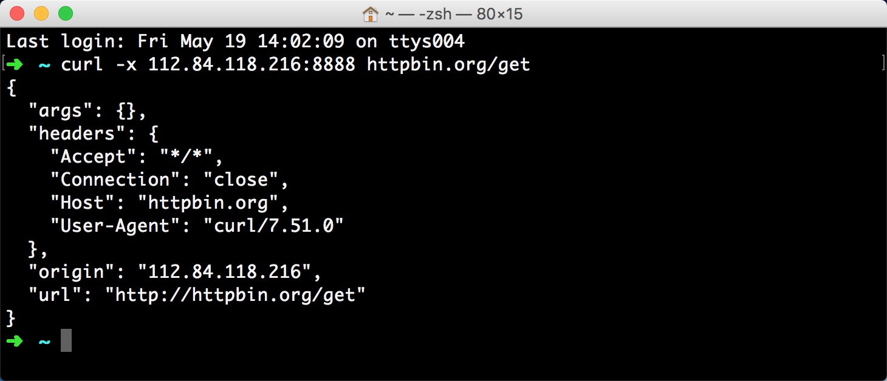
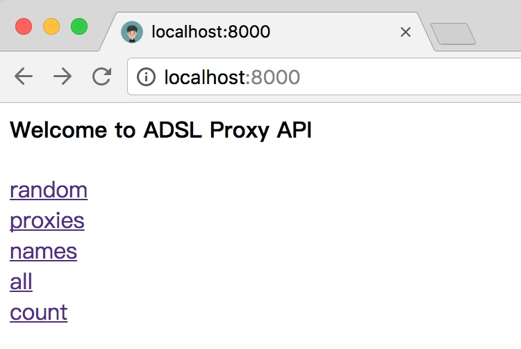

# 9.4 ADSL拨号代理

我们尝试维护过一个代理池，虽然可以挑选出许多可用代理，但是可能遇到稳定性不高、响应速度慢的问题，而且这些代理基本算是公共代理，即使是付费批量购买的代理肯定也有其他人在使用。

既然可能这些代理其他人也可能在使用，当有人使用相同代理也在抓取与和我们相同的站点的时候，这个代理的 IP 被封的概率就会更大。另外这些代理可能有效时间比较短，虽然有代理池一直在筛选，但如果一轮检测没有及时更新状态，也是有可能取到不可用的代理的。

所以说，如果要追求更加的稳定的代理的话，就需要去购买专有代理或者自己搭建代理服务器了。

但是服务器一般都是固定的 IP，我们总不能搭建 100 个代理就用 100 台服务器吧，这显然是不现实的，开销太大了。

所以这里 ADSL 动态拨号主机就可以派上用场了，

### 1. 什么是ADSL

ADSL 全称叫做 Asymmetric Digital Subscriber Line，非对称数字用户环路，因为它的上行和下行带宽不对称。它采用频分复用技术把普通的电话线分成了电话、上行和下行三个相对独立的信道，从而避免了相互之间的干扰。

这种主机是通过拨号的方式上网的，拨号的时候需要 ADSL 账号和密码，每拨号一次就更换一个 IP，IP 分布在多个 A段，如果都能使用的话，意味着 IP 量级可达千万，网上有不少 ADSL 拨号主机代理商，其宣称 IP 量级可达百万。如果我们用此种主机作为代理的话，每隔一段时间拨一次号，换一个 IP，这样一台主机就可以源源不断地更换 IP，可以有效防止 IP 被封禁。另外主机的稳定性也很好，代理响应速度也会很快。

本节来讲解一下 ADSL 拨号代理服务器的相关设置。

### 2. 准备工作

要实现代理池我们首先需要成功安装好了 Redis 数据库并启动服务，另外还需要安装 Requests、RedisPy、Tornado 库，如果没有安装可以参考第一章的安装说明。

### 3. 购买主机

在开始之前，我们需要先购买一台动态拨号 VPS 主机，这样的主机在百度搜索一下，服务商还是相当多的，在这里推荐一家云立方，官方网站：[http://www.yunlifang.cn/dynamicvps.asp](http://www.yunlifang.cn/dynamicvps.asp)，感觉还是比较良心的，非广告。

建议选择电信线路，主机配置的话可以自行选择，主要看下带宽是否可以满足需求就好了。

购买完成之后，就需要安装操作系统了，进入拨号主机的后台，首先预装一个操作系统。


在这里推荐安装 CentOS 7 系统。

然后找到远程管理面板找到远程连接的用户名和密码，也就是 SSH 远程连接服务器的信息。

比如我这边的 IP  端口分别是 153.36.65.214:20063，用户名是root。

命令行下输入：

```
ssh root@153.36.65.214 -p 20063
```

然后输入管理密码，就可以连接上远程服务器了。

进入之后，可以发现有一个可用的脚本文件，叫做 ppp.sh，这是拨号初始化的脚本，运行它会让我们输入拨号的用户名和密码，然后它就会开始各种拨号配置，一次配置成功，后面的拨号就不需要重复输入用户名和密码了。

运行 ppp.sh 脚本，输入用户名密码等待它的配置完成。


都提示成功之后就可以进行拨号了。

在拨号之前如果我们测试 ping 任何网站都是不通的，因为当前网络还没联通，输入拨号命令：

```
adsl-start
```

可以发现拨号命令成功运行，没有任何报错信息，这就证明拨号成功完成了，耗时约几秒钟。接下来如果再去 ping 外网就可以通了。

如果要停止拨号可以输入：

```
adsl-stop
```

停止之后，可以发现又连不通网络了。

所以只有拨号之后才可以建立网络连接。


所以断线重播的命令就是二者组合起来，先执行 adsl-stop 再执行 adsl-start，每拨一次号，ifconfig 命令观察一下主机的 IP，发现主机的 IP 一直是在变化的，网卡名称叫做 ppp0。


所以接下来我们要做的就有两件事，一是怎样将主机设置为代理服务器，二是怎样实时获取拨号主机的 IP。

### 4. 设置代理服务器

之前我们经常听说代理服务器，也设置过不少代理了，但是可能没有自己设置吧，自己有一台主机怎样设置为代理服务器呢？接下来我们就亲自试验下怎样搭建 HTTP 代理服务器。

在 Linux 下搭建 HTTP 代理服务器，推荐 TinyProxy 和 Squid，配置都非常简单，在这里我们以 TinyProxy 为例来讲解一下怎样搭建代理服务器。

#### 安装 TinyProxy

当然第一步就是安装 TinyProxy 这个软件了，在这里我使用的系统是 CentOS ，所以使用 yum 来安装，如果是其他系统如 Ubuntu 可以选择 apt-get 等命令安装，都是类似的。

命令行执行 yum 安装指令：

```
yum install -y epel-release
yum update -y
yum install -y tinyproxy
```

运行完成之后就可以完成 tinyproxy 的安装了。

#### 配置TinyProxy

安装完成之后还需要配置一下 TinyProxy 才可以用作代理服务器，需要编辑配置文件，它一般的路径是 /etc/tinyproxy/tinyproxy.conf。

可以看到有一行

```
Port 8888
```

在这里可以设置代理的端口，默认是 8888。

然后继续向下找，有这么一行

```
Allow 127.0.0.1
```

这是被允许连接的主机的 IP，如果想任何主机都可以连接，那就直接将它注释即可，所以在这里我们选择直接注释，也就是任何主机都可以使用这台主机作为代理服务器了。

修改为：

```
# Allow 127.0.0.1
```

设置完成之后重启 TinyProxy 即可：

```
systemctl enable tinyproxy.service
systemctl restart tinyproxy.service
```

防火墙开放该端口：

```
iptables -I INPUT -p tcp --dport 8888 -j ACCEPT
```

当然如果想直接关闭防火墙也可以：

```
systemctl stop firewalld.service
```

这样我们就完成了 TinyProxy 的配置了。

#### 验证TinyProxy

好了，这样我们就成功搭建好代理服务器了，首先 ifconfig 查看下当前主机的 IP，比如当前我的主机拨号 IP 为112.84.118.216，在其他的主机运行测试一下。

比如用 curl 命令设置代理请求一下 httpbin，检测下代理是否生效。

```
curl -x 112.84.118.216:8888 httpbin.org/get
```




如果有正常的结果输出并且 origin 的值为代理 IP 的地址，就证明 TinyProxy 配置成功了。

好，那到现在，我们接下来要做的就是需要动态实时获取主机的 IP 了。

### 5. 动态获取IP

现在我们可以执行命令让主机动态切换 IP 了，也在主机上搭建了代理服务器了，接下来我们只需要知道拨号后的 IP 就可以使用代理了。

首先我们需要考虑到，搭建 ADSL 代理不能仅限于一台主机，一台主机在拨号切换 IP 的间隙代理是不可用的，那么在这拨号的几秒时间内如果有第二台主机顶替第一台主机使用那就可以解决拨号间隙无法使用的问题了，所以我们要设计的架构必须要考虑到支持多主机的问题。

既然要支持多主机，假如有 10 台拨号主机同时需要维护，而爬虫需要使用这 10 台主机的代理，那么在爬虫端来维护的开销是非常大的，如果爬虫分布在不同的机器上运行，那么必须每个爬虫都要获得这 10 台拨号主机的配置，显然是不理想的。

所以为了更加方便地使用代理，我们还应该向上文的代理池一样定义一个统一的代理接口，爬虫端只需要配置代理接口即可获取可用代理，然后设置即可，非常简单易用。

要搭建一个接口，就势必需要一台服务器，而接口的数据从哪里获得呢，当然最理想的还是选择数据库。

选用怎样的数据库呢？比如我们需要同时维护 10 台拨号主机，每台拨号主机都会定时拨号，那这样每台主机在某个时刻可用的代理只有一个，所以我们没有必要去存储之前的拨号代理，因为重新拨号之后之前的代理已经不能用了，所以只需要将之前的代理更新其内容就好了，所以数据库要做的就是定时对每台主机的代理进行更新，而更新时又需要拨号主机的唯一标识，当需要更新时，根据主机标识查出这条数据，然后将这条数据对应的代理更新就好了，所以数据库端就需要存储一个主机标识到代理的映射关系。

那么很自然地我们就会想到关系型数据库如 MySQL 或者 Redis 的 Hash 存储。

而我们想要存储的只是一个映射关系，没有必要那么多字段，而且 Redis 相比 MySQL 效率更高，使用更方便，所以这里我们最终选定的存储方式就是 Redis 的 Hash。

### 6. 存储模块

那么接下来我们需要做的就需要一个 Redis 数据库，可被远程访问，各个拨号机器只需要将各自的主机标识和当前 IP和端口（也就是代理）发送给数据库存储下来就好了。

那么我们可以定义一个操作 Redis 数据库的类，示例如下：

```python
import redis
import random

# Redis数据库IP
REDIS_HOST = 'remoteaddress'
# Redis数据库密码, 如无则填None
REDIS_PASSWORD = 'foobared'
# Redis数据库端口
REDIS_PORT = 6379
# 代理池键名
PROXY_KEY = 'adsl'


class RedisClient(object):
    def __init__(self, host=REDIS_HOST, port=REDIS_PORT, password=REDIS_PASSWORD, proxy_key=PROXY_KEY):
        """
        初始化Redis连接
        :param host: Redis 地址
        :param port: Redis 端口
        :param password: Redis 密码
        :param proxy_key: Redis 哈希表名
        """
        self.db = redis.StrictRedis(host=host, port=port, password=password, decode_responses=True)
        self.proxy_key = proxy_key
    
    def set(self, name, proxy):
        """
        设置代理
        :param name: 主机名称
        :param proxy: 代理
        :return: 设置结果
        """
        return self.db.hset(self.proxy_key, name, proxy)
    
    def get(self, name):
        """
        获取代理
        :param name: 主机名称
        :return: 代理
        """
        return self.db.hget(self.proxy_key, name)
    
    def count(self):
        """
        获取代理总数
        :return: 代理总数
        """
        return self.db.hlen(self.proxy_key)
    
    def remove(self, name):
        """
        删除代理
        :param name: 主机名称
        :return: 删除结果
        """
        return self.db.hdel(self.proxy_key, name)
    
    def names(self):
        """
        获取主机名称列表
        :return: 获取主机名称列表
        """
        return self.db.hkeys(self.proxy_key)
    
    def proxies(self):
        """
        获取代理列表
        :return: 代理列表
        """
        return self.db.hvals(self.proxy_key)
    
    def random(self):
        """
        随机获取代理
        :return:
        """
        proxies = self.proxies()
        return random.choice(proxies)
    
    def all(self):
        """
        获取字典
        :return:
        """
        return self.db.hgetall(self.proxy_key)
```

在这里我们定义了一个 RedisClient 类，在 __init__() 方法中初始化了 Redis 连接，其中 REDIS_HOST 就是远程 Redis 的地址，REDIS_PASSWORD 是密码，REDIS_PORT 是端口，PROXY_KEY 是我们存储代理的 Hash 表的键名。

接下来我们定义了一个 set() 方法，用来向 Hash 表中添加映射关系，映射是从主机标识到代理的映射，比如一台主机的标识为 adsl1，当前的代理为 118.119.111.172:8888，那么 Hash 表中就会存储一个 key 为 adsl1，value 为 118.119.111.172:8888 的映射，Hash 结构如图所示：


这样就维护了一台主机的代理信息。

如果有多台主机，只需要向 Hash 中添加映射即可。

另外还定义了 get() 方法，就是从 Hash 表中取出某台主机对应的代理。

另外 remove() 方法则是从Hash表中移除对应的主机的代理。

另外还有 names()、proxies()、all() 方法则是分别获取Hash表中的主机列表、代理列表及所有主机代理映射。

count() 方法则是返回当前 Hash 表的大小，也就是可用代理的数目。

最后还有一个比较重要的方法 random()，就是随机从 Hash 表中取出一个可用代理，类似前面代理池的思想，确保每个代理都能被取到。

那这样我们的数据库操作就定义好了，如果要对数据库进行操作只需要初始化一个 RedisClient 对象，然后调用它的 set() 或者 remove() 方法即可对 Hash 表进行设置和删除。

这是拨号主机操作数据库的存储模块。

### 7. 拨号模块

剩下要做的就是拨号并把新的 IP 保存到 Redis Hash 表里了，我们再梳理一下流程。

首先是拨号定时，有定时拨号和非定时拨号两种选择。

对于非定时拨号，最好的方法就是向该主机发送一个信号，然后主机就启动拨号，但这样做的话，我们首先要搭建一个重新拨号的接口，如搭建一个 Web 接口，请求该接口即进行拨号，但开始拨号之后，此时主机的状态就从在线转为离线，而此时的 Web 接口也就相应失效了，拨号过程无法再连接，拨号之后接口的 IP 也变了，所以我们无法通过接口来方便地控制拨号过程和获取拨号结果，下次拨号还得改变拨号请求接口，所以非定时拨号的开销还是比较大的。

对于定时拨号，我们只需要在拨号主机上运行定时脚本即可，每隔一段时间拨号一次，更新 IP，然后将 IP 在 Redis Hash 表中更新即可，非常简单易用，另外可以适当将拨号频率调高一点，减少短时间内 IP 被封的可能性。

所以我们在这里选择定时拨号。

接下来就是如何获取 IP 了，获取拨号后的 IP 非常简单，只需要调用 ifconfig 命令，然后解析出对应网卡的 IP 即可，没有什么难度。

获取了 IP 之后，我们还需要进行有效性检测，拨号主机可以自己对自己检测，比如可以利用 Requests 设置自身的代理请求外网，如果成功，那么证明代理可用，然后再修改 Redis Hash 表，更新代理。

最后有一个值得注意的问题，就是在下次拨号前的操作，由于在拨号的间隙拨号主机是离线状态，而此时 Redis Hash 表中还存留了上次的代理，一旦这个代理被取用了，那将是无法使用的，所以为了避免这个情况，每台主机在拨号之前还需要将自身的代理从 Redis Hash 表中移除。

这样基本的逻辑就理顺了，我们用代码实现如下：

```python
import re
import time
import requests
from requests.exceptions import ConnectionError, ReadTimeout
from db import RedisClient

# 拨号网卡
ADSL_IFNAME = 'ppp0'
# 测试URL
TEST_URL = 'http://www.baidu.com'
# 测试超时时间
TEST_TIMEOUT = 20
# 拨号间隔
ADSL_CYCLE = 100
# 拨号出错重试间隔
ADSL_ERROR_CYCLE = 5
# ADSL命令
ADSL_BASH = 'adsl-stop;adsl-start'
# 代理运行端口
PROXY_PORT = 8888
# 客户端唯一标识
CLIENT_NAME = 'adsl1'

class Sender():
    def get_ip(self, ifname=ADSL_IFNAME):
        """
        获取本机IP
        :param ifname: 网卡名称
        :return:
        """
        (status, output) = subprocess.getstatusoutput('ifconfig')
        if status == 0:
            pattern = re.compile(ifname + '.*?inet.*?(\d+\.\d+\.\d+\.\d+).*?netmask', re.S)
            result = re.search(pattern, output)
            if result:
                ip = result.group(1)
                return ip

    def test_proxy(self, proxy):
        """
        测试代理
        :param proxy: 代理
        :return: 测试结果
        """
        try:
            response = requests.get(TEST_URL, proxies={
                'http': 'http://' + proxy,
                'https': 'https://' + proxy
            }, timeout=TEST_TIMEOUT)
            if response.status_code == 200:
                return True
        except (ConnectionError, ReadTimeout):
            return False

    def remove_proxy(self):
        """
        移除代理
        :return: None
        """
        self.redis = RedisClient()
        self.redis.remove(CLIENT_NAME)
        print('Successfully Removed Proxy')

    def set_proxy(self, proxy):
        """
        设置代理
        :param proxy: 代理
        :return: None
        """
        self.redis = RedisClient()
        if self.redis.set(CLIENT_NAME, proxy):
            print('Successfully Set Proxy', proxy)

    def adsl(self):
        """
        拨号主进程
        :return: None
        """
        while True:
            print('ADSL Start, Remove Proxy, Please wait')
            self.remove_proxy()
            (status, output) = subprocess.getstatusoutput(ADSL_BASH)
            if status == 0:
                print('ADSL Successfully')
                ip = self.get_ip()
                if ip:
                    print('Now IP', ip)
                    print('Testing Proxy, Please Wait')
                    proxy = '{ip}:{port}'.format(ip=ip, port=PROXY_PORT)
                    if self.test_proxy(proxy):
                        print('Valid Proxy')
                        self.set_proxy(proxy)
                        print('Sleeping')
                        time.sleep(ADSL_CYCLE)
                    else:
                        print('Invalid Proxy')
                else:
                    print('Get IP Failed, Re Dialing')
                    time.sleep(ADSL_ERROR_CYCLE)
            else:
                print('ADSL Failed, Please Check')
                time.sleep(ADSL_ERROR_CYCLE)
def run():
    sender = Sender()
    sender.adsl()
```

在这里定义了一个 Sender 类，它的主要作用是执行定时拨号并将新的 IP 测试通过之后更新到远程 Redis Hash 表里。

主方法是 adsl() 方法，首先是一个无限循环，循环体内就是拨号的逻辑。

首先调用了 remove_proxy() 方法将远程 Redis Hash 表中本机对应的代理移除，避免拨号时本主机的残留代理被取到。

接下来利用了 subprocess 模块来执行拨号脚本，拨号脚本很简单，就是 stop 之后再 start，定义成了 ADSL_BASH。

随后又调用 get_ip() 方法，通过 subprocess 模块执行了获取IP的命令 ifconfig，然后根据网卡名称获取了当前拨号网卡的 IP 地址，即拨号后的 IP。

再接下来就需要测试代理有效性了，调用了 test_proxy() 方法，将自身的代理设置好，使用 Requests 库来用代理连接 TEST_URL，在此 TEST_URL 设置为百度，如果请求成功，则证明代理有效。

如果代理有效，再调用 set_proxy() 方法将 Redis Hash 表中本机对应的代理更新，设置时需要传入本机的唯一标识和本机当前代理。本机唯一标识可随意配置，对应的变量为 CLIENT_NAME，保证各台拨号主机不冲突即可。本机当前代理则由拨号后的新 IP 加端口组合而成。通过调用 RedisClient 的 set() 方法，参数 name 为本机唯一标识，proxy 为拨号后的新代理，执行之后便可以更新 Hash 表中本机代理了。

建议至少配置两台主机，这样在一台主机的拨号间隙还有另一台主机的代理可用，拨号主机的数量不限，越多越好。

在拨号主机上执行一下拨号脚本，示例输出如下：


可以看到首先拨号前移除了代理，然后进行拨号，拨号完成之后获取到了新的 IP，随后检测代理，成功之后就设置代理到 Redis Hash 表中，然后等待一段时间，再重新进行拨号。

这样如果添加了多台拨号主机，就可以有多个稳定的定时更新的代理可用了，在 Redis Hash 表中会实时更新各台拨号主机的代理，如图所示：


图中所示是配置了四台 ADSL 拨号主机并运行后 Hash 表的内容，只要存在表中的代理都是可用的。

### 8. 接口模块

到目前为止，我们已经可以成功实时地更新拨号主机的代理了，不过还缺少一个模块，那就是接口模块，像之前的代理池一样，我们也定义一些接口来获取代理，如 random 获取随机代理，count 获取代理个数等等。

在这里我们选用 Tornado 来实现，利用 Tornado 的 Server 模块搭建 Web 接口服务，示例如下：

```python
import json
import tornado.ioloop
import tornado.web
from tornado.web import RequestHandler, Application

# API端口
API_PORT = 8000

class MainHandler(RequestHandler):
    def initialize(self, redis):
        self.redis = redis
    
    def get(self, api=''):
        if not api:
            links = ['random', 'proxies', 'names', 'all', 'count']
            self.write('<h4>Welcome to ADSL Proxy API</h4>')
            for link in links:
                self.write('<a href=' + link + '>' + link + '</a><br>')
        
        if api == 'random':
            result = self.redis.random()
            if result:
                self.write(result)
        
        if api == 'names':
            result = self.redis.names()
            if result:
                self.write(json.dumps(result))
        
        if api == 'proxies':
            result = self.redis.proxies()
            if result:
                self.write(json.dumps(result))
        
        if api == 'all':
            result = self.redis.all()
            if result:
                self.write(json.dumps(result))
        
        if api == 'count':
            self.write(str(self.redis.count()))


def server(redis, port=API_PORT, address=''):
    application = Application([
        (r'/', MainHandler, dict(redis=redis)),
        (r'/(.*)', MainHandler, dict(redis=redis)),
    ])
    application.listen(port, address=address)
    print('ADSL API Listening on', port)
    tornado.ioloop.IOLoop.instance().start()
```

在这里定义了五个接口，random 获取随机代理，names 获取主机列表，proxies 获取代理列表，all 获取代理映射，count 获取代理数量。

程序启动之后便会在 API_PORT 端口上运行 Web 服务，主页面如下：




访问 proxies 接口可以获得所有代理列表。


访问 random 接口可以获取随机可用代理。


这样我们只需要将接口部署到服务器上，即可通过 Web 接口获取可用代理了，获取方式和代理池类似。

### 9. 本节代码

本节代码地址为：[https://github.com/Python3WebSpider/AdslProxy](https://github.com/Python3WebSpider/AdslProxy)。

### 10. 结语

本节介绍了 ADSL 拨号代理的搭建过程，有了这种代理，我们可以无限次更换IP，而且线路非常稳定，抓取效果也会好很多。