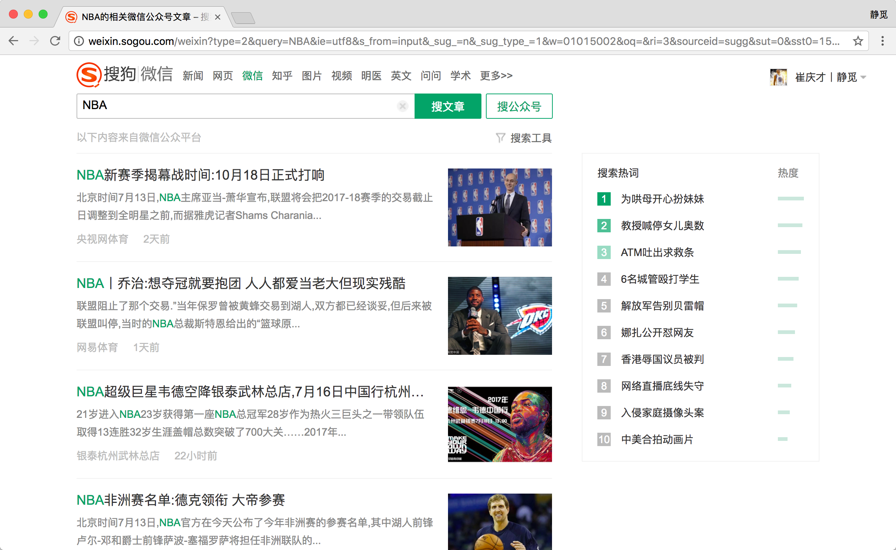
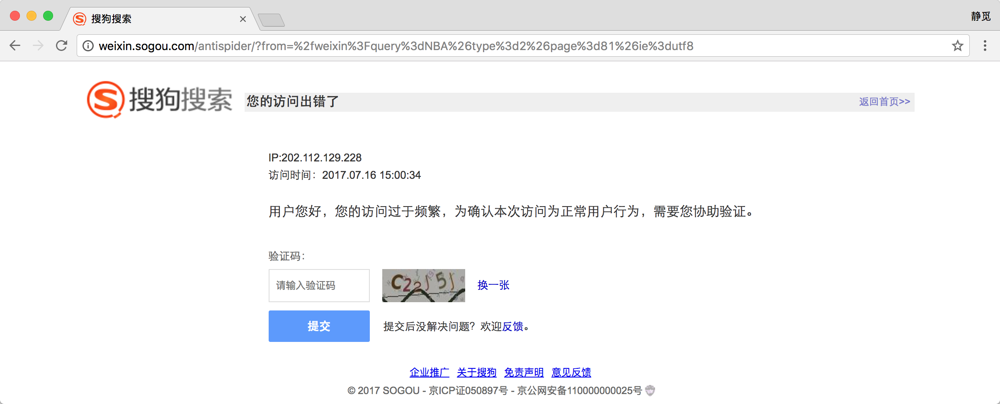
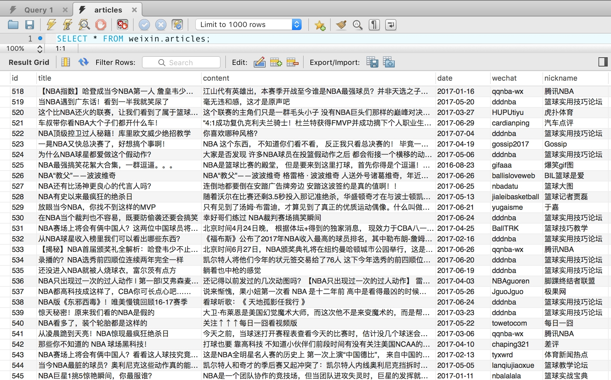

# 9.5 使用代理爬取微信公众号文章

前面我们讲解了代理池的维护和付费代理的相关使用方法，本节我们进行一下实战演练，利用代理来抓取微信公众号的文章。

### 1. 本节目标

本节我们的主要目标是利用代理抓取微信公众号的文章，提取其正文、发表日期、公众号等内容，抓取来源是搜狗微信，链接为：[http://weixin.sogou.com/](http://weixin.sogou.com/)，然后把抓取结果保存到 MySQL 数据库。

### 2. 准备工作

本节抓取微信公众号我们需要准备好前文中所介绍的代理池并可正常运行。这里需要用的 Python 库有 Aiohttp、Requests、RedisPy、PyQuery、Flask 、PyMySQL，如没有安装可以参考第一章的安装说明。

### 3. 抓取分析

搜狗对微信公众平台的公众号和文章做了整合，可以通过上面的链接搜索到相关的公众号和文章，例如搜索 NBA，可以搜索到最新的和 NBA 有关的文章：



直接点击搜索后其实有很多无关 GET 请求参数，将无关的参数去掉之后，可以只保留 type 和 query 参数，例如：[http://weixin.sogou.com/weixin?type=2&query=NBA](http://weixin.sogou.com/weixin?type=2&query=NBA)就是搜索关键词为 NBA，类型为 2 也就是文章的所有内容。

随后下拉网页，可以发现有下一页的链接，点击下一页即可翻页。


注意这里如果不登录账号只能看到10页的内容，登录之后可以看到100页。


所以如果需要抓取更多内容的话，就需要登录并使用 Cookies 来抓取。

搜狗微信这个站点的反爬虫很强，经常会跳出验证码，例如连续刷新多次，不出意外就会弹出类似如下图的验证：



观察一下网络请求发现是出现了 302 跳转，返回状态码为 302，跳转的链接开头为：[http://weixin.sogou.com/antispider/](http://weixin.sogou.com/antispider/)，很明显就是一个反爬虫的验证页面，所以我们得出，如果服务器返回状态码为 302 而非 200，则就是 IP 访问次数太高，IP 被封禁，此请求就是失败的了。

如果遇到这种情况，我们可以选择识别验证码并解封，也可以使用代理直接切换IP，在这里我们使用第二种方法，使用代理来直接跳过这个验证，代理使用上一节所讲的代理池，还需要更改一下检测的 URL 为搜狗微信的站点。

对于这种反爬很强的网站，如果遇到此种返回状态就需要重试，所以在这里我们采用另一种爬取方式，借助于数据库构造一个爬取队列，待爬取的请求都放到队列里，如果失败了重新放回到队列里，就会被重新调度爬取。

在这里我们可以采用 Redis 的队列数据结构，一旦有新的请求就加入到队列里，或者有需要重试的请求也放回队列。调度的时候如果队列不为空，那就把一个个请求取出来执行，得到响应后再进行解析，提取出我们想要的结果。

对于数据的存储，这次我们采用 MySQL 存储，借助于 PyMySQL 这个库，将爬取结果构造一个字典，实现动态存储。

综上所述，我们本节要实现的有：

* 修改代理池检测链接为搜狗微信站点
* 构造Redis爬取队列，用队列实现请求的存取
* 实现异常处理，失败的请求重新加入队列
* 实现翻页和提取文章列表并把对应请求加入队列
* 实现微信文章的信息的提取
* 将提取到的信息保存到MySQL

好，那么接下来我们就用代码来实现一下。

### 4. 构造 Request

既然我们要用队列来存储请求，那么肯定要实现一个请求Request 的数据结构，这个请求需要包含一些必要信息，如请求链接 URL、请求头 Headers、请求方式 Method、超时时间 Timeout，另外对于某个请求，肯定要有对应的方法来处理它的 Response，所以需要再加一个 Callback 回调函数，每次翻页请求需要代理来实现，所以还需要一个参数 NeedProxy，另外请求还需要有请求失败次数的记录，如果一个请求失败次数太多，那就不再重新请求了，所以还需要加一个 FailTime 失败次数的记录。

以上我们提到的都需要作为 Request 的一部分，我们将这些信息组成一个完整的 Request 放入队列去调度，这样从队列获取出来的时候直接执行这个请求就好了。

那么为了实现这个数据结构，我们可以采用继承 Reqeusts库中的 Request 对象的方式来实现。Requests 库中其实已经有了 Request 的这个对象，它将请求 Request 作为一个整体对象去执行，获取 Response 再返回，其实 Requests 库的 get()、post() 等方法的内部实现都是通过执行一个 Request 实现的。

我们首先看下 Request 这个对象的源码：

```python
class Request(RequestHooksMixin):
    def __init__(self,
            method=None, url=None, headers=None, files=None, data=None,
            params=None, auth=None, cookies=None, hooks=None, json=None):

        # Default empty dicts for dict params.
        data = [] if data is None else data
        files = [] if files is None else files
        headers = {} if headers is None else headers
        params = {} if params is None else params
        hooks = {} if hooks is None else hooks

        self.hooks = default_hooks()
        for (k, v) in list(hooks.items()):
            self.register_hook(event=k, hook=v)

        self.method = method
        self.url = url
        self.headers = headers
        self.files = files
        self.data = data
        self.json = json
        self.params = params
        self.auth = auth
        self.cookies = cookies
```

这是 Requests 库中 Request 对象的构造方法，可以发现这个 Request 已经包含了请求方式 Method、请求链接 URL、请求头 Headers 这几个属性，但是相比我们需要的还差了几个，所以我们需要实现一个特定的数据结构，在原先的基础上加入上文中所提到的额外的几个属性，所以这里我们需要继承 Request 对象重新实现一个 Request，在这里我们将它定义为 WeixinRequest，实现如下：

```python
TIMEOUT = 10
from requests import Request

class WeixinRequest(Request):
    def __init__(self, url, callback, method='GET', headers=None, need_proxy=False, fail_time=0, timeout=TIMEOUT):
        Request.__init__(self, method, url, headers)
        self.callback = callback
        self.need_proxy = need_proxy
        self.fail_time = fail_time
        self.timeout = timeout
```

在这里我们实现了 WeixinRequest 这个数据结构，在 __init__() 方法中先调用了 Request 的 __init__() 方法，然后加入额外的几个参数，分别定义为 callback、need_proxy、fail_time、timeout，分别代表回调函数、是否需要代理爬取、失败次数、超时时间。

有了这个 WeixinRequest 我们就可以将它作为一个整体来执行，一个个 WeixinRequest 对象都是独立的，每个请求都有自己的属性。例如我们可以调用它的 callback 就可以知道这个请求的响应应该用什么方法来处理了，调用 fail_time 就可以知道这个请求失败了多少次了，然后判断失败次数是不是到了阈值，该不该丢弃这个 Request。采用了面向对象的一些思想。

### 5. 实现请求队列

接下来我们就需要构造请求队列，实现请求的存取了，存取无非就是两个方法，一个是放，一个是取，既然是队列，那肯定是一端放，一端取，所以在这里我们利用 Redis 的 rpush() 和 lpop() 方法即可。

另外还需要注意的一点就是，存取不能直接存对象，Redis 里面存的都是字符串的形式，所以在存之前我们需要先把请求序列化，取出来的时候再将其反序列化，在这里利用 pickle 实现序列化和反序列化。

代码实现如下：

```python
from pickle import dumps, loads
from request import WeixinRequest

class RedisQueue():
    def __init__(self):
        """
        初始化Redis
        """
        self.db = StrictRedis(host=REDIS_HOST, port=REDIS_PORT, password=REDIS_PASSWORD)

    def add(self, request):
        """
        向队列添加序列化后的Request
        :param request: 请求对象
        :param fail_time: 失败次数
        :return: 添加结果
        """
        if isinstance(request, WeixinRequest):
            return self.db.rpush(REDIS_KEY, dumps(request))
        return False

    def pop(self):
        """
        取出下一个Request并反序列化
        :return: Request or None
        """
        if self.db.llen(REDIS_KEY):
            return loads(self.db.lpop(REDIS_KEY))
        else:
            return False

    def empty(self):
        return self.db.llen(REDIS_KEY) == 0
```

在这里实现了一个 RedisQueue，它的 __init__() 构造方法里面初始化了一个 StrictRedis 对象，随后我们实现了 add() 方法，在这里首先判断了 Request 的类型，如果是 WeixinRequest，那么就把它用 pickle 的 dumps() 方法序列化，然后再调用 rpush() 方法加入队列。pop() 方法则相反，是调用了 lpop() 方法将请求从队列取出，然后再用 pickle 的 loads() 方法将其转为 WeixinRequest 对象。另外还有 empty() 方法则返回了队列是否为空，只需要判断队列长度是否为 0 即可。

这样在调度的时候，我们只需要新建一个 RedisQueue 对象，然后调用 add() 方法，传入 WeixinRequest 对象即可将 WeixinRequest 加入队列，调用 pop() 方法即可取出下一个 WeixinRequest 对象，非常简单易用。

### 6. 修改代理池

好接下来我们就需要开始生成 Request 并开始爬取了，但是在这之前我们还需要做一件事，那就是先找一些可用代理。

之前我们的代理池检测的 URL 并不是搜狗微信这个站点，所以我们在这里需要将代理池检测的 URL 修改成搜狗微信站点，以便于把被搜狗微信站点疯掉的代理给剔除掉，留下可用代理。

所以我们需要做的就是将代理池的设置文件中的 TEST_URL 修改一下，如修改为：[http://weixin.sogou.com/weixin?type=2&query=nba](http://weixin.sogou.com/weixin?type=2&query=nba)，这样如果检测到被本站点封的代理就会减分，正常请求的代理就会赋值为 100，最后留下的就是可用代理。

修改完成之后将获取模块、检测模块、接口模块的开关都设置为 True，让代理池运行一会。


这样过一段时间，数据库中留下的 100分 的代理就是针对搜狗微信的可用代理了。


同时我们访问代理接口，在这里设置为 5555，访问：[http://127.0.0.1:5555/random](http://127.0.0.1:5555/random)，即可获取到随机可用代理。


再定义一个函数来获取随机代理即可：

```python
PROXY_POOL_URL = 'http://127.0.0.1:5555/random'

def get_proxy(self):
    """
    从代理池获取代理
    :return:
    """
    try:
        response = requests.get(PROXY_POOL_URL)
        if response.status_code == 200:
            print('Get Proxy', response.text)
            return response.text
        return None
    except requests.ConnectionError:
        return None
```

### 7. 第一个请求

接下来一切准备工作都做好了，下面我们就可以先构造第一个请求放到队列里面以供调度了，定义一个 Spider 的类，实现一个 start() 方法如下：

```python
from requests import Session
from db import RedisQueue
from request import WeixinRequest
from urllib.parse import urlencode


class Spider():
    base_url = 'http://weixin.sogou.com/weixin'
    keyword = 'NBA'
    headers = {
        'Accept': 'text/html,application/xhtml+xml,application/xml;q=0.9,image/webp,image/apng,*/*;q=0.8',
        'Accept-Encoding': 'gzip, deflate',
        'Accept-Language': 'zh-CN,zh;q=0.8,en;q=0.6,ja;q=0.4,zh-TW;q=0.2,mt;q=0.2',
        'Cache-Control': 'max-age=0',
        'Connection': 'keep-alive',
        'Cookie': 'IPLOC=CN1100; SUID=6FEDCF3C541C940A000000005968CF55; SUV=1500041046435211; ABTEST=0|1500041048|v1; SNUID=CEA85AE02A2F7E6EAFF9C1FE2ABEBE6F; weixinIndexVisited=1; JSESSIONID=aaar_m7LEIW-jg_gikPZv; ld=Wkllllllll2BzGMVlllllVOo8cUlllll5G@HbZllll9lllllRklll5@@@@@@@@@@',
        'Host': 'weixin.sogou.com',
        'Upgrade-Insecure-Requests': '1',
        'User-Agent': 'Mozilla/5.0 (Macintosh; Intel Mac OS X 10_12_3) AppleWebKit/537.36 (KHTML, like Gecko) Chrome/59.0.3071.115 Safari/537.36'
    }
    session = Session()
    queue = RedisQueue()
    
    def start(self):
        """
        初始化工作
        """
        # 全局更新Headers
        self.session.headers.update(self.headers)
        start_url = self.base_url + '?' + urlencode({'query': self.keyword, 'type': 2})
        weixin_request = WeixinRequest(url=start_url, callback=self.parse_index, need_proxy=True)
        # 调度第一个请求
        self.queue.add(weixin_request)
```

在这里定义了 Spider 类，设置了很多全局变量，比如 keyword 我们在这里设置为 NBA，即抓取微信文章的关键字，headers 就是请求头，在这里需要在网站登录一下账号，然后将请求头需要从浏览器里面复制出来，记得带上 Cookies，这样才能抓取 100 页的内容，然后又初始化了一个 Session 和 RedisQueue 对象，分别用来执行请求和存储请求。

在 start() 方法中，首先全局更新了 Headers，使得所有的请求都能应用上 Cookies。然后构造了一个起始URL，其实就是前面我们所提到的：[http://weixin.sogou.com/weixin?type=2&query=NBA](http://weixin.sogou.com/weixin?type=2&query=NBA)，随后用它构造了一个 WeixinRequest 对象，URL 就是此 URL，回调函数是 Spider 类的 parse_index() 方法，也就是当这个请求成功之后就用 parse_index() 来处理和解析，need_proxy 参数设置为 True，代表执行这个请求需要用到代理。随后我们调用了 RedisQueue 的 add() 方法将这个请求加入队列，等待调度。

### 8. 调度请求

加入了第一个请求之后，肯定就需要开始调度了，我们首先需要从队列中取出这个请求，然后将它的结果解析出来，再生成新的请求再加入队列，然后再拿出新的请求再执行，再将结果解析再生成新的请求继续加入队列，再供调度，这样循环往复执行，直到队列中没有请求，就代表爬取结束，所以在这里我们用代码实现如下：

```python
VALID_STATUSES = [200]

def schedule(self):
    """
    调度请求
    :return:
    """
    while not self.queue.empty():
        weixin_request = self.queue.pop()
        callback = weixin_request.callback
        print('Schedule', weixin_request.url)
        response = self.request(weixin_request)
        if response and response.status_code in VALID_STATUSES:
            results = list(callback(response))
            if results:
                for result in results:
                    print('New Result', result)
                    if isinstance(result, WeixinRequest):
                        self.queue.add(result)
                    if isinstance(result, dict):
                        self.mysql.insert('articles', result)
            else:
                self.error(weixin_request)
        else:
            self.error(weixin_request)
```

在这里实现了一个 schedule() 方法，其内部是一个循环，循环的判断是队列不为空。

当队列不为空时，调用 pop() 方法取出下一个请求，执行了 request() 方法执行这个请求，request() 方法实现如下：

```python
from requests import ReadTimeout, ConnectionError

def request(self, weixin_request):
    """
    执行请求
    :param weixin_request: 请求
    :return: 响应
    """
    try:
        if weixin_request.need_proxy:
            proxy = get_proxy()
            if proxy:
                proxies = {
                    'http': 'http://' + proxy,
                    'https': 'https://' + proxy
                }
                return self.session.send(weixin_request.prepare(),
                                         timeout=weixin_request.timeout, allow_redirects=False, proxies=proxies)
        return self.session.send(weixin_request.prepare(), timeout=weixin_request.timeout, allow_redirects=False)
    except (ConnectionError, ReadTimeout) as e:
        print(e.args)
        return False
```

在这里首先判断了这个请求是否需要代理，如果需要代理，则调用 get_proxy() 方法获取代理，然后调用 Session 的 send() 方法执行这个请求，这里的请求调用了 prepare() 方法转化为 Prepared Request，具体的用法可以参考：[http://docs.python-requests.org/en/master/user/advanced/#prepared-requests](http://docs.python-requests.org/en/master/user/advanced/#prepared-requests)，同时设置好 allow_redirects 为False，timeout 是该请求的超时时间，最后将响应返回。

这样执行完 request() 方法之后得到的会有两种结果，一种是 False，意思就是请求失败，连接错误。另一种就是 Response 对象，得到 Response 对象之后还需要判断状态码，如果状态码合法，那么就进行解析，否则重新将请求加回队列。

如果状态码合法，解析的时候是调用的 WeixinRequest 的回调函数对应的函数解析，比如这里的回调函数就是parse_index()，其实现如下：

```python
from pyquery import PyQuery as pq

def parse_index(self, response):
    """
    解析索引页
    :param response: 响应
    :return: 新的响应
    """
    doc = pq(response.text)
    items = doc('.news-box .news-list li .txt-box h3 a').items()
    for item in items:
        url = item.attr('href')
        weixin_request = WeixinRequest(url=url, callback=self.parse_detail)
        yield weixin_request
    next = doc('#sogou_next').attr('href')
    if next:
        url = self.base_url + str(next)
        weixin_request = WeixinRequest(url=url, callback=self.parse_index, need_proxy=True)
        yield weixin_request
```

此方法做了两件事，一件事就是获取本页的所有微信文章链接，另一件事就是获取下一页的链接，再构造成 WeixinRequest 之后都 yield 返回。

随后 schedule() 方法将返回的结果进行遍历，利用 isinstance() 方法判断返回的结果如果是 WeixinRequest 就将其重新加入队列。

这样第一此循环就结束了。

这时 While 循环会继续执行，这时队列已经包含了第一页内容的文章详情页请求和下一页的请求了，所以第二次循环得到的下一个请求就是文章详情页的请求，重新调用 request( )方法获取其 Response，然后调用其对应的回调函数解析。这时详情页请求的回调方法就不同了，这次是 parse_detail() 方法，此方法实现如下：

```python
def parse_detail(self, response):
    """
    解析详情页
    :param response: 响应
    :return: 微信公众号文章
    """
    doc = pq(response.text)
    data = {
        'title': doc('.rich_media_title').text(),
        'content': doc('.rich_media_content').text(),
        'date': doc('#post-date').text(),
        'nickname': doc('#js_profile_qrcode > div > strong').text(),
        'wechat': doc('#js_profile_qrcode > div > p:nth-child(3) > span').text()
    }
    yield data
```

这个方法实际就是解析了微信文章详情页的内容，提取出来了它的标题、正文文本、发布日期、发布人昵称、微信公众号名称，组合成一个字典返回。

返回之后还是需要判断类型，判断是字典类型就调用 mysql对象的 insert() 方法将数据存入数据库。

这样第二次循环就执行完毕了。

随后第三次循环、第四次循环，循环往复，各个请求都有各自的回调函数，索引页解析完毕之后会继续生成后续请求，详情页解析完毕之后会返回结果以便存储，直到爬取完毕。

这样整个调度就完成了。

完善一下整个 Spider 的代码，实现如下：

```python
from requests import Session
from config import *
from db import RedisQueue
from mysql import MySQL
from request import WeixinRequest
from urllib.parse import urlencode
import requests
from pyquery import PyQuery as pq
from requests import ReadTimeout, ConnectionError


class Spider():
    base_url = 'http://weixin.sogou.com/weixin'
    keyword = 'NBA'
    headers = {
        'Accept': 'text/html,application/xhtml+xml,application/xml;q=0.9,image/webp,image/apng,*/*;q=0.8',
        'Accept-Encoding': 'gzip, deflate',
        'Accept-Language': 'zh-CN,zh;q=0.8,en;q=0.6,ja;q=0.4,zh-TW;q=0.2,mt;q=0.2',
        'Cache-Control': 'max-age=0',
        'Connection': 'keep-alive',
        'Cookie': 'IPLOC=CN1100; SUID=6FEDCF3C541C940A000000005968CF55; SUV=1500041046435211; ABTEST=0|1500041048|v1; SNUID=CEA85AE02A2F7E6EAFF9C1FE2ABEBE6F; weixinIndexVisited=1; JSESSIONID=aaar_m7LEIW-jg_gikPZv; ld=Wkllllllll2BzGMVlllllVOo8cUlllll5G@HbZllll9lllllRklll5@@@@@@@@@@',
        'Host': 'weixin.sogou.com',
        'Upgrade-Insecure-Requests': '1',
        'User-Agent': 'Mozilla/5.0 (Macintosh; Intel Mac OS X 10_12_3) AppleWebKit/537.36 (KHTML, like Gecko) Chrome/59.0.3071.115 Safari/537.36'
    }
    session = Session()
    queue = RedisQueue()
    mysql = MySQL()
    
    def get_proxy(self):
        """
        从代理池获取代理
        :return:
        """
        try:
            response = requests.get(PROXY_POOL_URL)
            if response.status_code == 200:
                print('Get Proxy', response.text)
                return response.text
            return None
        except requests.ConnectionError:
            return None
    
    def start(self):
        """
        初始化工作
        """
        # 全局更新Headers
        self.session.headers.update(self.headers)
        start_url = self.base_url + '?' + urlencode({'query': self.keyword, 'type': 2})
        weixin_request = WeixinRequest(url=start_url, callback=self.parse_index, need_proxy=True)
        # 调度第一个请求
        self.queue.add(weixin_request)
    
    def parse_index(self, response):
        """
        解析索引页
        :param response: 响应
        :return: 新的响应
        """
        doc = pq(response.text)
        items = doc('.news-box .news-list li .txt-box h3 a').items()
        for item in items:
            url = item.attr('href')
            weixin_request = WeixinRequest(url=url, callback=self.parse_detail)
            yield weixin_request
        next = doc('#sogou_next').attr('href')
        if next:
            url = self.base_url + str(next)
            weixin_request = WeixinRequest(url=url, callback=self.parse_index, need_proxy=True)
            yield weixin_request
    
    def parse_detail(self, response):
        """
        解析详情页
        :param response: 响应
        :return: 微信公众号文章
        """
        doc = pq(response.text)
        data = {
            'title': doc('.rich_media_title').text(),
            'content': doc('.rich_media_content').text(),
            'date': doc('#post-date').text(),
            'nickname': doc('#js_profile_qrcode > div > strong').text(),
            'wechat': doc('#js_profile_qrcode > div > p:nth-child(3) > span').text()
        }
        yield data
    
    def request(self, weixin_request):
        """
        执行请求
        :param weixin_request: 请求
        :return: 响应
        """
        try:
            if weixin_request.need_proxy:
                proxy = self.get_proxy()
                if proxy:
                    proxies = {
                        'http': 'http://' + proxy,
                        'https': 'https://' + proxy
                    }
                    return self.session.send(weixin_request.prepare(),
                                             timeout=weixin_request.timeout, allow_redirects=False, proxies=proxies)
            return self.session.send(weixin_request.prepare(), timeout=weixin_request.timeout, allow_redirects=False)
        except (ConnectionError, ReadTimeout) as e:
            print(e.args)
            return False
    
    def error(self, weixin_request):
        """
        错误处理
        :param weixin_request: 请求
        :return:
        """
        weixin_request.fail_time = weixin_request.fail_time + 1
        print('Request Failed', weixin_request.fail_time, 'Times', weixin_request.url)
        if weixin_request.fail_time < MAX_FAILED_TIME:
            self.queue.add(weixin_request)
    
    def schedule(self):
        """
        调度请求
        :return:
        """
        while not self.queue.empty():
            weixin_request = self.queue.pop()
            callback = weixin_request.callback
            print('Schedule', weixin_request.url)
            response = self.request(weixin_request)
            if response and response.status_code in VALID_STATUSES:
                results = list(callback(response))
                if results:
                    for result in results:
                        print('New Result', result)
                        if isinstance(result, WeixinRequest):
                            self.queue.add(result)
                        if isinstance(result, dict):
                            self.mysql.insert('articles', result)
                else:
                    self.error(weixin_request)
            else:
                self.error(weixin_request)
    
    def run(self):
        """
        入口
        :return:
        """
        self.start()
        self.schedule()


if __name__ == '__main__':
    spider = Spider()
    spider.run()
```

最后加了一个 run() 方法作为入口，启动的时候只需要执行 Spider 的 run() 方法即可。

### 9. MySQL存储

整个调度模块完成了，上面还没提及到的就是存储模块，在这里还需要定义一个 MySQL 类供存储数据，实现如下：

```python
REDIS_HOST = 'localhost'
REDIS_PORT = 6379
REDIS_PASSWORD = 'foobared'
REDIS_KEY = 'weixin'

import pymysql
from config import *

class MySQL():
    def __init__(self, host=MYSQL_HOST, username=MYSQL_USER, password=MYSQL_PASSWORD, port=MYSQL_PORT,
                 database=MYSQL_DATABASE):
        """
        MySQL初始化
        :param host:
        :param username:
        :param password:
        :param port:
        :param database:
        """
        try:
            self.db = pymysql.connect(host, username, password, database, charset='utf8', port=port)
            self.cursor = self.db.cursor()
        except pymysql.MySQLError as e:
            print(e.args)
    
    def insert(self, table, data):
        """
        插入数据
        :param table:
        :param data:
        :return:
        """
        keys = ', '.join(data.keys())
        values = ', '.join(['%s'] * len(data))
        sql_query = 'insert into %s (%s) values (%s)' % (table, keys, values)
        try:
            self.cursor.execute(sql_query, tuple(data.values()))
            self.db.commit()
        except pymysql.MySQLError as e:
            print(e.args)
            self.db.rollback()
```

__init__() 方法初始化了 MySQL 连接，在这里需要 MySQL 的用户、密码、端口、数据库名等信息。在这里数据库名为 weixin ，需要自己创建一下。

insert() 方法传入表名和字典即可动态构造 SQL，在前文 MySQ L使用一节也有讲到，构造完 SQL 之后执行即可插入数据。

在这里还需要提前建立一个数据表，表名为 articles，建表的 SQL 语句如下：

```sql
CREATE TABLE `articles` (
  `id` int(11) NOT NULL,
  `title` varchar(255) NOT NULL,
  `content` text NOT NULL,
  `date` varchar(255) NOT NULL,
  `wechat` varchar(255) NOT NULL,
  `nickname` varchar(255) NOT NULL
) DEFAULT CHARSET=utf8;
ALTER TABLE `articles` ADD PRIMARY KEY (`id`);
```

好，那这样我们的整个爬虫就算完成了。

### 10. 运行

示例运行结果如下：


可以看到首先调度了第一页结果对应的请求，获取了代理执行此请求，随后得到了11个新的请求，都是 WeixinRequest类型，将其再加入队列，随后继续调度新加入的请求，也就是文章详情页对应的请求，再执行，得到的就是文章详情对应的提取结果，是字典类型。

这样循环往复，不断抓取，直至所有结果抓取完毕，程序终止，爬取完成。

看一下抓取结果：



可以看到相关的微信文章都被存储到数据库了。

### 11. 本节代码

本节代码地址为：[https://github.com/Python3WebSpider/Weixin](https://github.com/Python3WebSpider/Weixin)，可以试运行，运行之前请先配置好代理池。

### 12. 结语

以上便是使用代理爬取微信公众号文章的方法，涉及到的新知识点不少，希望大家可以好好消化。
