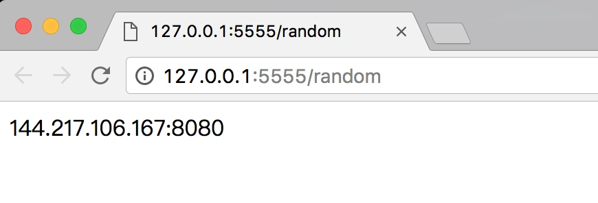

# 9.5 使用代理爬取微信公众号文章

前面讲解了代理池的维护和付费代理的相关使用方法，接下来我们进行一下实战演练，利用代理来爬取微信公众号的文章。

### 1. 本节目标

我们的主要目标是利用代理爬取微信公众号的文章，提取正文、发表日期、公众号等内容，爬取来源是搜狗微信，其链接为 http://weixin.sogou.com/，然后把爬取结果保存到 MySQL 数据库。

### 2. 准备工作

首先需要准备并正常运行前文中所介绍的代理池。这里需要用的 Python 库有 aiohttp、requests、redis-py、pyquery、Flask、PyMySQL，如这些库没有安装可以参考第 1 章的安装说明。

### 3. 爬取分析

搜狗对微信公众平台的公众号和文章做了整合。我们可以通过上面的链接搜索到相关的公众号和文章，例如搜索 NBA，可以搜索到最新的文章，如图 9-21 所示。


图 9-21 搜索结果

点击搜索后，搜索结果的 URL 中其实有很多无关 GET 请求参数，将无关的参数去掉，只保留 type 和 query 参数，例如 http://weixin.sogou.com/weixin?type=2&amp;query=NBA，搜索关键词为 NBA，类型为 2，2 代表搜索微信文章。

下拉网页，点击下一页即可翻页，如图 9-22 所示。


图 9-22 翻页列表

注意，如果没有输入账号登录，那只能看到 10 页的内容，登录之后可以看到 100 页内容，如图 9-23 和图 9-24 所示。


图 9-23 不登录的结果


图 9-24 登录后的结果

如果需要爬取更多内容，就需要登录并使用 Cookies 来爬取。

搜狗微信站点的反爬虫能力很强，如连续刷新，站点就会弹出类似如图 9-25 所示的验证。


图 9-25 验证码页面

网络请求出现了 302 跳转，返回状态码为 302，跳转的链接开头为 http://weixin.sogou.com/antispider/，这很明显就是一个反爬虫的验证页面。所以我们得出结论，如果服务器返回状态码为 302 而非 200，则 IP 访问次数太高，IP 被封禁，此请求就是失败了。

如果遇到这种情况，我们可以选择识别验证码并解封，也可以使用代理直接切换 IP。在这里我们采用第二种方法，使用代理直接跳过这个验证。代理使用上一节所讲的代理池，还需要更改检测的 URL 为搜狗微信的站点。

对于这种反爬能力很强的网站来说，如果我们遇到此种返回状态就需要重试。所以我们采用另一种爬取方式，借助数据库构造一个爬取队列，待爬取的请求都放到队列里，如果请求失败了重新放回队列，就会被重新调度爬取。

在这里我们可以采用 Redis 的队列数据结构，新的请求就加入队列，或者有需要重试的请求也放回队列。调度的时候如果队列不为空，那就把一个个请求取出来执行，得到响应后再进行解析，提取出我们想要的结果。

这次我们采用 MySQL 存储，借助 PyMySQL 库，将爬取结果构造为一个字典，实现动态存储。

综上所述，我们本节实现的功能有如下几点。

* 修改代理池检测链接为搜狗微信站点
* 构造 Redis 爬取队列，用队列实现请求的存取
* 实现异常处理，失败的请求重新加入队列
* 实现翻页和提取文章列表并把对应请求加入队列
* 实现微信文章的信息的提取
* 将提取到的信息保存到 MySQL

好，那么接下来我们就用代码来实现一下。

### 4. 构造 Request

既然我们要用队列来存储请求，那么肯定要实现一个请求 Request 的数据结构，这个请求需要包含一些必要信息，如请求链接、请求头、请求方式、超时时间。另外对于某个请求，我们需要实现对应的方法来处理它的响应，所以需要再加一个 Callback 回调函数。每次翻页请求需要代理来实现，所以还需要一个参数 NeedProxy。如果一个请求失败次数太多，那就不再重新请求了，所以还需要加失败次数的记录。

这些字段都需要作为 Request 的一部分，组成一个完整的 Request 对象放入队列去调度，这样从队列获取出来的时候直接执行这个 Request 对象就好了。

我们可以采用继承 reqeusts 库中的 Request 对象的方式来实现这个数据结构。requests 库中已经有了 Request 对象，它将请求 Request 作为一个整体对象去执行，得到响应后再返回。其实 requests 库的 get()、post() 等方法都是通过执行 Request 对象实现的。

我们首先看看 Request 对象的源码：

```python
class Request(RequestHooksMixin):
    def __init__(self,
            method=None, url=None, headers=None, files=None, data=None,
            params=None, auth=None, cookies=None, hooks=None, json=None):

        # Default empty dicts for dict params.
        data = [] if data is None else data
        files = [] if files is None else files
        headers = {} if headers is None else headers
        params = {} if params is None else params
        hooks = {} if hooks is None else hooks

        self.hooks = default_hooks()
        for (k, v) in list(hooks.items()):
            self.register_hook(event=k, hook=v)

        self.method = method
        self.url = url
        self.headers = headers
        self.files = files
        self.data = data
        self.json = json
        self.params = params
        self.auth = auth
        self.cookies = cookies
```
这是 requests 库中 Request 对象的构造方法。这个 Request 已经包含了请求方式、请求链接、请求头这几个属性，但是相比我们需要的还差了几个。我们需要实现一个特定的数据结构，在原先基础上加入上文所提到的额外几个属性。这里我们需要继承 Request 对象重新实现一个请求，将它定义为 WeixinRequest，实现如下：
```python
TIMEOUT = 10
from requests import Request

class WeixinRequest(Request):
    def __init__(self, url, callback, method='GET', headers=None, need_proxy=False, fail_time=0, timeout=TIMEOUT):
        Request.__init__(self, method, url, headers)
        self.callback = callback
        self.need_proxy = need_proxy
        self.fail_time = fail_time
        self.timeout = timeout
```

在这里我们实现了 WeixinRequest 数据结构。__init__() 方法先调用了 Request 的__init__() 方法，然后加入额外的几个参数，定义为 callback、need_proxy、fail_time、timeout，分别代表回调函数、是否需要代理爬取、失败次数、超时时间。

我们就可以将 WeixinRequest 作为一个整体来执行，一个个 WeixinRequest 对象都是独立的，每个请求都有自己的属性。例如，我们可以调用它的 callback，就可以知道这个请求的响应应该用什么方法来处理，调用 fail_time 就可以知道这个请求失败了多少次，判断失败次数是不是到了阈值，该不该丢弃这个请求。这里我们采用了面向对象的一些思想。

### 5. 实现请求队列

接下来我们就需要构造请求队列，实现请求的存取。存取无非就是两个操作，一个是放，一个是取，所以这里利用 Redis 的 rpush() 和 lpop() 方法即可。

另外还需要注意，存取不能直接存 Request 对象，Redis 里面存的是字符串。所以在存 Request 对象之前我们先把它序列化，取出来的时候再将其反序列化，这个过程可以利用 pickle 模块实现。

```python
from pickle import dumps, loads
from request import WeixinRequest

class RedisQueue():
    def __init__(self):
        """初始化 Redis"""
        self.db = StrictRedis(host=REDIS_HOST, port=REDIS_PORT, password=REDIS_PASSWORD)

    def add(self, request):
        """
        向队列添加序列化后的 Request
        :param request: 请求对象
        :param fail_time: 失败次数
        :return: 添加结果
        """
        if isinstance(request, WeixinRequest):
            return self.db.rpush(REDIS_KEY, dumps(request))
        return False

    def pop(self):
        """
        取出下一个 Request 并反序列化
        :return: Request or None
        """
        if self.db.llen(REDIS_KEY):
            return loads(self.db.lpop(REDIS_KEY))
        else:
            return False

    def empty(self):
        return self.db.llen(REDIS_KEY) == 0
```

这里实现了一个 RedisQueue，它的 \_\_init\_\_() 构造方法里面初始化了一个 StrictRedis 对象。随后实现了 add() 方法，首先判断 Request 的类型，如果是 WeixinRequest，那么就把程序就会用 pickle 的 dumps() 方法序列化，然后再调用 rpush() 方法加入队列。pop() 方法则相反，调用 lpop() 方法将请求从队列取出，然后再用 pickle 的 loads() 方法将其转为 WeixinRequest 对象。另外，empty() 方法返回队列是否为空，只需要判断队列长度是否为 0 即可。

在调度的时候，我们只需要新建一个 RedisQueue 对象，然后调用 add() 方法，传入 WeixinRequest 对象，即可将 WeixinRequest 加入队列，调用 pop() 方法，即可取出下一个 WeixinRequest 对象，非常简单易用。

### 6. 修改代理池

接下来我们要生成请求并开始爬取。在此之前还需要做一件事，那就是先找一些可用代理。

之前代理池检测的 URL 并不是搜狗微信站点，所以我们需要将代理池检测的 URL 修改成搜狗微信站点，以便于把被搜狗微信站点封禁的代理剔除掉，留下可用代理。

现在将代理池的设置文件中的 TEST_URL 修改一下，如 http://weixin.sogou.com/weixin?type=2&amp;  
query=nba，被本站点封的代理就会减分，正常请求的代理就会赋值为 100，最后留下的就是可用代理。

修改之后将获取模块、检测模块、接口模块的开关都设置为 True，让代理池运行一会，如图 9-26 所示。


图 9-26 代理池运行结果

这样，数据库中留下的 100 分的代理就是针对搜狗微信的可用代理了，如图 9-27 所示。


图 9-27 可用代理列表

同时访问代理接口，接口设置为 5555，访问 http://127.0.0.1:5555/random，即可获取到随机可用代理，如图 9-28 所示。



图 9-28 代理接口

再定义一个函数来获取随机代理：

```python
PROXY_POOL_URL = 'http://127.0.0.1:5555/random'

def get_proxy(self):
    """
    从代理池获取代理
    :return:
    """
    try:
        response = requests.get(PROXY_POOL_URL)
        if response.status_code == 200:
            print('Get Proxy', response.text)
            return response.text
        return None
    except requests.ConnectionError:
        return None
```

### 7. 第一个请求

一切准备工作都做好，下面我们就可以构造第一个请求放到队列里以供调度了。定义一个 Spider 类，实现 start() 方法的代码如下：

```python
from requests import Session
from db import RedisQueue
from request import WeixinRequest
from urllib.parse import urlencode


class Spider():
    base_url = 'http://weixin.sogou.com/weixin'
    keyword = 'NBA'
    headers = {
        'Accept': 'text/html,application/xhtml+xml,application/xml;q=0.9,image/webp,image/apng,*/*;q=0.8',
        'Accept-Encoding': 'gzip, deflate',
        'Accept-Language': 'zh-CN,zh;q=0.8,en;q=0.6,ja;q=0.4,zh-TW;q=0.2,mt;q=0.2',
        'Cache-Control': 'max-age=0',
        'Connection': 'keep-alive',
        'Cookie': 'IPLOC=CN1100; SUID=6FEDCF3C541C940A000000005968CF55; SUV=1500041046435211; ABTEST=0|1500041048|v1; SNUID=CEA85AE02A2F7E6EAFF9C1FE2ABEBE6F; weixinIndexVisited=1; JSESSIONID=aaar_m7LEIW-jg_gikPZv; ld=Wkllllllll2BzGMVlllllVOo8cUlllll5G@HbZllll9lllllRklll5@@@@@@@@@@',
        'Host': 'weixin.sogou.com',
        'Upgrade-Insecure-Requests': '1',
        'User-Agent': 'Mozilla/5.0 (Macintosh; Intel Mac OS X 10_12_3) AppleWebKit/537.36 (KHTML, like Gecko) Chrome/59.0.3071.115 Safari/537.36'
    }
    session = Session()
    queue = RedisQueue()
    
    def start(self):
        """初始化工作"""
        # 全局更新 Headers
        self.session.headers.update(self.headers)
        start_url = self.base_url + '?' + urlencode({'query': self.keyword, 'type': 2})
        weixin_request = WeixinRequest(url=start_url, callback=self.parse_index, need_proxy=True)
        # 调度第一个请求
        self.queue.add(weixin_request)
```

这里定义了 Spider 类，设置了很多全局变量，比如 keyword 设置为 NBA，headers 就是请求头。在浏览器里登录账号，然后在开发者工具里将请求头复制出来，记得带上 Cookie 字段，这样才能爬取 100 页的内容。然后初始化了 Session 和 RedisQueue 对象，它们分别用来执行请求和存储请求。

首先，start() 方法全局更新了 headers，使得所有请求都能应用 Cookies。然后构造了一个起始 URL：http://weixin.sogou.com/weixin?type=2&amp;query=NBA，随后用改 URL 构造了一个 WeixinRequest 对象。回调函数是 Spider 类的 parse_index() 方法，也就是当这个请求成功之后就用 parse_index() 来处理和解析。need_proxy 参数设置为 True，代表执行这个请求需要用到代理。随后我们调用了 RedisQueue 的 add() 方法，将这个请求加入队列，等待调度。

### 8. 调度请求

加入第一个请求之后，调度开始了。我们首先从队列中取出这个请求，将它的结果解析出来，生成新的请求加入队列，然后拿出新的请求，将结果解析，再生成新的请求加入队列，这样循环往复执行，直到队列中没有请求，则代表爬取结束。我们用代码实现如下：

```python
VALID_STATUSES = [200]

def schedule(self):
    """
    调度请求
    :return:
    """
    while not self.queue.empty():
        weixin_request = self.queue.pop()
        callback = weixin_request.callback
        print('Schedule', weixin_request.url)
        response = self.request(weixin_request)
        if response and response.status_code in VALID_STATUSES:
            results = list(callback(response))
            if results:
                for result in results:
                    print('New Result', result)
                    if isinstance(result, WeixinRequest):
                        self.queue.add(result)
                    if isinstance(result, dict):
                        self.mysql.insert('articles', result)
            else:
                self.error(weixin_request)
        else:
            self.error(weixin_request)
```

在这里实现了一个 schedule() 方法，其内部是一个循环，循环的判断是队列不为空。

当队列不为空时，调用 pop() 方法取出下一个请求，调用 request() 方法执行这个请求，request() 方法的实现如下：

```python
from requests import ReadTimeout, ConnectionError

def request(self, weixin_request):
    """
    执行请求
    :param weixin_request: 请求
    :return: 响应
    """
    try:
        if weixin_request.need_proxy:
            proxy = get_proxy()
            if proxy:
                proxies = {
                    'http': 'http://' + proxy,
                    'https': 'https://' + proxy
                }
                return self.session.send(weixin_request.prepare(),
                                         timeout=weixin_request.timeout, allow_redirects=False, proxies=proxies)
        return self.session.send(weixin_request.prepare(), timeout=weixin_request.timeout, allow_redirects=False)
    except (ConnectionError, ReadTimeout) as e:
        print(e.args)
        return False
```

这里首先判断这个请求是否需要代理，如果需要代理，则调用 get_proxy() 方法获取代理，然后调用 Session 的 send() 方法执行这个请求。这里的请求调用了 prepare() 方法转化为 Prepared Request，具体的用法可以参考 http://docs.python-requests.org/en/master/user/advanced/#prepared-requests，同时设置 allow_redirects 为 False，timeout 是该请求的超时时间，最后响应返回。

执行 request() 方法之后会得到两种结果：一种是 False，即请求失败，连接错误；另一种是 Response 对象，还需要判断状态码，如果状态码合法，那么就进行解析，否则重新将请求加回队列。

如果状态码合法，解析的时候就会调用 WeixinRequest 的回调函数进行解析。比如这里的回调函数是 parse_index()，其实现如下：

```python
from pyquery import PyQuery as pq

def parse_index(self, response):
    """
    解析索引页
    :param response: 响应
    :return: 新的响应
    """
    doc = pq(response.text)
    items = doc('.news-box .news-list li .txt-box h3 a').items()
    for item in items:
        url = item.attr('href')
        weixin_request = WeixinRequest(url=url, callback=self.parse_detail)
        yield weixin_request
    next = doc('#sogou_next').attr('href')
    if next:
        url = self.base_url + str(next)
        weixin_request = WeixinRequest(url=url, callback=self.parse_index, need_proxy=True)
        yield weixin_request
```

此方法做了两件事：一件事就是获取本页的所有微信文章链接，另一件事就是获取下一页的链接，再构造成 WeixinRequest 之后 yield 返回。

然后，schedule() 方法将返回的结果进行遍历，利用 isinstance() 方法判断返回结果，如果返回结果是 WeixinRequest，就将其重新加入队列。

至此，第一次循环结束。

这时 while 循环会继续执行。队列已经包含第一页内容的文章详情页请求和下一页的请求，所以第二次循环得到的下一个请求就是文章详情页的请求，程序重新调用 request() 方法获取其响应，然后调用其对应的回调函数解析。这时详情页请求的回调方法就不同了，这次是 parse_detail() 方法，此方法实现如下：

```python
def parse_detail(self, response):
    """
    解析详情页
    :param response: 响应
    :return: 微信公众号文章
    """
    doc = pq(response.text)
    data = {'title': doc('.rich_media_title').text(),
        'content': doc('.rich_media_content').text(),
        'date': doc('#post-date').text(),
        'nickname': doc('#js_profile_qrcode> div > strong').text(),
        'wechat': doc('#js_profile_qrcode> div > p:nth-child(3) > span').text()}
    yield data
```

这个方法解析了微信文章详情页的内容，提取出它的标题、正文文本、发布日期、发布人昵称、微信公众号名称，将这些信息组合成一个字典返回。

结果返回之后还需要判断类型，如是字典类型，程序就调用 mysql 对象的 insert() 方法将数据存入数据库。

这样，第二次循环执行完毕。

第三次循环、第四次循环，循环往复，每个请求都有各自的回调函数，索引页解析完毕之后会继续生成后续请求，详情页解析完毕之后会返回结果以便存储，直到爬取完毕。

现在，整个调度就完成了。

我们完善一下整个 Spider 代码，实现如下：

```python
from requests import Session
from config import *
from db import RedisQueue
from mysql import MySQL
from request import WeixinRequest
from urllib.parse import urlencode
import requests
from pyquery import PyQuery as pq
from requests import ReadTimeout, ConnectionError


class Spider():
    base_url = 'http://weixin.sogou.com/weixin'
    keyword = 'NBA'
    headers = {
        'Accept': 'text/html,application/xhtml+xml,application/xml;q=0.9,image/webp,image/apng,*/*;q=0.8',
        'Accept-Encoding': 'gzip, deflate',
        'Accept-Language': 'zh-CN,zh;q=0.8,en;q=0.6,ja;q=0.4,zh-TW;q=0.2,mt;q=0.2',
        'Cache-Control': 'max-age=0',
        'Connection': 'keep-alive',
        'Cookie': 'IPLOC=CN1100; SUID=6FEDCF3C541C940A000000005968CF55; SUV=1500041046435211; ABTEST=0|1500041048|v1; SNUID=CEA85AE02A2F7E6EAFF9C1FE2ABEBE6F; weixinIndexVisited=1; JSESSIONID=aaar_m7LEIW-jg_gikPZv; ld=Wkllllllll2BzGMVlllllVOo8cUlllll5G@HbZllll9lllllRklll5@@@@@@@@@@',
        'Host': 'weixin.sogou.com',
        'Upgrade-Insecure-Requests': '1',
        'User-Agent': 'Mozilla/5.0 (Macintosh; Intel Mac OS X 10_12_3) AppleWebKit/537.36 (KHTML, like Gecko) Chrome/59.0.3071.115 Safari/537.36'
    }
    session = Session()
    queue = RedisQueue()
    mysql = MySQL()
    
    def get_proxy(self):
        """
        从代理池获取代理
        :return:
        """
        try:
            response = requests.get(PROXY_POOL_URL)
            if response.status_code == 200:
                print('Get Proxy', response.text)
                return response.text
            return None
        except requests.ConnectionError:
            return None
    
    def start(self):
        """初始化工作"""
        # 全局更新 Headers
        self.session.headers.update(self.headers)
        start_url = self.base_url + '?' + urlencode({'query': self.keyword, 'type': 2})
        weixin_request = WeixinRequest(url=start_url, callback=self.parse_index, need_proxy=True)
        # 调度第一个请求
        self.queue.add(weixin_request)
    
    def parse_index(self, response):
        """
        解析索引页
        :param response: 响应
        :return: 新的响应
        """
        doc = pq(response.text)
        items = doc('.news-box .news-list li .txt-box h3 a').items()
        for item in items:
            url = item.attr('href')
            weixin_request = WeixinRequest(url=url, callback=self.parse_detail)
            yield weixin_request
        next = doc('#sogou_next').attr('href')
        if next:
            url = self.base_url + str(next)
            weixin_request = WeixinRequest(url=url, callback=self.parse_index, need_proxy=True)
            yield weixin_request
    
    def parse_detail(self, response):
        """
        解析详情页
        :param response: 响应
        :return: 微信公众号文章
        """
        doc = pq(response.text)
        data = {'title': doc('.rich_media_title').text(),
            'content': doc('.rich_media_content').text(),
            'date': doc('#post-date').text(),
            'nickname': doc('#js_profile_qrcode> div > strong').text(),
            'wechat': doc('#js_profile_qrcode> div > p:nth-child(3) > span').text()}
        yield data
    
    def request(self, weixin_request):
        """
        执行请求
        :param weixin_request: 请求
        :return: 响应
        """
        try:
            if weixin_request.need_proxy:
                proxy = self.get_proxy()
                if proxy:
                    proxies = {
                        'http': 'http://' + proxy,
                        'https': 'https://' + proxy
                    }
                    return self.session.send(weixin_request.prepare(),
                                             timeout=weixin_request.timeout, allow_redirects=False, proxies=proxies)
            return self.session.send(weixin_request.prepare(), timeout=weixin_request.timeout, allow_redirects=False)
        except (ConnectionError, ReadTimeout) as e:
            print(e.args)
            return False
    
    def error(self, weixin_request):
        """
        错误处理
        :param weixin_request: 请求
        :return:
        """
        weixin_request.fail_time = weixin_request.fail_time + 1
        print('Request Failed', weixin_request.fail_time, 'Times', weixin_request.url)
        if weixin_request.fail_time < MAX_FAILED_TIME:
            self.queue.add(weixin_request)
    
    def schedule(self):
        """
        调度请求
        :return:
        """
        while not self.queue.empty():
            weixin_request = self.queue.pop()
            callback = weixin_request.callback
            print('Schedule', weixin_request.url)
            response = self.request(weixin_request)
            if response and response.status_code in VALID_STATUSES:
                results = list(callback(response))
                if results:
                    for result in results:
                        print('New Result', result)
                        if isinstance(result, WeixinRequest):
                            self.queue.add(result)
                        if isinstance(result, dict):
                            self.mysql.insert('articles', result)
                else:
                    self.error(weixin_request)
            else:
                self.error(weixin_request)
    
    def run(self):
        """
        入口
        :return:
        """
        self.start()
        self.schedule()


if __name__ == '__main__':
    spider = Spider()
    spider.run()
```

最后，我们加了一个 run() 方法作为入口，启动的时候只需要执行 Spider 的 run() 方法即可。

### 9. MySQL 存储

整个调度模块完成了，上面还没提及到的就是存储模块，在这里还需要定义一个 MySQL 类供存储数据，实现如下：

```python
REDIS_HOST = 'localhost'
REDIS_PORT = 6379
REDIS_PASSWORD = 'foobared'
REDIS_KEY = 'weixin'

import pymysql
from config import *

class MySQL():
    def __init__(self, host=MYSQL_HOST, username=MYSQL_USER, password=MYSQL_PASSWORD, port=MYSQL_PORT,
                 database=MYSQL_DATABASE):
        """
        MySQL 初始化
        :param host:
        :param username:
        :param password:
        :param port:
        :param database:
        """
        try:
            self.db = pymysql.connect(host, username, password, database, charset='utf8', port=port)
            self.cursor = self.db.cursor()
        except pymysql.MySQLError as e:
            print(e.args)
    
    def insert(self, table, data):
        """
        插入数据
        :param table:
        :param data:
        :return:
        """
        keys = ', '.join(data.keys())
        values = ', '.join(['% s'] * len(data))
        sql_query = 'insert into % s (% s) values (% s)' % (table, keys, values)
        try:
            self.cursor.execute(sql_query, tuple(data.values()))
            self.db.commit()
        except pymysql.MySQLError as e:
            print(e.args)
            self.db.rollback()
```

\_\_init\_\_() 方法初始化了 MySQL 连接，需要 MySQL 的用户、密码、端口、数据库名等信息。数据库名为 weixin，需要自己创建。

insert() 方法传入表名和字典即可动态构造 SQL，在 5.2 节中也有讲到，SQL 构造之后执行即可插入数据。

我们还需要提前建立一个数据表，表名为 articles，建表的 SQL 语句如下：

```sql
CREATE TABLE `articles` (`id` int(11) NOT NULL,
  `title` varchar(255) NOT NULL,
  `content` text NOT NULL,
  `date` varchar(255) NOT NULL,
  `wechat` varchar(255) NOT NULL,
  `nickname` varchar(255) NOT NULL
) DEFAULT CHARSET=utf8;
ALTER TABLE `articles` ADD PRIMARY KEY (`id`);
```

现在，我们的整个爬虫就算完成了。

### 10. 运行

示例运行结果如图 9-29 所示：


图 9-29 运行结果

程序首先调度了第一页结果对应的请求，获取了代理执行此请求，随后得到了 11 个新请求，请求都是 WeixinRequest 类型，将其再加入队列。随后继续调度新加入的请求，也就是文章详情页对应的请求，再执行，得到的就是文章详情对应的提取结果，提取结果是字典类型。

程序循环往复，不断爬取，直至所有结果爬取完毕，程序终止，爬取完成。

爬取结果如图 9-30 所示。


图 9-30 爬取结果

我们可以看到，相关微信文章都已被存储到数据库里了。

### 11. 本节代码

本节代码地址为：[https://github.com/Python3WebSpider/Weixin](https://github.com/Python3WebSpider/Weixin)，运行之前请先配置好代理池。

### 12. 结语

以上内容便是使用代理爬取微信公众号文章的方法，涉及的新知识点不少，希望大家可以好好消化。