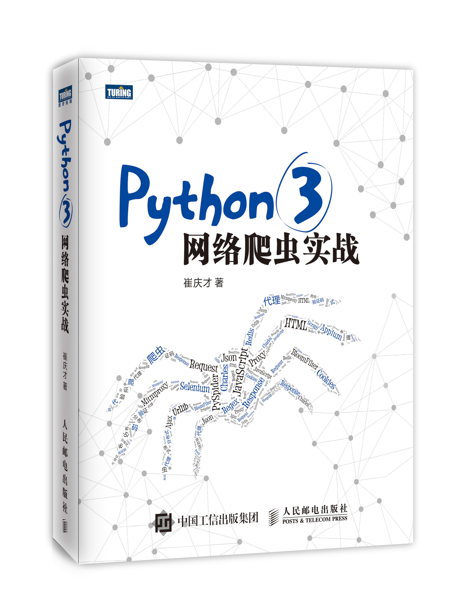

# Python3网络爬虫开发实战

本书通过多个实战案例详细介绍了 Python3 网络爬虫的知识。

本书由图灵教育-人民邮电出版社出版发行，敬请期待，版权所有，禁止转载。

作者：崔庆才

个人博客：[cuiqingcai.com](http://cuiqingcai.com)

技术交流：[cuiqingcai.com/exchange](http://cuiqingcai.com/exchange)

视频资源：

[Python3爬虫三大案例实战分享](https://edu.hellobi.com/course/156)

[自己动手，丰衣足食！Python3网络爬虫实战案例](https://edu.hellobi.com/course/157)

<<<<<<< HEAD

